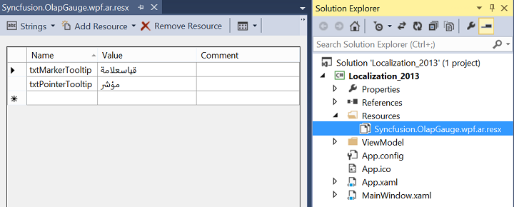

# Localization

Localization deals with customizing data and resources for specific culture or language. The built-in localization and globalization mechanism in WPF allows you to localize any string resource used by OlapGauge control.

We need to create and place the resource files in a separate location inside in the user application. Then we can access to the culture specific resources from the current application assembly.

For this, first create a resource file for our OlapGauge control and translate the strings to your culture. Once it is translated, you might use the resources in your projects by setting corresponding culture in your application.

Please refer the below code sample 



public MainWindow()
{
    //Set the current thread culture to load the localization resource file.    
    System.Threading.Thread.CurrentThread.CurrentUICulture = new System.Globalization.CultureInfo("ar-AE");
    InitializeComponent();
    if (System.Globalization.CultureInfo.CurrentUICulture.ToString() == "ar-AE") 
    {
        this.FlowDirection = System.Windows.FlowDirection.RightToLeft;
    }
}



## RTL Support

RTL support for OlapGauge is used to display the content from right to left by setting the **"FlowDirection"** property to **"RightToLeft"**. The following code sample explains how to set this property.





<syncfusion:OlapGauge x:Name="olapGauge" FlowDirection="RightToLeft" Grid.Column="0" HorizontalAlignment="Stretch" ReportName="SalesReport" olapshared:DataSource.ConnectionString="{Binding OlapConnectionString}">




 
this.olapGauge.FlowDirection = System.Windows.FlowDirection.RightToLeft;




  
Me.olapGauge.FlowDirection = System.Windows.FlowDirection.RightToLeft;





A sample is available locally in the following location:

{system drive}:\Users\&lt;User Name&gt;\AppData\Local\Syncfusion\EssentialStudio\&lt;Version Number&gt;\WPF\OlapGauge.WPF\Samples\Localization\Localization Demo\

