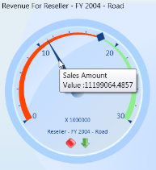
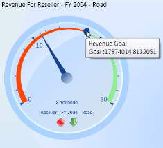

# Run Time Feature

## Pointer ToolTip

OlapGauge for WPF provides value information when the mouse pointer is moved over the pointer. This is achieved by enabling **"ShowPointersTooltip"** property of the OlapGauge. The following code sample illustrates the setting of this property.




 
    this.olapGauge1.ShowPointersTooltip = true;




  
    Me.olapGauge1.ShowPointersTooltip = True





## Marker ToolTip

OlapGauge for WPF provides goal information when the mouse pointer is moved over the marker. This is achieved by enabling **"ShowMarkersTooltip"** property of the OlapGauge. The following code sample illustrates the setting of this property.




 
    this.olapGauge1.ShowMarkersTooltip = true;




  
    Me.olapGauge1.ShowMarkersTooltip = True





A sample demo is available at the following location:

[system drive]:\Users\\{User Name}\AppData\Local\Syncfusion\EssentialStudio\\{Version Number}\WPF\OlapGauge.WPF\Samples\Product ShowCase\KPI\

