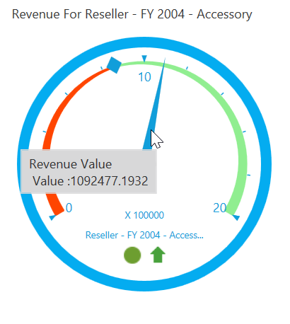
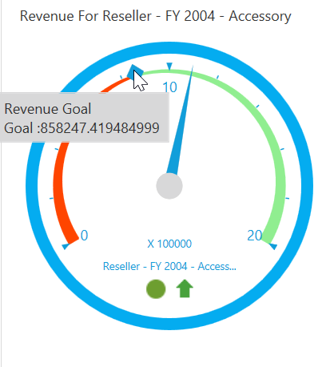

# Tooltip

OlapGauge provides the information about values when the mouse pointer is moved over the gauge.

## Pointer tooltip

OlapGauge provides value information when the mouse pointer is moved over the pointer. This is achieved by enabling `ShowPointersTooltip` property.

The following code snippet illustrates about how to show tooltip for pointers:





<syncfusion:OlapGauge x:Name="OlapGauge1" ShowPointersTooltip="True"/>





this.OlapGauge1.ShowPointersTooltip = true;





Me.OlapGauge1.ShowPointersTooltip = True





## Marker tooltip

OlapGauge provides goal information when the mouse pointer is moved over the marker. This is achieved by enabling `ShowMarkersTooltip` property.

The following code snippet illustrates about how to show tooltip for markers:





<syncfusion:OlapGauge x:Name="OlapGauge1" ShowMarkersTooltip="True"/>





this.OlapGauge1.ShowMarkersTooltip = true;





Me.OlapGauge1.ShowMarkersTooltip = True





A demo sample is available at the following location:

{system drive}:\Users\&lt;User Name&gt;\AppData\Local\Syncfusion\EssentialStudio\&lt;Version Number&gt;\WPF\OlapGauge.WPF\Samples\Product ShowCase\KPI\