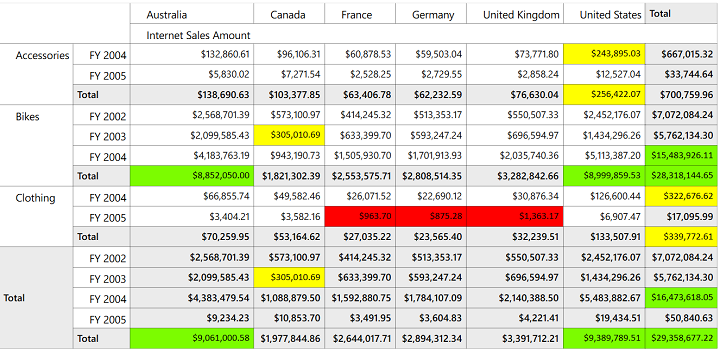

# Conditional Formatting

Conditional Formatting is the concept of applying custom style to any object based on certain conditions. Conditional Formatting for OlapGrid WPF allows you to format grid cells based on a certain condition. This can be achieved by defining OlapGridDataConditionalFormat for the grid. Using this class, you can specify the filter criteria for the cells and the style to be applied for filtered cells. Once these specifications are defined, the given styles are applied to only those cells that satisfy the condition specified. Conditional Formatting can be specified through the OlapGrid.ConditionalFormats property. This is an observable collection, into which you can add required number of formatters of type OlapGridDataConditionalFormat. 

The filter criteria are specified by the OlapGridDataConditionalFormat.Conditions property, which is a collection of OlapGridDataCondition objects. 

The style for each ConditionalFormat can be specified using OlapGridDataConditionalFormat.CellStyle property which should be of type OlapGridCellStyle.

## Use Case Scenarios

Conditional Formatting can be used in Marketing scenarios, where you can easily track the product sales rate of different regions.

## Adding Conditional Formatting 

The following code snippets show how to create an OlapGrid and to add Conditional Formats.

  

    [XAML]

<syncfusion:OlapGrid>

 <syncfusion:OlapGrid.ConditionalFormats> 

   <!-- Adding Conditions -->                       

   <syncfusion:OlapGridDataConditionalFormat Name="C1">

      <!-- Specifying Cell Style -->

      < syncfusion:OlapGridDataConditionalFormat.CellStyle>

          <syncfusion:OlapGridCellStyle Background="Yellow" FontFamily="Calibri" FontSize="12"/>

          </syncfusion:OlapGridDataConditionalFormat.CellStyle>

      <!-- Specfying Conditions --> 

      <syncfusion:OlapGridDataConditionalFormat.Conditions>

          <syncfusion:OlapGridDataCondition ConditionType="GreaterThan" Value="2000000" MeasureElement="Internet Sales Amount" PredicateType="Or"/>

          <syncfusion:OlapGridDataCondition ConditionType="LessThan" Value="5000000" MeasureElement="Internet Sales Amount" PredicateType="And"/>

          </syncfusion:OlapGridDataConditionalFormat.Conditions>

   </syncfusion:OlapGridDataConditionalFormat>                        

 </syncfusion:OlapGrid.ConditionalFormats>

</syncfusion:OlapGrid>

    

  

    [C#]

OlapGrid olapGrid1 = new OlapGrid();

// Instantiating OlapDataManager with Connection string.

OlapDataManager olapDataManager = new OlapDataManager(connectionString);

// Set current report for OlapDataManager.

olapDataManager.SetCurrentReport(olapReport());

// Specifying OlapDataManager to Grid.

olapGrid1.OlapDataManager = OlapDataManager;

 // Specifying OlapGridData Conditional Format.

OlapGridDataConditionalFormat conditionalFormat = new OlapGridDataConditionalFormat();

// Adding Conditions to OlapGridData Conditional Format.

conditionalFormat.Conditions.Add(new OlapGridDataCondition() { 

            ConditionType= OlapGridDataConditionType.GreaterThan , 

            MeasureElement="Internet Sales Amount",

            Value="2000000",

            PredicateType = PredicateType.Or });

conditionalFormat.Conditions.Add(new OlapGridDataCondition() { 

            ConditionType= OlapGridDataConditionType.LessThan , 

            MeasureElement="Internet Sales Amount",

            Value="5000000",

            PredicateType = PredicateType.And });

// Specifying Cell Style to Conditional Format.

conditionalFormat.CellStyle = new OlapGridCellStyle() { Background= Brushes.Yellow, FontFamily = new FontFamily("Calibri"), FontSize=12 

};

// Adding Conditions to Grid.

this.olapgrid1.ConditionalFormats.Add(conditionalFormat);

// Data Binding.

this.olapgrid1.DataBind();

    

  

    [VB]

Dim olapGrid1 As OlapGrid = New OlapGrid()

' Instantiating OlapDataManager with Connection string.

Dim olapDataManager As OlapDataManager = New OlapDataManager(connectionString)

' Set current report for OlapDataManager.

olapDataManager.SetCurrentReport(olapReport())

' Specifying OlapDataManager to Grid.

olapGrid1.OlapDataManager = OlapDataManager

' Specifying OlapGridData Conditional Format.

Dim conditionalFormat As OlapGridDataConditionalFormat = New OlapGridDataConditionalFormat()

' Adding Conditions to OlapGridData Conditional Format.

conditionalFormat.Conditions.Add(New OlapGridDataCondition() With {.ConditionType= OlapGridDataConditionType.GreaterThan, .MeasureElement="Internet Sales Amount", .Value="2000000", .PredicateType = PredicateType.Or})

conditionalFormat.Conditions.Add(New OlapGridDataCondition() With {.ConditionType= OlapGridDataConditionType.LessThan, .MeasureElement="Internet Sales Amount", .Value="5000000", .PredicateType = PredicateType.And})

' Specifying Cell Style to Conditional Format.

conditionalFormat.CellStyle = New OlapGridCellStyle()

Dim TempFontFamily As FontFamily = New FontFamily("Calibri"), FontSize=12

Brushes.Yellow, FontFamily = New FontFamily("Calibri"), FontSize

Background= Brushes.Yellow, FontFamily

' Adding Conditions to Grid.

Me.olapgrid1.ConditionalFormats.Add(conditionalFormat)

' Data Binding.

Me.olapgrid1.DataBind()

    

## Sample Link

..\..\ Syncfusion\BI\WPF\OlapGrid.WPF\Samples\Appearance\Conditional Formatting Demo

