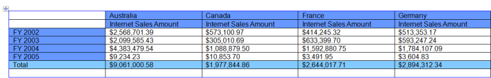
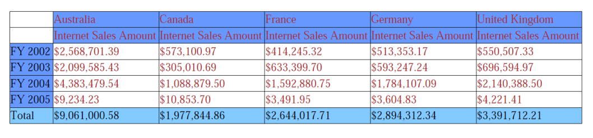

# Export

The OlapGrid Data can be exported to Excel, Word and PDF file formats. The OlapGrid data can be exported using the following methods of OlapGrid.

## Excel Export

[C#]

// Export OlapGrid Data to Excel

this.OlapGrid1.ExportToExcel("fileName");

[VB]

' Export OlapGrid Data to Excel 

Me.OlapGrid1.ExportToExcel("fileName")

{{ '' | markdownify }}
{:.image }

### Word Export

[C#]

// Export OlapGrid Data to Word

this.OlapGrid1.ExportToWord("fileName");

 [VB]

' Export OlapGrid Data to Word 

Me.OlapGrid1.ExportToWord("fileName")

{{ '' | markdownify }}
{:.image }

## Pdf Export

[C#]

// Export OlapGrid Data to Pdf

this.OlapGrid1.ExportToPdf("fileName");

[VB]

' Export OlapGrid Data to Pdf 

Me.OlapGrid1.ExportToPdf("fileName")

{{ '' | markdownify }}
{:.image }

The Format state of Grid is maintained on exported documents. 

Sample Location

A sample demo is available at the following location:

..\Syncfusion\EssentialStudio\<Versionnumber>\BI\WPF\OlapGrid.WPF\Samples\Exporting\Exporting Grid Demo

## CSV Export

OLAP Grid for WPF provides support to export itself to CSV file format. 

Use Case Scenarios 

You can export the contents of the OLAP Grid to the CSV file format for future references and analysis purposes.

Methods

_Methods_

<table>
<tr>
<td>
Method</td><td>
Description</td><td>
Parameters</td><td>
Type</td><td>
Return Type</td></tr>
<tr>
<td>
Export(string filename)</td><td>
Gets the file name to save the file with the specified name.</td><td>
filename as string</td><td>
-</td><td>
void</td></tr>
<tr>
<td>
ExportToCsv(PivotEngine pivotEngine, string filename)</td><td>
Gets the Pivot Engine and file name for exporting the content to CSV file format with the specified name. </td><td>
pivotEngine as PivotEngine, filename as string</td><td>
-</td><td>
void</td></tr>
</table>

Adding CSV Export for OLAP Grid in an application

The GridCsvExport class provides you support for exporting data from OLAP Grid to a CSV file format. Add the following dll along with the default dll’s in the reference folder: 

* Syncfusion.OlapGridConverter.Wpf

[C#] 

SaveFileDialog saveFileDialog = new SaveFileDialog();

saveFileDialog.AddExtension = true;

saveFileDialog.FileName = "OlapGrid Report";

saveFileDialog.DefaultExt = "CSV";

saveFileDialog.Filter = "Csv file (.csv)|*.csv";

if (saveFileDialog.ShowDialog() == true)

{

    if (this.olapGrid.InternalGrid != null && this.olapGrid.InternalGrid.Engine != null)

    {

         GridCsvExport gridCsvExport = new GridCsvExport(this.olapGrid.InternalGrid.Engine);

         gridCsvExport.Export(saveFileDialog.FileName);

         MessageBox.Show("CSV document exported successfully!");

    }

}

[VB]

Dim saveFileDialog As New SaveFileDialog()

saveFileDialog.AddExtension = True

saveFileDialog.FileName = "OlapGrid Report"

saveFileDialog.DefaultExt = "CSV"

saveFileDialog.Filter = "Csv file (.csv)|*.csv"

If saveFileDialog.ShowDialog() = True Then

If Me.olapGrid.InternalGrid IsNot Nothing AndAlso Me.olapGrid.InternalGrid.Engine IsNot Nothing Then

        Dim gridCsvExport As New GridCsvExport(Me.olapGrid.InternalGrid.Engine)

        gridCsvExport.Export(saveFileDialog.FileName)

        MessageBox.Show("CSV document exported successfully!")

End If

End If

{{ '' | markdownify }}
{:.image }

Sample Link

{Installation Drive}:\Users\<user name>\AppData\Local\Syncfusion\EssentialStudio\<version    number>\BI\WPF\OlapGrid.Wpf\Samples\Exporting\Exporting Demo

