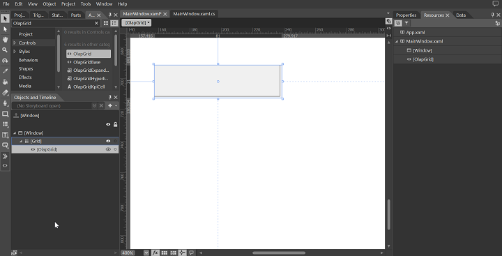
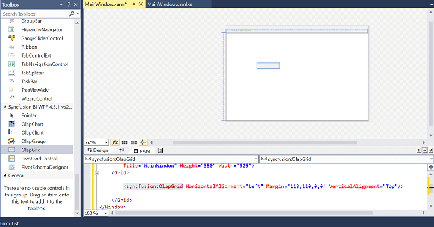
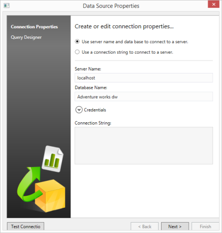
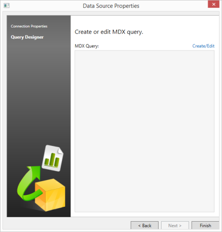
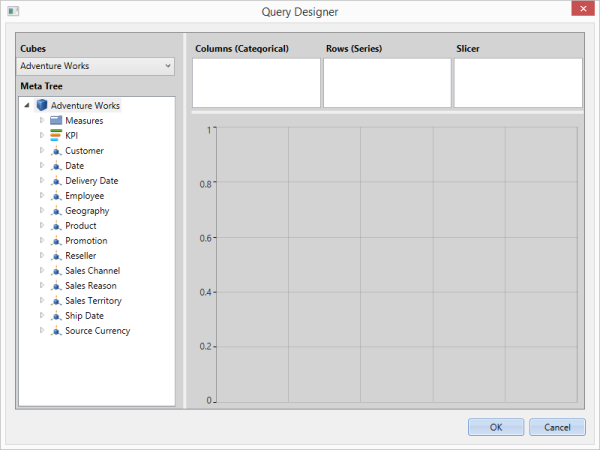
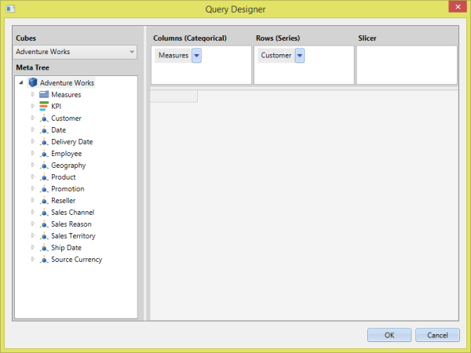
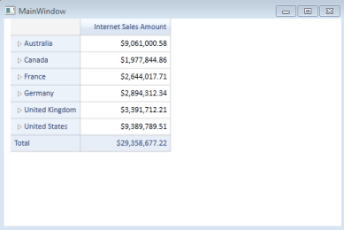

# Getting Started

## Configuring OLAP Grid Control

This segment explains how to configure an OLAP Grid component in an application. You can also learn how to pass the required data to OLAP Grid and to customize its various options according to your requirements.

In the following example, the OLAP Grid component displays Internet Sales Amount over different fiscal years against various geographical locations. This helps you analyze the summarized data over different fiscal years.

### Through Visual Studio

1. Open Visual Studio IDE and from the File menu, select New  Project.
2. In the New Project Dialog box, click the tree node item Windows under Visual C# and select WPF Application and Click OK.

{{ '' | markdownify }}
{:.image }

3. Drag and drop OLAP Grid control from Syncfusion BI WPF toolbox onto the Design page. The required Syncfusion assemblies are added automatically to the application.

{{ '' | markdownify }}
{:.image }

4. Add name for OLAP Grid in the XAML page to access it from code behind.

[XAML]

<Window x:Class="WpfApplication.MainWindow1"

    xmlns="http://schemas.microsoft.com/winfx/2006/xaml/presentation"

    xmlns:x="http://schemas.microsoft.com/winfx/2006/xaml"

    xmlns:syncfusion="http://schemas.syncfusion.com/wpf">

    <Grid>

        <syncfusion:OlapGrid Name="olapGrid1" HorizontalAlignment="Left" Margin="248,137,0,0" VerticalAlignment="Top"/>

   </Grid>

</Window>

5. Add the following namespace in the code behind part for manipulating OlapReport and OlapDataManager.
1. Syncfusion.Olap.Manager
2. Syncfusion.Olap.Reports

[C#]

using Syncfusion.Olap.Manager;

using Syncfusion.Olap.Reports;

public partial class MainWindow : SampleWindow

{

   private OlapDataManager olapDataManager = null;

   private string _connectionSting = "Enter a valid connection string";

   public MainWindow()

   {

       //Connection string is passed to OlapDataManager as an argument

       olapDataManager = new OlapDataManager(_connectionSting);

       InitializeComponent();

       //A default OlapReport is set to OlapDataManager

       olapDataManager.SetCurrentReport(CreateOlapReport());

       // Finally OLAP Grid gets information from the OlapDataManager

       this.olapGrid1.OlapDataManager = olapDataManager;

       this.olapGrid1.DataBind();

   }

   /// 

   /// Defining OlapReport with Dimension and Measure

   /// 

   private OlapReport CreateOlapReport()

   {

       OlapReport olapReport = new OlapReport();

       //Setting the Cube name

       olapReport.CurrentCubeName = "Adventure Works";

       DimensionElement dimensionElementColumn = new DimensionElement();

       //Specifying the name of the Dimension

       dimensionElementColumn.Name = "Customer";

       //Specifying the Hierarchy and Level name

       dimensionElementColumn.AddLevel("Customer Geography", "Country");

       MeasureElements measureElementColumn = new MeasureElements();

       //Specifying the Measure name

       measureElementColumn.Elements.Add(new MeasureElement { Name = "Internet Sales Amount" });

       DimensionElement dimensionElementRow = new DimensionElement();

       // Specifying the name of the Dimension

       dimensionElementRow.Name = "Date";

       // Specifying the Hierarchy and Level name

       dimensionElementRow.AddLevel("Fiscal", "Fiscal Year");

       ///Adding Dimension in column axis

       olapReport.CategoricalElements.Add(dimensionElementColumn);

       ///Adding Measure in column axis

       olapReport.CategoricalElements.Add(measureElementColumn);

       ///Adding Dimension in row axis

       olapReport.SeriesElements.Add(dimensionElementRow);

       return olapReport;

    }

}

[VB]

Imports Syncfusion.Olap.Manager

Imports Syncfusion.Olap.Reports

Partial Public Class MainWindow 

           Inherits SampleWindow

Private olapDataManager As OlapDataManager = Nothing

Private _connectionSting As String = " Enter valid connection string;"

Private Sub MainWindow() As Public

        'Connection string is passed to OlapDataManager as an argument

        olapDataManager = New OlapDataManager(_connectionSting)

        InitializeComponent()

        'A default OlapReport is set to OlapDataManager

        olapdata.SetCurrentReport(CreateOlapReport())

        'Finally OLAP Grid gets information from the OlapDataManager

        Me.olapGrid1.OlapDataManager = olapDataManager

        Me.olapGrid1.DataBind()

End Sub

      ''' 

      ''' Defining OlapReport with Dimension and Measure

      ''' 

      Private Function CreateOlapReport() As OlapReport

            Dim olapReport As OlapReport = New OlapReport()

            'Setting the Cube name

            olapReport.CurrentCubeName = "Adventure Works"

            Dim dimensionElementColumn As DimensionElement = New DimensionElement()

            'Specifying the name of the Dimension

            dimensionElementColumn.Name = "Customer"

            'Specifying the Hierarchy and Level name

            dimensionElementColumn.AddLevel("Customer Geography", "Country")

            Dim measureElementColumn As MeasureElements = New MeasureElements()

            ' Specifying the Measure name

            measureElementColumn.Elements.Add(New MeasureElement With {.Name = "Internet Sales Amount"})

            Dim dimensionElementRow As DimensionElement = New DimensionElement()

            ' Specifying the name of the Dimension

            dimensionElementRow.Name = "Date"

            ' Specifying the Hierarchy and Level name

            dimensionElementRow.AddLevel("Fiscal", "Fiscal Year")

            ''' Adding Dimension in column axis

            olapReport.CategoricalElements.Add(dimensionElementColumn)

            ''' Adding Measure in column axis

            olapReport.CategoricalElements.Add(measureElementColumn)

            ''' Adding Dimension in row axis

            olapReport.SeriesElements.Add(dimensionElementRow)

            Return olapReport

      End Function

End Class

6. Run the application.

{{ '' | markdownify }}
{:.image }

### Through Expression Blend

OLAP Grid control can also be created and configured using Expression Blend as illustrated here.

1. Open Blend for Visual Studio and from the File menu, select New  Project.
2. In the New Project Dialog box, click WPF item and select WPF Application, then click OK.

{{ '' | markdownify }}
{:.image }

3. In Projects tab, under Solution Explorer, right-click on the project References and select Add Reference… for adding assembly to an application manually. 

{{ '' | markdownify }}
{:.image }

4. Include the following assemblies to the application from the installed location.
1. Syncfusion.Grid.Wpf
2. Syncfusion.Olap.Base
3. Syncfusion.OlapGrid.Wpf
4. Syncfusion.OlapGridCommon.Wpf
5. Syncfusion.OlapShared.Wpf

Assembly Location: _<system drive>\Program Files(x86)\Syncfusion\Essential Studio\<version number>\precompiledassemblies\<version number>\<framework version>_

5. After adding the above assemblies, the OlapGrid control is automatically added in the Assests. Now, find OlapGrid and drag it to the designer window.

{{ '' | markdownify }}
{:.image }

6. Add name for OLAP Grid in the XAML page for accessing it in code behind.

[XAML]

<Window

      xmlns="http://schemas.microsoft.com/winfx/2006/xaml/presentation"

      xmlns:x="http://schemas.microsoft.com/winfx/2006/xaml"

      xmlns:syncfusion="http://schemas.syncfusion.com/wpf"                

      x:Class="WpfApplication.MainWindow"

      xmlns:local ="c"

      Title="MainWindow" Height="350" Width="525"                        

      Loaded="Window_Loaded_1" >

    <Grid>

       <syncfusion:olapGrid Name="olapGrid1"/>

    </Grid>

</Window>

7. Add the following namespace in the code-behind part for manipulating OlapReport and OlapDataManager.
1. Syncfusion.Olap.Manager
2. Syncfusion.Olap.Reports

[C#]

using Syncfusion.Olap.Manager;

using Syncfusion.Olap.Reports;

public partial class MainWindow : SampleWindow

{

   private OlapDataManager olapDataManager = null;

   private string _connectionSting = "Enter a valid connection string";

   public MainWindow()

   {

       InitializeComponent();

       //Connection string is passed to OlapDataManager as an argument

       olapDataManager = new OlapDataManager(_connectionSting);

       //A default OlapReport is set to OlapDataManager

       olapDataManager.SetCurrentReport(CreateOlapReport());

       // Finally OLAP Grid gets the information from the OlapDataManager

       this.olapGrid1.OlapDataManager = olapDataManager;

       this.olapGrid1.DataBind();

   }

   /// 

   /// Defining OlapReport with Dimension and Measure

   /// 

   private OlapReport CreateOlapReport()

   {

       OlapReport olapReport = new OlapReport();

       // Setting the Cube name

       olapReport.CurrentCubeName = "Adventure Works";

       DimensionElement dimensionElementColumn = new DimensionElement();

       // Specifying the name of the Dimension

       dimensionElementColumn.Name = "Customer";

       // Specifying the Hierarchy and Level name

       dimensionElementColumn.AddLevel("Customer Geography", "Country");

       MeasureElements measureElementColumn = new MeasureElements();

       //Specifying the Measure name

       measureElementColumn.Elements.Add(new MeasureElement { Name = "Internet Sales Amount" });

       DimensionElement dimensionElementRow = new DimensionElement();

       // Specifying the name of the Dimension

       dimensionElementRow.Name = "Date";

       // Specifying the Hierarchy and Level name

       dimensionElementRow.AddLevel("Fiscal", "Fiscal Year");

       ///Adding Dimension in column axis

       olapReport.CategoricalElements.Add(dimensionElementColumn);

       ///Adding Measure in column axis

       olapReport.CategoricalElements.Add(measureElementColumn);

       ///Adding Dimension in row axis

       olapReport.SeriesElements.Add(dimensionElementRow);

       return olapReport;

    }

}

[VB]

Imports Syncfusion.Olap.Manager

Imports Syncfusion.Olap.Reports

Partial Public Class MainWindow 

           Inherits SampleWindow

Private olapDataManager As OlapDataManager = Nothing

Private _connectionSting As String = "Enter a valid connection string"

Private Sub MainWindow() As Public

        'Connection string is passed to OlapDataManager as an argument

        olapDataManager = New OlapDataManager(_connectionSting)

        InitializeComponent()

        'A default OlapReport is set to OlapDataManager

        olapdata.SetCurrentReport(CreateOlapReport())

        'Finally OLAP Grid gets the information from the OlapDataManager

        Me.olapGrid1.OlapDataManager = olapDataManager

        Me.olapGrid1.DataBind()

End Sub

      ''' 

      ''' Defining OlapReport with Dimension and Measure

      ''' 

      Private Function CreateOlapReport() As OlapReport

            Dim olapReport As OlapReport = New OlapReport()

            ' Setting the Cube name

            olapReport.CurrentCubeName = "Adventure Works"

            Dim dimensionElementColumn As DimensionElement = New DimensionElement()

            ' Specifying the name of the Dimension

            dimensionElementColumn.Name = "Customer"

            ' Specifying the Hierarchy and Level name

            dimensionElementColumn.AddLevel("Customer Geography", "Country")

            Dim measureElementColumn As MeasureElements = New MeasureElements()

            ' Specifying the Measure name

            measureElementColumn.Elements.Add(New MeasureElement With {.Name = "Internet Sales Amount"})

            Dim dimensionElementRow As DimensionElement = New DimensionElement()

            ' Specifying the name of the Dimension

            dimensionElementRow.Name = "Date"

            ' Specifying the Hierarchy and Level name

            dimensionElementRow.AddLevel("Fiscal", "Fiscal Year")

            ''' Adding Dimension in column axis

            olapReport.CategoricalElements.Add(dimensionElementColumn)

            ''' Adding Measure in column axis

            olapReport.CategoricalElements.Add(measureElementColumn)

            ''' Adding Dimension in row axis

            olapReport.SeriesElements.Add(dimensionElementRow)

            Return olapReport

      End Function

End Class

8. Run the application.

{{ '' | markdownify }}
{:.image }

### Through Code-Behind

1. Open Visual Studio IDE and from the File menu, select New  Project.
2. In the New Project Dialog box, click the tree node Windows under Visual C# and select WPF Application and click OK.

{{ '' | markdownify }}
{:.image }

{{ '' | markdownify }}
{:.image }

3. Right-click References, under Solution Explorer and select Add Reference.., then add the following Syncfusion assemblies manually to the project from installed location.
1. Syncfusion.Core
2. Syncfusion.Grid.Wpf
3. Syncfusion.Olap.Base
4. Syncfusion.OlapGrid.Wpf
5. Syncfusion.OlapGridCommon.Wpf
6. Syncfusion.OlapShared.Wpf

Assembly Location: _<system drive>\Program Files(x86)\Syncfusion\Essential Studio\<version number>\precompiledassemblies\<version number>\<framework version>_

4. Include the following namespace in code-behind for instantiating OLAP Grid and to manipulate OlpaDataManager and OlapReport.
1. Syncfusion.Windows.Grid.Olap
2. Syncfusion.Olap.Manager
3. Syncfusion.Olap.Reports

[C#]

using Syncfusion.Windows.Grid.Olap;

using Syncfusion.Olap.Manager;

using Syncfusion.Olap.Reports;

namespace WpfApplication1

{

    public partial class MainWindow : Window

    {

        public MainWindow()

        {

            //OLAP Grid instantiation

            OlapGrid olapGrid1 = new OlapGrid();

            InitializeComponent();

            //Connection string is passed to OlapDataManager as an argument

            OlapDataManager olapDataManager = new OlapDataManager("Enter a valid connection string");

            //A default OlapReport is set to OlapDataManager

            olapDataManager.SetCurrentReport(CreateOlapReport());

            //Finally OLAP Grid gets information from the OlapDataManager 

            olapGrid1.OlapDataManager = olapDataManager;

            olapGrid1.DataBind();

            // OLAP Grid added to the Main Window

            this.AddChild(olapGrid1);

        }

        /// 

        /// Defining OlapReport with Dimension and Measure

        /// 

        private OlapReport CreateOlapReport()

        {

            OlapReport olapReport = new OlapReport();

            // Setting the Cube name

            olapReport.CurrentCubeName = "Adventure Works";

            DimensionElement dimensionElementColumn = new DimensionElement();

            // Specifying the name of the Dimension

            dimensionElementColumn.Name = "Customer";

            // Specifying the Hierarchy and Level name

            dimensionElementColumn.AddLevel("Customer Geography", "Country");

            MeasureElements measureElementColumn = new MeasureElements();

            //Specifying the Measure name

            measureElementColumn.Elements.Add(new MeasureElement { Name = "Internet Sales Amount" });

            DimensionElement dimensionElementRow = new DimensionElement();

            // Specifying the name of the Dimension

            dimensionElementRow.Name = "Date";

            // Specifying the Hierarchy and Level name

            dimensionElementRow.AddLevel("Fiscal", "Fiscal Year");

            ///Adding Dimension in column axis

            olapReport.CategoricalElements.Add(dimensionElementColumn);

            ///Adding Measure in column axis

            olapReport.CategoricalElements.Add(measureElementColumn);

            ///Adding Dimension in row axis

            olapReport.SeriesElements.Add(dimensionElementRow);

            return olapReport;

        }

    }

}

[VB]

Imports Syncfusion.Windows.Grid.Olap

Imports Syncfusion.Olap.Manager

Imports Syncfusion.Olap.Reports

Partial Public Class MainWindow

    Inherits Window

    Public Sub New()

        'OLAP Grid instantiation

        Dim olapGrid1 As OlapGrid = New OlapGrid()

        InitializeComponent()

        'Connection string is passed to OlapDataManager as an argument

        Dim olapDataManager As OlapDataManager = New OlapDataManager("Enter a valid connection string")

        'A default OlapReport is set to OlapDataManager

        olapDataManager.SetCurrentReport(CreateOlapReport())

        'Finally OLAP Grid gets the information from the OlapDataManager

        olapGrid1.OlapDataManager = olapDataManager

        olapGrid1.DataBind()

        'OLAP Grid added to the Main Window

        Me.AddChild(olapGrid1)

    End Sub

      ''' 

      ''' Defining OlapReport with Dimension and Measure

      ''' 

      Private Function CreateOlapReport() As OlapReport

            Dim olapReport As OlapReport = New OlapReport()

            ' Setting the Cube name

            olapReport.CurrentCubeName = "Adventure Works"

            Dim dimensionElementColumn As DimensionElement = New DimensionElement()

            ' Specifying the name of the Dimension

            dimensionElementColumn.Name = "Customer"

            ' Specifying the Hierarchy and Level name

            dimensionElementColumn.AddLevel("Customer Geography", "Country")

            Dim measureElementColumn As MeasureElements = New MeasureElements()

            ' Specifying the Measure name

            measureElementColumn.Elements.Add(New MeasureElement With {.Name = "Internet Sales Amount"})

            Dim dimensionElementRow As DimensionElement = New DimensionElement()

            ' Specifying the name of the Dimension

            dimensionElementRow.Name = "Date"

            ' Specifying the Hierarchy and Level name

            dimensionElementRow.AddLevel("Fiscal", "Fiscal Year")

            ''' Adding Dimension in column axis

            olapReport.CategoricalElements.Add(dimensionElementColumn)

            ''' Adding Measure in column axis

            olapReport.CategoricalElements.Add(measureElementColumn)

            ''' Adding Dimension in row axis

            olapReport.SeriesElements.Add(dimensionElementRow)

            Return olapReport

      End Function

End Class

{{ '' | markdownify }}
{:.image }

### Design-Time Binding

Design-time support for OLAP Grid allows you to reduce the time spent on creating and customizing the report. Normally, it takes 10 to 15 minutes for creating a report and in the case of unfamiliar cubes it may extend further, but by using design time support you can create a report in a couple of minutes.

The following steps explain how to create a report during design-time

Creating a Basic Report during design-time

1. Drag and drop the control from the toolbox to the Visual Studio Designer surface.

{{ '' | markdownify }}
{:.image }

2. Right-click OLAP Grid available in the designer.
3. Then, navigate to the Configure data source -> Create/Edit data source… option in the Context Menu.

{{ '' | markdownify }}
{:.image }

Now the Data Source Properties wizard is opened.

{{ '' | markdownify }}
{:.image }

4. From the Data Source Properties wizard select the connection type. 
1. When you want to connect to SSAS, select Use server name and data base to connect to a server.__Specify the necessary information to connect to the server
2. When you want to connect to an Offline cube, select Use a connection string to connect to a server.__Enter your connection string path.

{{ '' | markdownify }}
{:.image }

5. When you want to test the connection, click the Test Connection button, displayed in the bottom left corner of the window.
6. Click the Next button, to proceed. 

> _Note: The Next button is enabled only when any one of the connection options are filled properly._

7. When the connection is valid, it displays the summary page of the Data Source Properties Wizard.

{{ '' | markdownify }}
{:.image }

8. The MDX query text box in the summary page is empty, when you are creating a query for the first time. When you are editing an already existing query it displays the current query in the text box.
9. For creating or editing a query, click the Create/Edit link, displayed in the top-right side of the MDX query textbox. This opens a Query Designer dialog. 

{{ '' | markdownify }}
{:.image }

10. When you are editing an existing query it displays the required dimensions in the specific axis of the query designer and the preview of that query is displayed in a Grid control.
> 
_Note: It does not display any style/formatting applied to the Grid. It displays only the result of the query._

11. Drag and drop dimensions, to frame a new query. 

{{ '' | markdownify }}
{:.image }

12. Then, click OK, to save the query or click Cancel, to revert the changes made during this session.
13. The summary page of the Data Source Properties now displays the resultant MDX query. 

{{ '' | markdownify }}
{:.image }

14. Click Finish. Run the application.

{{ '' | markdownify }}
{:.image }

