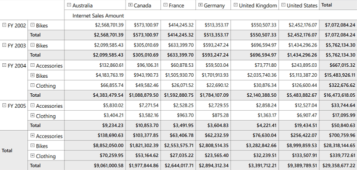
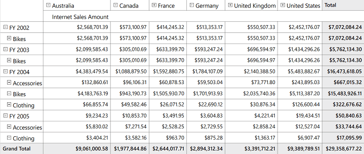
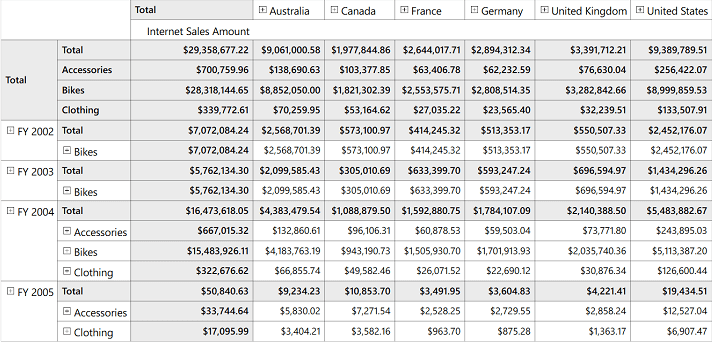
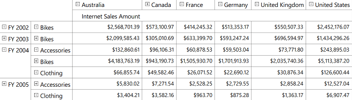

# Layouts

The position of summary cells in OlapGrid can be customized with the help of Grid layouts. It can be either positioned at the top or bottom of each parent member. 

The following are the five different kinds of layouts supported by OlapGrid:

* Normal Layout
* Excel Like Layout
* Excel Like Layout with Member Properties
* Normal Top Summary and
* No Summaries Layout

**Normal Layout**

Normal Layout is the default layout of OlapGrid in which the summary cells are positioned at the bottom of each parent member and the child member appears adjacent to it.


  


    /// Grid Layout will be Normal
    this.OlapGrid1.Layout = GridLayout.Normal; 





    ' Grid Layout will be Normal
    Me.OlapGrid1.Layout = GridLayout.Normal





**Excel Like Layout**

In the Excel-like layout, the summary cells are positioned at the bottom alone and the child members appear below the parent member with some indent space.


  


    /// Excel-like Grid Layout
    this.OlapGrid1.Layout = GridLayout.ExceLikeLayout; 





    ' Excel-like Grid Layout
    Me.OlapGrid1.Layout = GridLayout.ExceLikeLayout





**Excel Like Layout with Member Properties**

This kind of layout is used to display member properties along with dimension members. The properties appear adjacent to each member.

N> This layout is applicable only for member having properties defined in OLAP Cube. Those members are bound to OlapGrid through OlapReport.


  


    /// Excel-like Grid Layout with Member Properties 
    this.OlapGrid1.Layout = GridLayout.ExcelLikeLayoutWithMemberProperties;





    ' Excel-like Grid Layout with Member Properties
    Me.OlapGrid1.Layout = GridLayout.ExcelLikeLayoutWithMemberProperties





**Normal Top Summary Layout**

In Normal Top Summary layout, the summary cells are positioned at the top of each parent member and the child member appears adjacent to it.


  


    /// Grid Layout will be Normal with summary positioned at the top
    this.OlapGrid1.Layout = GridLayout.NormalTopSummary; 





    ' Grid Layout will be Normal with summary positioned at the top
    Me.OlapGrid1.Layout = GridLayout.NormalTopSummary





**No Summaries Layout**

In No Summaries layout, the summary cells are hidden and the child member appears adjacent to the parent member.


  


    /// Grid Layout without Summaries
    this.OlapGrid1.Layout = GridLayout.NoSummaries; 





    ' Grid Layout without Summaries
    Me.OlapGrid1.Layout = GridLayout.NoSummaries





A sample demo is available at the following location:

[system drive]:\Users\\{User Name}\AppData\Local\Syncfusion\EssentialStudio\\{Version Number}\WPF\OlapGrid.WPF\Samples\Appearance\Grid Layout
