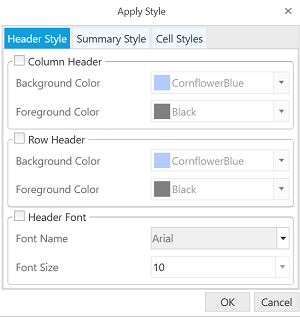

# Appearance 

OlapGrid can be formatted by the following way:

* Style dialog
* Configuring the properties of cell style

## Style Dialog

The OlapGrid style dialog is used to format the cells of the control. Styling can be applied to column header, row header, summary cell and value cell. The following properties of header and summary cells can be formatted:

* Background Color
* Foreground Color
* Font Name 
* Font Size

The following are the properties of value cells that can be formatted:

* Font Name
* Font Style
* Font Color
* Font Size

The following code sample will launch the OlapGrid style dialog:


  


// To display style dialog
this.OlapGrid1.ShowStyleDialog();





' To display style dialog
Me.OlapGrid1.ShowStyleDialog()





## Configuring the properties of cell style

The following properties lets the OlapGrid cell to be customized, so that the OlapGrid appears in a custom style rather than the default one.

* **Background** - Gets or sets the background color of cell.
* **FontFamily** - Gets or sets the font family of cell.
* **FontSize** - Gets or sets the font size of cell.
* **FontWeight** - Gets or sets the font weigh of cell.
* **Foreground** - Gets or sets the foreground color of cell.

The column, row, summary and value cells of OlapGrid can be formatted independently using the following properties.

* ColumnHeaderStyle
* RowHeaderStyle
* SummaryColumnStyle
* SummaryRowStyle
* ValueCellsStyle


  


// Specifying the background color for column header
this.OlapGrid1.ColumnHeaderStyle.Background = new SolidColorBrush(Color.FromRgb(175, 209, 255));
// Specifying the background color for row header
this.OlapGrid1.RowHeaderCellStyle.Background = new SolidColorBrush(Color.FromRgb(175, 209, 255));
// Specifying the background color for summary cell
this.OlapGrid1.SummaryColumnStyle.Background = new SolidColorBrush(Color.FromRgb(206, 225, 248)); 





' Specifying the background color for column header
Me.OlapGrid1.ColumnHeaderStyle.Background = New SolidColorBrush(Color.FromRgb(175, 209, 255))
' Specifying the background color for row header
Me.OlapGrid1.RowHeaderCellStyle.Background = New SolidColorBrush(Color.FromRgb(175, 209, 255))
' Specifying the background color for summary cell
Me.OlapGrid1.SummaryColumnStyle.Background = New SolidColorBrush(Color.FromRgb(206, 225, 248))





The value cell text alignment can be changed using the following property of OlapGrid,





// Specifying the value cell text alignment
this.OlapGrid1.ValueCellTextAlignment = HorizontalAlignment.Center;





' Specifying the value cell text alignment
Me.OlapGrid1.ValueCellTextAlignment = HorizontalAlignment.Center





A sample demo is available at the following location:

{system drive}:\Users\&lt;User Name&gt;\AppData\Local\Syncfusion\EssentialStudio\&lt;Version Number&gt;\WPF\OlapGrid.WPF\Samples\Exporting\Exporting Grid

