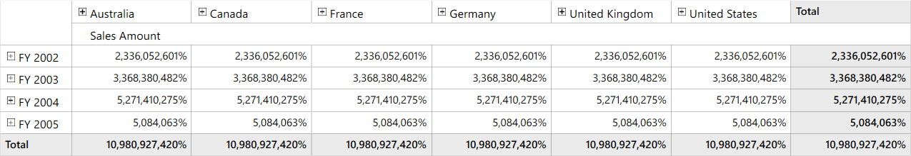
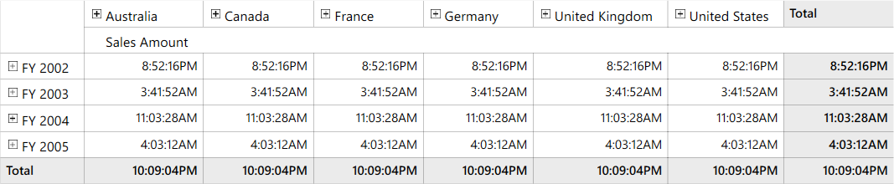
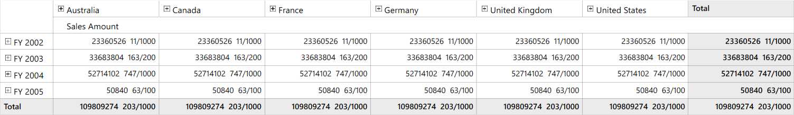
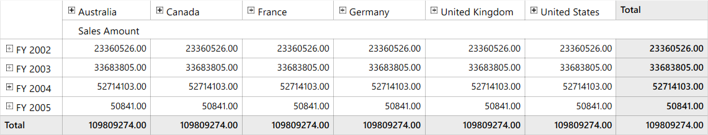
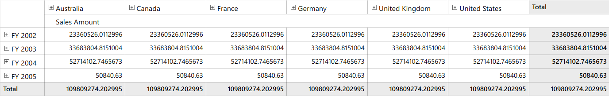
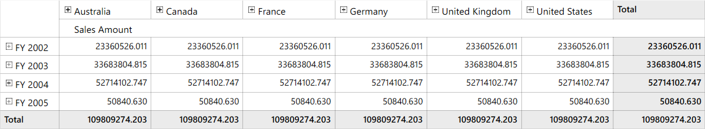

# Apply Formatting for Measure and Value Elements

The values of measure and value element can be formatted by using the `Format` property of corresponding elements. The following types of formats are supported by measure and value elements.

* Percent
* Date

## Percent format

This format helps to display the values of measure and value element in percentage format. Refer to the below code sample to format the measure element values in percentage format.





this.OlapGrid1.CategoricalElements.Add(new MeasureElement() { ElementName = "Sales Amount", Format = NumberFormat.Percent });





Dim measureElementGroup As New MeasureElements()
measureElementGroup.Elements.Add(New MeasureElement() With {.ElementName = "Sales Amount", .Format = NumberFormat.Percent})





* `Currency` - is used to display the cell value as currency format.

Refer the below code sample:





    MeasureElements measureElementGroup = new MeasureElements();
    measureElementGroup.Elements.Add(new MeasureElement() { ElementName = "Sales Amount", Format = NumberFormat.Currency });





	Dim measureElementGroup As New MeasureElements()
	measureElementGroup.Elements.Add(New MeasureElement() With {.ElementName = "Sales Amount", .Format = NumberFormat.Currency})





* `Number` - is used to display the cell value as numeric format.

Refer the below code sample:





    MeasureElements measureElementGroup = new MeasureElements();
    measureElementGroup.Elements.Add(new MeasureElement() { ElementName = "Sales Amount", Format = NumberFormat.Number });





	Dim measureElementGroup As New MeasureElements()
	measureElementGroup.Elements.Add(New MeasureElement() With {.ElementName = "Sales Amount", .Format = NumberFormat.Number})





* `Date` - is used to display the cell value as date format.

Refer the below code sample:





    MeasureElements measureElementGroup = new MeasureElements();
    measureElementGroup.Elements.Add(new MeasureElement() { ElementName = "Sales Amount", Format = NumberFormat.Date });





	Dim measureElementGroup As New MeasureElements()
	measureElementGroup.Elements.Add(New MeasureElement() With {.ElementName = "Sales Amount", .Format = NumberFormat.Date})





* `Scientific` - is used to display the cell value as scientific(exponential) format. 

Refer the below code sample:





    MeasureElements measureElementGroup = new MeasureElements();
    measureElementGroup.Elements.Add(new MeasureElement() { ElementName = "Sales Amount", Format = NumberFormat.Scientific });





	Dim measureElementGroup As New MeasureElements()
	measureElementGroup.Elements.Add(New MeasureElement() With {.ElementName = "Sales Amount", .Format = NumberFormat.Scientific})





* `Accounting` - is used to display the cell value as accounting format.

Refer the below code sample:





    MeasureElements measureElementGroup = new MeasureElements();
    measureElementGroup.Elements.Add(new MeasureElement() { ElementName = "Sales Amount", Format = NumberFormat.Accounting });





	Dim measureElementGroup As New MeasureElements()
	measureElementGroup.Elements.Add(New MeasureElement() With {.ElementName = "Sales Amount", .Format = NumberFormat.Accounting})





* `Time` - is used to display the cell value as time format.

Refer the below code sample:





    MeasureElements measureElementGroup = new MeasureElements();
    measureElementGroup.Elements.Add(new MeasureElement() { ElementName = "Sales Amount", Format = NumberFormat.Time });





	Dim measureElementGroup As New MeasureElements()
	measureElementGroup.Elements.Add(New MeasureElement() With {.ElementName = "Sales Amount", .Format = NumberFormat.Time})





* `Fraction` - is used to display the cell value as fraction number format.

Refer the below code sample:





    MeasureElements measureElementGroup = new MeasureElements();
    measureElementGroup.Elements.Add(new MeasureElement() { ElementName = "Sales Amount", Format = NumberFormat.Fraction });





	Dim measureElementGroup As New MeasureElements()
	measureElementGroup.Elements.Add(New MeasureElement() With {.ElementName = "Sales Amount", .Format = NumberFormat.Fraction})





* `HexaDecimal` - is used to display the cell value as hexadecimal format.

Refer the below code sample:





    MeasureElements measureElementGroup = new MeasureElements();
    measureElementGroup.Elements.Add(new MeasureElement() { ElementName = "Sales Amount", Format = NumberFormat.HexaDecimal });





	Dim measureElementGroup As New MeasureElements()
	measureElementGroup.Elements.Add(New MeasureElement() With {.ElementName = "Sales Amount", .Format = NumberFormat.HexaDecimal})





* `Decimal` -  is used to display the cell value as decimal format.

Refer the below code sample:





    MeasureElements measureElementGroup = new MeasureElements();
    measureElementGroup.Elements.Add(new MeasureElement() { ElementName = "Sales Amount", Format = NumberFormat.Decimal });





	Dim measureElementGroup As New MeasureElements()
	measureElementGroup.Elements.Add(New MeasureElement() With {.ElementName = "Sales Amount", .Format = NumberFormat.Decimal})





* `RoundTrip` -  is used to display the cell value as round trip format.

Refer the below code sample:





    MeasureElements measureElementGroup = new MeasureElements();
    measureElementGroup.Elements.Add(new MeasureElement() { ElementName = "Sales Amount", Format = NumberFormat.RoundTrip });





	Dim measureElementGroup As New MeasureElements()
	measureElementGroup.Elements.Add(New MeasureElement() With {.ElementName = "Sales Amount", .Format = NumberFormat.RoundTrip})





* `General` - is used to display the cell value as general number format.

Refer the below code sample:





    MeasureElements measureElementGroup = new MeasureElements();
    measureElementGroup.Elements.Add(new MeasureElement() { ElementName = "Sales Amount", Format = NumberFormat.General });





	Dim measureElementGroup As New MeasureElements()
	measureElementGroup.Elements.Add(New MeasureElement() With {.ElementName = "Sales Amount", .Format = NumberFormat.General})





* `FixedPoint` - is used to display the cell value as fixed point format.

Refer the below code sample:





    MeasureElements measureElementGroup = new MeasureElements();
    measureElementGroup.Elements.Add(new MeasureElement() { ElementName = "Sales Amount", Format = NumberFormat.FixedPoint });





	Dim measureElementGroup As New MeasureElements()
	measureElementGroup.Elements.Add(New MeasureElement() With {.ElementName = "Sales Amount", .Format = NumberFormat.FixedPoint})





* `Custom` - is used to display the cell values with its own customer order.

Refer the below code sample:





    MeasureElements measureElementGroup = new MeasureElements();
    measureElementGroup.Elements.Add(new MeasureElement() { ElementName = "Sales Amount", Format = NumberFormat.Custom, FormatString = "#0.000" });





	Dim measureElementGroup As New MeasureElements()
	measureElementGroup.Elements.Add(New MeasureElement() With {.ElementName = "Sales Amount", .Format = NumberFormat.Custom, .FormatString = "#0.000"})





* `None` - is used to displays the actual value from the cube without any formatting the cell value.

Refer the below code sample:





    MeasureElements measureElementGroup = new MeasureElements();
    measureElementGroup.Elements.Add(new MeasureElement() { ElementName = "Sales Amount", Format = NumberFormat.None });





	Dim measureElementGroup As New MeasureElements()
	measureElementGroup.Elements.Add(New MeasureElement() With {.ElementName = "Sales Amount", .Format = NumberFormat.None})





