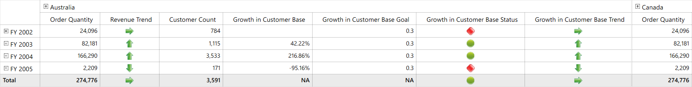

# Custom ordering of Measures and KPIs

## Enabling custom ordering

By enabling the property, `DisplayMeasuresInDesiredOrder` in OLAP report instance associated with the OlapGrid, the custom ordering of KPIs can be done. The below code snippet illustrates how to use the property.





olapReport.DisplayMeasuresInDesiredOrder = true;





olapReport.DisplayMeasuresInDesiredOrder = True





## Specifying the desired order

For defining the custom order of Measures and KPIs, the element name value is set to the data type of **ValueElements** instance to any of the OLAP report axis. The KPIs are denoted by enabling the property `IsKPI` to true. The following code snippet illustrates the specifications need to be done in the OLAP report.





private OlapReport CreateReport()
{
    OlapReport olapReport = new OlapReport();
    olapReport.CurrentCubeName = "Adventure Works";
    // Enable the custom ordering of Measures and KPIs
    olapReport.DisplayMeasuresInDesiredOrder = true;

    DimensionElement dimensionElementRow = new DimensionElement();
    dimensionElementRow.Name = "Date";
    dimensionElementRow.AddLevel("Fiscal", "Fiscal");

    DimensionElement dimensionElementColumn = new DimensionElement();
    dimensionElementColumn.Name = "Customer";
    dimensionElementColumn.AddLevel("Customer Geography", "Country");

    // Defining the order
    ValueElements valueElementGroup = new ValueElements();
    valueElementGroup.Add(new ValueElement { Name = "Sales Amount" });
    valueElementGroup.Add(new ValueElement { Name = "Revenue", IsKPI = true });
    valueElementGroup.Add(new ValueElement { Name = "Order Qunatity" });
    valueElementGroup.Add(new ValueElement { Name = "Growth in Customer Base", IsKPI = true });

    olapReport.CategoricalElements.Add(dimensionElementColumn);
    olapReport.CategoricalElements.Add(valueElementGroup);
    olapReport.SeriesElements.Add(dimensionElementRow);

    return olapReport;
}





Private Function CreateReport() As OlapReport
    Dim olapReport As New OlapReport()
    olapReport.CurrentCubeName = "Adventure Works"
    ' Enable the custom ordering of Measures and KPIs
    olapReport.DisplayMeasuresInDesiredOrder = True

    Dim dimensionElementRow As New DimensionElement()
    dimensionElementRow.Name = "Date"
    dimensionElementRow.AddLevel("Fiscal", "Fiscal")

    Dim dimensionElementColumn As New DimensionElement()
    dimensionElementColumn.Name = "Customer"
    dimensionElementColumn.AddLevel("Customer Geography", "Country")

    ' Defining the order
    Dim valueElementGroup As New ValueElements()
    valueElementGroup.Add(New ValueElement With {.Name = "Sales Amount"})
    valueElementGroup.Add(New ValueElement With {.Name = "Revenue", .IsKPI = True})
    valueElementGroup.Add(New ValueElement With {.Name = "Order Quantity"})
    valueElementGroup.Add(New ValueElement With {.Name = "Growth in Customer Base", .IsKPI = True})

    olapReport.CategoricalElements.Add(dimensionElementColumn)
    olapReport.CategoricalElements.Add(valueElementGroup)
    olapReport.SeriesElements.Add(dimensionElementRow)

    Return olapReport
End Function





## Customizing the KPIs

By default, for any given KPI its Value, Goal, Status and Trend gets displayed all together. This can be also be customized by using the following properties.

* `ShowKPIGoal` - Gets or sets a value indicating whether to display the given KPI's goal element.
* `ShowKPIStatus` - Gets or sets a value indicating whether to display the given KPI's status element.
* `ShowKPITrend` - Gets or sets a value indicating whether to display the given KPI's trend element.
* `ShowKPIValue` - Gets or sets a value indicating whether to display the given KPI's value element.

The following code snippet illustrates how to customize the KPI elements.





private OlapReport CreateReport()
{
    OlapReport olapReport = new OlapReport();
    olapReport.CurrentCubeName = "Adventure Works";
    olapReport.DisplayMeasuresInDesiredOrder = true;

    DimensionElement dimensionElementRow = new DimensionElement();
    dimensionElementRow.Name = "Date";
    dimensionElementRow.AddLevel("Fiscal", "Fiscal");

    DimensionElement dimensionElementColumn = new DimensionElement();
    dimensionElementColumn.Name = "Customer";
    dimensionElementColumn.AddLevel("Customer Geography", "Country");

    ValueElements valueElementGroup = new ValueElements();
    valueElementGroup.Add(new ValueElement { Name = "Order Quantity" });
    valueElementGroup.Add(new ValueElement { Name = "Revenue", IsKPI = true, ShowKPIGoal = false, ShowKPIStatus = false, ShowKPIValue = false });
    valueElementGroup.Add(new ValueElement { Name = "Customer Count" });
    valueElementGroup.Add(new ValueElement { Name = "Growth in Customer Base", IsKPI = true });

    olapReport.CategoricalElements.Add(dimensionElementColumn);
    olapReport.CategoricalElements.Add(valueElementGroup);
    olapReport.SeriesElements.Add(dimensionElementRow);

    return olapReport;
}





Private Function CreateReport() As OlapReport
    Dim olapReport As New OlapReport()
    olapReport.CurrentCubeName = "Adventure Works"
    olapReport.DisplayMeasuresInDesiredOrder = True

    Dim dimensionElementRow As New DimensionElement()
    dimensionElementRow.Name = "Date"
    dimensionElementRow.AddLevel("Fiscal", "Fiscal")

    Dim dimensionElementColumn As New DimensionElement()
    dimensionElementColumn.Name = "Customer"
    dimensionElementColumn.AddLevel("Customer Geography", "Country")

    Dim valueElementGroup As New ValueElements()
    valueElementGroup.Add(New ValueElement With {.Name = "Order Quantity"})
    valueElementGroup.Add(New ValueElement With {.Name = "Revenue", .IsKPI = True, .ShowKPIGoal = False, .ShowKPIStatus = False, .ShowKPIValue = False})
    valueElementGroup.Add(New ValueElement With {.Name = "Customer Count"})
    valueElementGroup.Add(New ValueElement With {.Name = "Growth in Customer Base", .IsKPI = True})

    olapReport.CategoricalElements.Add(dimensionElementColumn)
    olapReport.CategoricalElements.Add(valueElementGroup)
    olapReport.SeriesElements.Add(dimensionElementRow)

    Return olapReport
End Function





