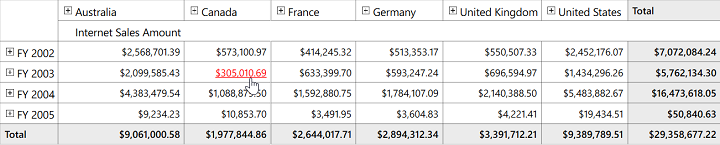
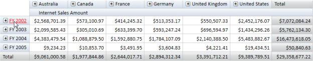
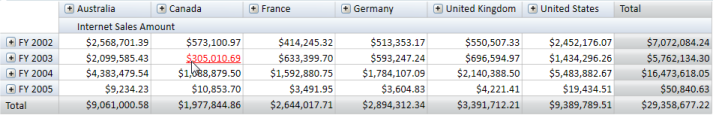

# Hyperlink Cells

## Definition

The OlapGrid allows hyper linking of cells to retrieve a detailed description about a particular cell. The Hyperlink Cells property of OlapGrid generates a separate event for the clicked cell to retrieve a detailed description about that cell that can be retrieved. 

Hyperlink Cell’s property can be applied to the following cells:

* Column Header 
* Row Header and 
* Value Cell 

## Enabling hyperlink cells

The Hyperlink cells can be enabled by the following property of OlapGrid such as:

  

    [C#]

// To Enable Hyperlink for Column Header

this.OlapGrid1.ColumnHeaderStyle.IsHyperlinkCell = true;

// To Enable Hyperlink for Row Header

this.OlapGrid1.RowHeaderStyle.IsHyperlinkCell = true;

// To Enable Hyperlink for Value Cell

this.OlapGrid1.ValueCellsStyle.IsHyperlinkCell = true;

// To Enable Hyperlink for Summary Column

this.OlapGrid1.SummaryColumnStyle.IsHyperlinkCell = true;

// To Enable Hyperlink for Summary Row

this.OlapGrid1.SummaryRowStyle.IsHyperlinkCell = true;

    

  

    [VB]

' To Enable Hyperlink for Column Header

Me.OlapGrid1.ColumnHeaderStyle.IsHyperlinkCell = True

' To Enable Hyperlink for Row Header

Me.OlapGrid1.RowHeaderStyle.IsHyperlinkCell = True

' To Enable Hyperlink for Value Cell

Me.OlapGrid1.ValueCellsStyle.IsHyperlinkCell = True

' To Enable Hyperlink for Summary Column

Me.OlapGrid1.SummaryColumnStyle.IsHyperlinkCell = True

' To Enable Hyperlink for Summary Row

Me.OlapGrid1.SummaryRowStyle.IsHyperlinkCell = True

    

The Hyperlink Click event can be tagged by the following way:

  

    [C#]

// Tag Hyperlink Cell Click Event

this.OlapGrid1.LinkClick += new Syncfusion.Windows.Grid.Olap.LinkLabelClickEventHander(OlapGrid1_LinkClick);

    

  

   [VB]

' Tag Hyperlink Cell Click Event

Me.OlapGrid1.LinkClick += New Syncfusion.Windows.Grid.Olap.LinkLabelClickEventHander(OlapGrid1_LinkClick);

    

The LinkClick event will return the clicked Cell Descriptor.

  

   [C#]

void OlapGrid1_LinkClick(object sender, Syncfusion.Windows.Grid.Olap.LinkLabelEventArgs e)

{

   string uniqueName = e.PivotCellDescriptor.UniqueName;   

}  

    

  

   [VB]

Private Sub OlapGrid1_LinkClick(ByVal sender As Object, ByVal e As Syncfusion.Windows.Grid.Olap.LinkLabelEventArgs)

Dim uniqueName As String = e.PivotCellDescriptor.UniqueName

End Sub

    

## Sample Location

A sample demo is available at the following location:

..\Syncfusion\EssentialStudio\<Versionnumber>\BI\WPF\OlapGrid.WPF\Samples\Appearance\Hyperlink Header Demo

