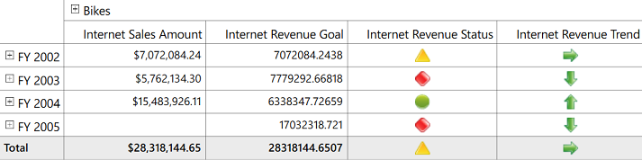

# Key Performance Indicator (KPI)

KPI is a collection of calculations that are associated with a measure group in a cube that are used to evaluate business success. Typically, these calculations are a combination of multi-dimensional expressions (MDX) or calculated members. KPIs also have additional metadata that provides information about how Grid applications should display the results of KPIs calculations.

The following are the different types of Indicators:

* KPI Goal
* KPI Status
* KPI Trend
* KPI Value


 

     
    /// 

    /// OlapReport with KPI Elements
    /// 

    /// <returns></returns>
    private OlapReport LoadBasicKPI()
    {
       OlapReport olapReport = new OlapReport();
       // Selecting the Cube
       olapReport.CurrentCubeName = "Adventure Works";
       KpiElements kpiElement = new KpiElements();
       // Specifying the KPI Element name and configuring its Indicators
       kpiElement.Elements.Add(new KpiElement
       {
           Name = "Internet Revenue",
           ShowKPIGoal = true,
           ShowKPIStatus = true,
           ShowKPIValue = true,
           ShowKPITrend = true
       });
       DimensionElement dimensionElementRow = new DimensionElement();
       // Specifying the Name for Row Dimension Element
       dimensionElementRow.Name = "Date";
       // Specifying the Level element
       dimensionElementRow.AddLevel("Fiscal", "Fiscal Year");
       // Adding Row Elements
       olapReport.SeriesElements.Add(dimensionElementRow);
       // Adding Column Elements
       olapReport.CategoricalElements.Add(kpiElement);
       return olapReport;
     }





    ''' 

    ''' OlapReport with KPI Elements
    ''' 

    ''' <returns></returns>
    Private Function LoadBasicKPI() As OlapReport
       Dim olapReport As New OlapReport()
       ' Selecting the Cube
       olapReport.CurrentCubeName = "Adventure Works"
       Dim kpiElement As New KpiElements()
       ' Specifying the KPI Element name and configuring its Indicators
       kpiElement.Elements.Add(New KpiElement()
       {
           Name = "Internet Revenue",
           ShowKPIGoal = true,
           ShowKPIStatus = true,
           ShowKPIValue = true,
           ShowKPITrend = true
       })
       Dim dimensionElementRow As New DimensionElement()
       ' Specifying the Name for Row Dimension Element
       dimensionElementRow.Name = "Date"
       ' Specifying the Level element
       dimensionElementRow.AddLevel("Fiscal", "Fiscal Year")
       ' Adding Row Elements
       olapReport.SeriesElements.Add(dimensionElementRow)
       ' Adding Column Elements
       olapReport.CategoricalElements.Add(kpiElement)
       Return olapReport
    End Function


 


A sample demo is available at the following location:

[system drive]:\Users\\{User Name} \AppData\Local\Syncfusion\EssentialStudio\\{Version Number}\WPF\OlapGrid.WPF\Samples\Product Showcase\KPI

