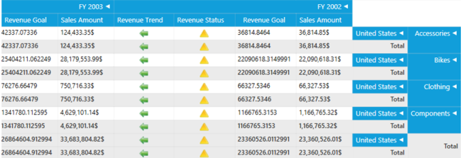

# RTL Support

Right-to-left support has been provided for the OLAP Grid control for WPF. Users can now display content from right to left by setting the flow direction option in the control. 

Use Case Scenario

Some cultures have a written language that reads from right to left. Controls deployed for such cultures should be rendered from right to left. In these cases, we can utilize RTL support of the OLAP Gauge component. 

Properties

_Property Table_

<table>
<tr>
<td>
Property </td><td>
Description </td><td>
Type </td><td>
Data Type </td></tr>
<tr>
<td>
FlowDirection</td><td>
Gets or sets the flow direction for the OLAP Grid control.</td><td>
Normal</td><td>
enum</td></tr>
</table>
## Adding RTL support for OLAP Grid in an application 

To enable RTL support, the FlowDirection property of the OLAP Grid control needs to be set as RightToLeft. The following code sample explains how to set the FlowDirection property. It can be set through XAML or C# code.

[XAML]

&lt;syncfusion:OlapGrid x:Name="olapGrid" FlowDirection="RightToLeft" ReportName="SalesReport" SharedDataManagerName="localManager" olapshared:DataSource.DataManagerName="localManager"&gt;  

[C#]

  this.olapGrid.FlowDirection = System.Windows.FlowDirection.RightToLeft;

[VB]

  Me.olapGrid.FlowDirection = System.Windows.FlowDirection.RightToLeft;

{  | markdownify }
{:.image }

_RTL support for OLAP Grid_

Sample Link

A sample is locally available in the following location:

SystemDrive

\Users\&lt;user_name&gt;\AppData\Local\Syncfusion\EssentialStudio\&lt;version_number&gt;\BI\WPF\OlapGrid.WPF\Localization\LocalizationDemo

