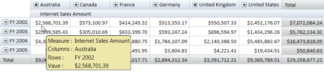

# ToolTip

OlapGrid can additionally display dimension member information within a tooltip when the mouse pointer is moved over the Header Cells or Value Cells of the Grid control.

## HeaderToolTip

OlapGrid provides drill down information through the Header Cell ToolTip for hierarchical dimensions, enabling efficient preview of data before drilling down. It can be enabled using the following property of OlapGrid.


  

    

// Enabling HeaderCell Tooltip

this.OlapGrid1.ShowHeaderCellsToolTip = true;

    

  

    

' Enabling HeaderCell Tooltip

Me.OlapGrid1.ShowHeaderCellsToolTip = True

    



## ValueCellToolTip

OlapGrid provides cell information (Measure, Column Header Value, Row Header Value and Cell Value) when the mouse pointer is hovered on the Value Cells. This property can be enabled by:


  

    

// Enabling Valuecell Tooltip

this.OlapGrid1.ShowValueCellToolTip = true;

    

  

    

' Enabling Valuecell Tooltip

Me.OlapGrid1.ShowValueCellToolTip = True

    



