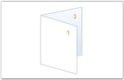

# Booklets

Booklets are documents with multiple pages arranged on sheets of paper. When folded, the paper represents the correct page order. Essential PDF provides support for creating booklets that produces the resulting PDF document that can be printed and stapled in the center to form a booklet. 

For example, assume that you have a 13-page document. Creating a booklet of the document results in a PDF file with 7 pages (page 1, null), (page2, page13), (page3, page12), (page7, page8).

PdfBookletCreator class is used for creating Booklets. The following code example illustrates how to create the Booklet.



//Loads a PDF document.

PdfLoadedDocument ldoc = new PdfLoadedDocument("SamplePDF.pdf");

//Creates booklet with two sides.

PdfDocument doc = PdfBookletCreator.CreateBooklet(ldoc, new SizeF(500, 500), true);

 //Saves the document.

doc.Save("Sample.pdf");





'Loads a PDF document.

Dim ldoc As PdfLoadedDocument = New PdfLoadedDocument("SamplePDF.pdf)

'Creates booklet with two sides.

Dim doc As PdfDocument = PdfBookletCreator.CreateBooklet(ldoc, New SizeF(500, 500), True)

'Saves the document.

doc.Save("Sample.pdf")



The following code example illustrates the overloads of the CreateBooklet method.



CreateBooklet(PdfLoadedDocument, SizeF);

CreateBooklet(PdfLoadedDocument, SizeF, Boolean);

CreateBooklet(String, String, SizeF);

CreateBooklet(PdfLoadedDocument, SizeF, Boolean, PdfMargins);

CreateBooklet(String, String, SizeF, Boolean);


You can also apply margins to the booklets at the time of creating the booklet by using one of the preceding overloads.

 The following code example illustrates how to create a booklet with the following overload: CreateBooklet (PdfLoadedDocument, SizeF, Boolean, PdfMargins).



//Loads a PDF document.

PdfLoadedDocument ldoc = new PdfLoadedDocument("SamplePDF.pdf");

//Specifies the margin.

PdfMargins margin = new PdfMargins();

margin.All = 10;

//Createz booklet with two sides.

PdfDocument doc = PdfBookletCreator.CreateBooklet(ldoc, new SizeF(500, 500), true, margin);

//Saves the document.

doc.Save("Sample.pdf");




'Loads a PDF document.

Dim ldoc As PdfLoadedDocument = New PdfLoadedDocument("SamplePDF.pdf)

'Specifies the margin.

Dim margin As PdfMargins = New PdfMargins()

margin.All = 10

'Creates booklet with two sides.

Dim doc As PdfDocument = PdfBookletCreator.CreateBooklet(ldoc, New SizeF(500, 500), True, margin)

'Saves the document.

doc.Save("Sample.pdf")



