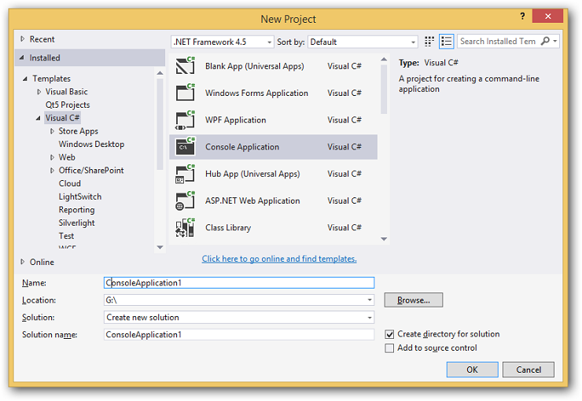
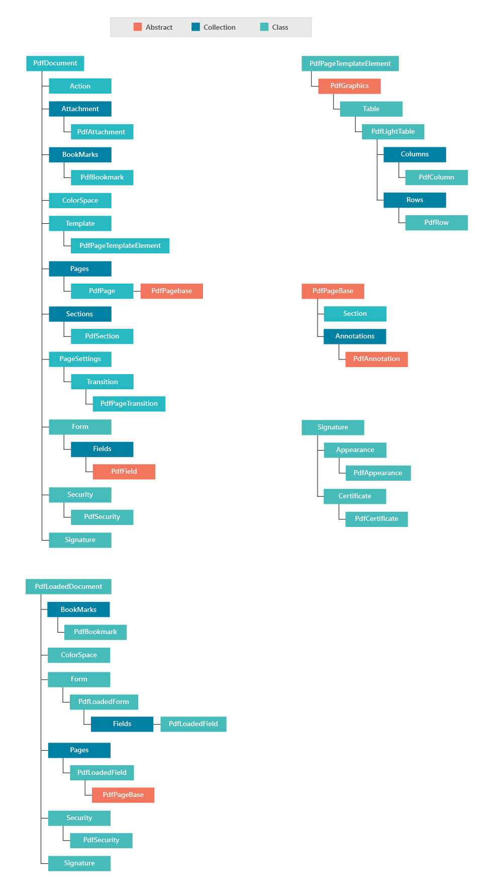
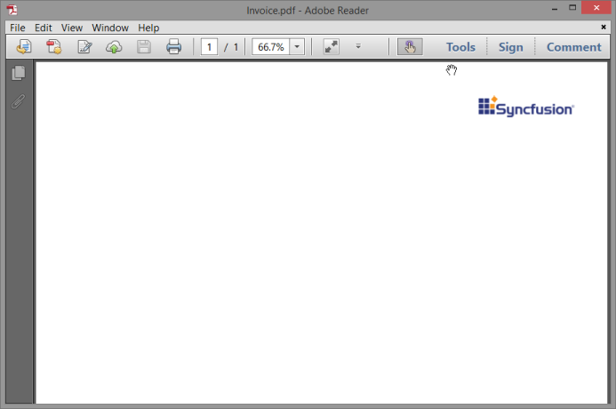
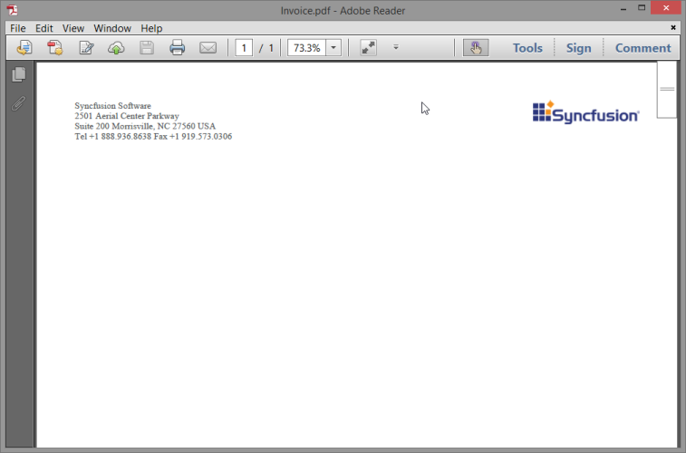
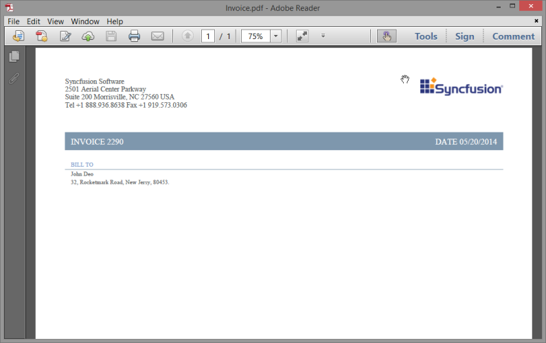
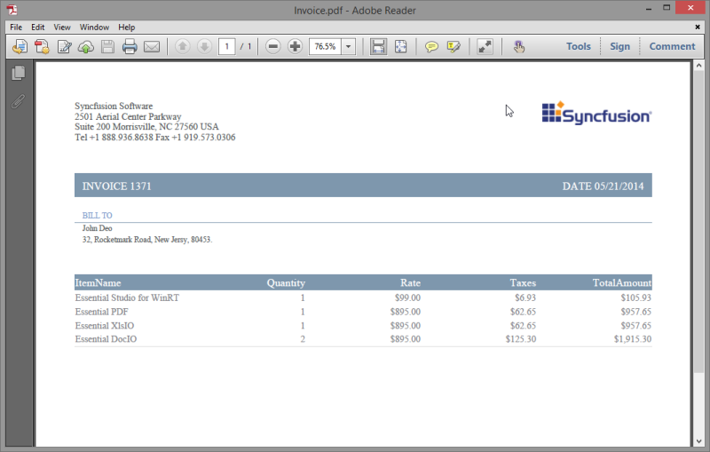

# Getting Started

The following sections guides you to create an Essential PDF document.

## Create a Hello World PDF document

Creating a Console Application

1. Open Microsoft Visual Studio. Open File menu and click New Project. In the New Project dialog, select Console Application template, name the project and click OK.

2. Now you need to deploy Essential PDF into this Console application.
3. Open Solution Explorer of the application that you created. Right-click the Reference folder and then click Add References to Essential PDF assemblies.
4. Add the following assemblies as references in the application.
1. Syncfusion.Core.dll
2. Syncfusion.Compression.Base.dll
3. Syncfusion.Pdf.Base.dll

Create the document

The first thing to do in your code is to create the document that is an instance of PdfDocument class.



PdfDocument document = new PdfDocument();



Create the first page of the document

Once the document is created, add atleast one page in the document. You can achieve this using the Add method of PdfPage object. A page in the document is an instance of PdfPage class.



PdfPage page = document.Pages.Add();



Create the content of the page

After creating the page, you need to fill it with content. The content of a page is created using the PDF graphics property of the page object. Using the Graphics property of the page, you can draw contents to the page. In this sample, you can write a simple text on the page.



PdfGraphics graphics = page.Graphics;

graphics.DrawString("Hello world!", new PdfStandardFont(PdfFontFamily.Helvetica, 12), new PdfSolidBrush(Color.Black), new PointF(20, 20));





Dim graphics As PdfGraphics = page.Graphics

graphics.DrawString("Hello world!", New PdfStandardFont(PdfFontFamily.Helvetica, 12), New PdfSolidBrush(Color.Black), New PointF(20, 20))



When drawing text, a font and brush is required. The brush is used to fill the text outline.

Saving the document

Once the content is added, you can save the document. You can save the document to a stream or file on disk.



document.Save("Sample.pdf");





document.Save("Sample.pdf")



The following code sample illustrates you on how to create a hello world document.



//Creates a new PDF document.

PdfDocument document = new PdfDocument();

//Adds a page.

PdfPage page = document.Pages.Add();

//Creates PDF graphics for the page.

PdfGraphics graphics = page.Graphics;

//Creates a solid brush.

PdfBrush brush = new PdfSolidBrush(Color.Black);

//Sets the font.

PdfFont font = new PdfStandardFont(PdfFontFamily.Helvetica, 12);

//Draws the text.

graphics.DrawString("Hello world!", font, brush, new PointF(20, 20));

//Saves the document.

document.Save("Sample.pdf");





'Creates a new PDF document.

Dim document As PdfDocument = New PdfDocument()

'Adds a page to the document.

Dim page As PdfPage = document.Pages.Add()

'Creates PDF graphics for the page.

Dim graphics As PdfGraphics = page.Graphics

'Creates a solid brush.

Dim brush As PdfBrush = New PdfSolidBrush(Color.Black)

'Sets the font.

Dim font As PdfFont = New PdfStandardFont(PdfFontFamily.Helvetica, 12)

'Draws the text.

graphics.DrawString("Hello world!", font, brush,new PointF(20,20))

'Saves the document.

document.Save("Sample.pdf")


## Asynchronous Support

Essential PDF can read, write, and merge PDF files using asynchronous methods. This is a new approach introduced in Framework 4.5 or greater that enables applications to use asynchronous programming in Windows store apps (WinRT) and in WindowsPhone (WP). The following list of public APIs in Essential PDF support asynchronous programming.

> Note: Asynchronous support is applicable to Windows Store apps and Windows Phone

Method Table

<table>
<tr>
<th>
 Method</th><th>
Overloads</th><th>
Description</th></tr>
<tr>
<td rowspan = "6">
OpenAsync</td><td>
async Task<bool> OpenAsync(StorageFile stFile)</td><td>
Opens an existing PDF document as a storage file.</td></tr>
<tr>
<td>
async Task<bool> OpenAsync(StorageFile stFile,string password)</td><td>
Opens a secure existing PDF document with password.</td></tr>
<tr>
<td>
async Task<bool> OpenAsync(byte[] bytes)</td><td>
Opens an existing PDF document as byte array.</td></tr>
<tr>
<td>
async Task<bool> OpenAsync(byte[] bytes, stringpassword)</td><td>
Opens a secured existing PDF document with password.</td></tr>
<tr>
<td>
async Task<bool> OpenAsync(Stream stream)</td><td>
Opens an existing PDF document as stream.</td></tr>
<tr>
<td>
async Task<bool> OpenAsync(Stream stream, stringpassword)</td><td>
Opens a secured existing PDF document with password.</td></tr>
<tr>
<td>
SaveAsync</td><td>
async Task<bool> SaveAsync(Stream stream)</td><td>
Saves the document to a stream in asynchronous mode.</td></tr>
<tr>
<td>
SaveAsync</td><td>
async Task<bool> SaveAsync(StorageFile stFile)</td><td>
Saves the PDF file as storage file.</td></tr>
<tr>
<td>
Save</td><td>
async Task<bool> Save()</td><td>
Saves the modified document.</td></tr>
<tr>
<td rowspan = "2">
ImportPageAsync</th><th>
async Task<PdfPageBase> ImportPageAsync(PdfLoadedDocument ldDoc, intpageIndex)</td><td rowspan = "2">
Imports a page in asynchronous mode.</td></tr>
<tr>
<td>
async Task<PdfPageBase> ImportPageAsync(PdfLoadedDocument ldDoc,PdfPageBase page)</td></tr>
<tr>
<td>
ImportPageRangeAsync</td><th>
async Task<PdfPageBase> ImportPageRangeAsync(PdfLoadedDocument ldDoc,int startIndex, int endIndex)</td><td>
Imports page range in asynchronous mode.</td></tr>
<tr>
<td>
AppendAsync</td><td>
async Task<bool> AppendAsync(PdfLoadedDocument ldDoc)</td><td>
Appends documents in asynchronous mode.</td></tr>
<tr>
<td>
MergeAsync</td><td>
async static Task<PdfDocumentBase> MergeAsync(PdfDocumentBase dest,PdfLoadedDocument src)</td><td>
Merges documents in asynchronous mode.</td></tr>
</table>
## Class Diagram

The following illustration displays the Class Diagram for Essential PDF.

[PDF Version Compatibility](http://help.syncfusion.com/ug/windows%20forms/pdf/documents/pdfversioncompatibil.htm)

You can view the PDF files generated by Essential PDF using Adobe Acrobat Reader 7.x or later versions. Other conforming Readers that strictly follow Adobe’s PDF specification 1.4 or later also can be used.

> Note: Adobe Reader is free software; hence, the most recent version can be downloaded easily.

Essential PDF allows you to control the version of PDF files using the Version property of the PdfFileStructure class. You need the following settings to control the version and structure.

Version (property)-Specifies the version of the PDF document.

CrossReferenceType (property)-Specifies the type of the cross-reference in the file. This property allows you to present a cross-reference with a standard format in a cross-reference table. The cross-references can also be presented as a cross-reference stream using the CrossReferenceStream property. This format is supported by the PDF 1.5 and higher versions. The files using this format are more compact, especially when compression is used. However, generating such a file takes more time.

> Note: This property marks the file by the specified version only. It does not control the compatibility of the features used in the file.

 The following code example illustrates how to change the PDF version to 1.6



//Creates a new PDF document.

PdfDocument document = new PdfDocument();

//Sets the PDF version.

document.FileStructure.Version = PdfVersion.Version1_6;

//Adds a page.

PdfPage page = document.Pages.Add();

//Creates PDF graphics for the page.

PdfGraphics graphics = page.Graphics;

//Creates a solid brush.

PdfBrush brush = new PdfSolidBrush(Color.Black);

//Sets the font.

PdfFont font = new PdfStandardFont(PdfFontFamily.Helvetica, 12);

//Draws the text.

graphics.DrawString("Hello world!", font, brush, new PointF(20, 20));

//Saves the document.

document.Save("Output.pdf");

//Closes the document.

document.Close();




'Creates a new PDF document.

Dim document As New PdfDocument()

'Sets the PDF version.

document.FileStructure.Version = PdfVersion.Version1_6

'Adds a page.

Dim page As PdfPage = document.Pages.Add()

'Creates PDF graphics for the page.

Dim graphics As PdfGraphics = page.Graphics

'Creates a solid brush.

Dim brush As PdfBrush = New PdfSolidBrush(Color.Black)

'Sets the font.

Dim font As PdfFont = New PdfStandardFont(PdfFontFamily.Helvetica, 12)

'Draws the text.

graphics.DrawString("Hello world!", font, brush, New PointF(20, 20))

'Saves the document.

document.Save("Output.pdf")

'Closes the document.

document.Close()



It is possible to change PDF version for the existing PDF document using the following code sample.



//Creates a new PDF document.

PdfLoadedDocument document = new PdfLoadedDocument("Input.pdf");

//Sets the PDF version.

document.FileStructure.Version = PdfVersion.Version1_7;

document.FileStructure.IncrementalUpdate = false;

//Saves the document.

document.Save("Output.pdf");

//Closes the document.

document.Close();





'Creates a new PDF document.

Dim document As New PdfLoadedDocument("Input.pdf")

'Sets the PDF version.

document.FileStructure.Version = PdfVersion.Version1_7

document.FileStructure.IncrementalUpdate = False

'Saves the document.

document.Save("Output.pdf")

'Closes the document.

document.Close()


## PDF Features

Supported and non-supported elements of Essential PDF for Windows, ASP.NET, WPF, ASP.NET MVC, Silverlight, and Windows Store apps are listed in the following table.

List of supported and non-supported elements of Essential PDF

<table>
<tr>
<th>
Features</th><th colspan = "2">
Windows Forms/WPF</th><th>
ASP.NET/ ASP.NET MVC(Medium Trust)</th><th colspan = "2">
Silverlight</th><th colspan = "2">
Windows Store Apps</th></tr>
<tr>
<td>
Drawing Text</td><td colspan = "2">
Yes</td><td>
Yes</td><td colspan = "2">
Yes</td><td colspan = "2">
Yes</td></tr>
<tr>
<td>
Text Formatting</td><td colspan = "2">
Yes</td><td>
Yes</td><td colspan = "2">
Yes</td><td colspan = "2">
Yes</td></tr>
<tr>
<td>
Multilingual Support</td><td colspan = "2">
Yes</td><td>
No</td><td colspan = "2">
No</td><td colspan = "2">
No</td></tr>
<tr>
<td>
Drawing RTL text</td><td colspan = "2">
Yes</td><td>
No</td><td colspan = "2">
No</td><td colspan = "2">
No</td></tr>
<tr>
<td>
Text Extraction</td><td colspan = "2">
Yes</td><td>
Yes</td><td colspan = "2">
No</td><td colspan = "2">
No</td></tr>
<tr>
<td>
Unicode</td><td colspan = "2">
Yes</td><td>
No</td><td colspan = "2">
No</td><td colspan = "2">
No</td></tr>
<tr>
<td>
Pagination</td><td colspan = "2">
Yes</td><td>
Yes</td><td colspan = "2">
Yes</td><td colspan = "2">
Yes</td></tr>
<tr>
<td colspan = "8">
Graphics</td></tr>
<tr>
<td>
Pen and Brush</td><td colspan = "2">
Yes</td><td>
Yes</td><td colspan = "2">
Yes</td><td colspan = "2">
Yes</td></tr>
<tr>
<td>
Layers</td><td colspan = "2">
Yes</td><td>
Yes</td><td colspan = "2">
Yes</td><td colspan = "2">
Yes</td></tr>
<tr>
<td>
Transparent Graphics</td><td colspan = "2">
Yes</td><td>
Yes</td><td colspan = "2">
No</td><td colspan = "2">
No</td></tr>
<tr>
<td>
Color Spaces</td><td colspan = "2">
Yes</td><td>
Yes</td><td colspan = "2">
Yes</td><td colspan = "2">
Yes</td></tr>
<tr>
<td>
Image Extraction</td><td colspan = "2">
Yes</td><td>
Yes</td><td colspan = "2">
No</td><td colspan = "2">
No</td></tr>
<tr>
<td>
Enhanced Printing Support</td><td colspan = "2">
Yes</td><td>
Yes</td><td colspan = "2">
Yes</td><td colspan = "2">
Yes</td></tr>
<tr>
<td>
Barcode</td><td colspan = "2">
Yes</td><td>
Yes</td><td colspan = "2">
No</td><td colspan = "2">
No</td></tr>
<tr>
<td colspan = "8">
Document–level Operations</td></tr>
<tr>
<td>
Merge Documents</td><td colspan = "2">
Yes</td><td>
Yes</td><td colspan = "2">
Yes</td><td colspan = "2">
Yes</td></tr>
<tr>
<td>
Split Documents</td><td colspan = "2">
Yes</td><td>
Yes</td><td colspan = "2">
Yes</td><td colspan = "2">
Yes</td></tr>
<tr>
<td>
Overlay Documents</td><td colspan = "2">
Yes</td><td>
Yes</td><td colspan = "2">
Yes</td><td colspan = "2">
Yes</td></tr>
<tr>
<td>
Import Pages</td><td colspan = "2">
Yes</td><td>
Yes</td><td colspan = "2">
Yes</td><td colspan = "2">
Yes</td></tr>
<tr>
<td>
Stamp</td><td colspan = "2">
Yes</td><td>
Yes</td><td colspan = "2">
Yes</td><td colspan = "2">
Yes</td></tr>
<tr>
<td>
Booklet</td><td>
Yes</td><td colspan = "2">
Yes</td><td colspan = "2">
Yes</td><td colspan = "2">
Yes</td></tr>
<tr>
<td colspan = "8">
Document Settings</td></tr>
<tr>
<td>
Custom Metadata</td><td colspan = "2">
Yes</td><td>
Yes</td><td colspan = "2">
No</td><td colspan = "2">
No</td></tr>
<tr>
<td>
Document Properties</td><td colspan = "2">
Yes</td><td>
Yes</td><td colspan = "2">
Yes</td><td colspan = "2">
Yes</td></tr>
<tr>
<td>
Page Orientation</td><td colspan = "2">
Yes</td><td>
Yes</td><td colspan = "2">
Yes</td><td colspan = "2">
Yes</td></tr>
<tr>
<td>
Page Sizes</td><td colspan = "2">
Yes</td><td>
Yes</td><td colspan = "2">
Yes</td><td colspan = "2">
Yes</td></tr>
<tr>
<td>
Viewer Preferences</td><td colspan = "2">
Yes</td><td>
Yes</td><td colspan = "2">
Yes</td><td colspan = "2">
Yes</td></tr>
<tr>
<td colspan = "8">
Forms</td></tr>
<tr>
<td>
Fields</td><td colspan = "2">
Yes</td><td>
Yes</td><td colspan = "2">
Yes</td><td colspan = "2">
Yes</td></tr>
<tr>
<td>
Form Filling</td><td colspan = "2">
Yes</td><td>
Yes</td><td colspan = "2">
Yes</td><td colspan = "2">
Yes</td></tr>
<tr>
<td>
Flatten</td><td colspan = "2">
Yes</td><td>
Yes</td><td colspan = "2">
Yes</td><td colspan = "2">
Yes</td></tr>
<tr>
<td>
Import Form Data</td><td colspan = "2">
Yes</td><td>
Yes</td><td colspan = "2">
Yes</td><td colspan = "2">
Yes</td></tr>
<tr>
<td>
Form Export</td><td colspan = "2">
Yes</td><td>
Yes</td><td colspan = "2">
Yes</td><td colspan = "2">
Yes</td></tr>
<tr>
<td colspan = "8">
Document Conversion</td></tr>
<tr>
<td>
TIFF to PDF</td><td colspan = "2">
Yes</td><td>
No</td><td colspan = "2">
No</td><td colspan = "2">
No</td></tr>
<tr>
<td>
HTML to PDF</td><td colspan = "2">
Yes</td><td>
No</td><td colspan = "2">
No</td><td colspan = "2">
No</td></tr>
<tr>
<td>
RTF To PDF</td><td colspan = "2">
Yes</td><td>
No</td><td colspan = "2">
No</td><td colspan = "2">
No</td></tr>
<tr>
<td>
DOC To PDF</td><td colspan = "2">
Yes</td><td>
No</td><td colspan = "2">
No</td><td colspan = "2">
No</td></tr>
<tr>
<td>
Excel To PDF</td><td colspan = "2">
Yes</td><td>
No</td><td colspan = "2">
No</td><td colspan = "2">
No</td></tr>
<tr>
<td>
PDF OCR</td><td colspan = "2">
Yes</td><td>
No</td><td colspan = "2">
No</td><td colspan = "2">
No</td></tr>
<tr>
<td colspan = "8">
PDF Standards</td></tr>
<tr>
<td>
PDF/ A-1b Compliance</td><td colspan = "2">
Yes</td><td>
Yes</td><td colspan = "2">
Yes</td><td colspan = "2">
Yes</td></tr>
<tr>
<td>
PDF/x1a: 2001 Compliance</td><td colspan = "2">
Yes</td><td>
Yes</td><td colspan = "2">
Yes</td><td colspan = "2">
Yes</td></tr>
<tr>
<td colspan = "8">
Fonts</td></tr>
<tr>
<td>
Standard Fonts</td><td colspan = "2">
Yes</td><td>
Yes</td><td colspan = "2">
Yes</td><td colspan = "2">
Yes</td></tr>
<tr>
<td>
CJK Fonts</td><td colspan = "2">
Yes</td><td>
Yes</td><td colspan = "2">
Yes</td><td colspan = "2">
Yes</td></tr>
<tr>
<td>
True Type Fonts</td><td colspan = "2">
Yes</td><td>
No</td><td colspan = "2">
No</td><td colspan = "2">
No</td></tr>
<tr>
<td>
Unicode True Type</td><td colspan = "2">
Yes</td><td>
No</td><td colspan = "2">
No</td><td colspan = "2">
No</td></tr>
<tr>
<td colspan = "8">
Images</td></tr>
<tr>
<td>
Scalar Images</td><td colspan = "2">
Yes</td><td>
Yes</td><td colspan = "2">
Yes*</td><td colspan = "2">
Yes*</td></tr>
<tr>
<td>
Soft Mask</td><td colspan = "2">
Yes</td><td>
Yes</td><td colspan = "2">
Yes</td><td colspan = "2">
Yes</td></tr>
<tr>
<td>
Vector Images</td><td colspan = "2">
Yes</td><td>
No</td><td colspan = "2">
No</td><td colspan = "2">
No</td></tr>
<tr>
<td>
Watermarks</td><td colspan = "2">
Yes</td><td>
Yes</td><td colspan = "2">
Yes</td><td colspan = "2">
Yes</td></tr>
<tr>
<td colspan = "8">
Tables</td></tr>
<tr>
<td>
ADO.Net Tables Support</td><td colspan = "2">
Yes</td><td>
Yes</td><td colspan = "2">
No</td><td colspan = "2">
No</td></tr>
<tr>
<td>
Cell / Row / Column Formatting</td><td colspan = "2">
Yes</td><td>
Yes</td><td colspan = "2">
Yes</td><td colspan = "2">
Yes</td></tr>
<tr>
<td>
Header</td><td colspan = "2">
Yes</td><td>
Yes</td><td colspan = "2">
Yes</td><td colspan = "2">
Yes</td></tr>
<tr>
<td>
Pagination</td><td colspan = "2">
Yes</td><td>
Yes</td><td colspan = "2">
Yes</td><td colspan = "2">
Yes</td></tr>
<tr>
<td>
Borders</td><td colspan = "2">
Yes</td><td>
Yes</td><td colspan = "2">
Yes</td><td colspan = "2">
Yes</td></tr>
<tr>
<td>
RowSpan** and ColumnSpan</td><td colspan = "2">
Yes</td><td>
Yes</td><td colspan = "2">
Yes</td><td colspan = "2">
Yes</td></tr>
<tr>
<td>
Nested**</td><td colspan = "2">
Yes</td><td>
Yes</td><td colspan = "2">
Yes</td><td colspan = "2">
Yes</td></tr>
<tr>
<td>
Cell Padding and Spacing</td><td colspan = "2">
Yes</td><td>
Yes</td><td colspan = "2">
Yes</td><td colspan = "2">
Yes</td></tr>
<tr>
<td colspan = "8">
Page Level Operations</td></tr>
<tr>
<td>
Headers and Footers</td><td colspan = "2">
Yes</td><td>
Yes</td><td colspan = "2">
Yes</td><td colspan = "2">
Yes</td></tr>
<tr>
<td>
Page Label</td><td colspan = "2">
Yes</td><td>
Yes</td><td colspan = "2">
Yes</td><td colspan = "2">
Yes</td></tr>
<tr>
<td>
Automatic Fields</td><td colspan = "2">
Yes</td><td>
Yes</td><td colspan = "2">
Yes</td><td colspan = "2">
Yes</td></tr>
<tr>
<td colspan = "10">
 Interactive Elements</td></tr>
<tr>
<td>
3D-Annotation</td><td colspan = "2">
Yes</td><td colspan = "2">
Yes</td><td colspan = "2">
Yes</td><td colspan = "3">
Yes</td></tr>
<tr>
<td>
Action</td><td colspan = "2">
Yes</td><td colspan = "2">
Yes</td><td colspan = "2">
Yes</td><td colspan = "3">
Yes</td></tr>
<tr>
<td>
Attachment</td><td colspan = "2">
Yes</td><td colspan = "2">
Yes</td><td colspan = "2">
Yes</td><td colspan = "3">
Yes</td></tr>
<tr>
<td>
Bookmark</td><td colspan = "2">
Yes</td><td colspan = "2">
Yes</td><td colspan = "2">
Yes</td><td colspan = "3">
Yes</td></tr>
<tr>
<td>
Hyperlink</td><td colspan = "2">
Yes</td><td colspan = "2">
Yes</td><td colspan = "2">
Yes</td><td colspan = "3">
Yes</td></tr>
<tr>
<td colspan = "10">
Security</td></tr>
<tr>
<td>
Digital Signature</td><td colspan = "2">
Yes</td><td colspan = "2">
No</td><td colspan = "2">
No</td><td colspan = "3">
No</td></tr>
<tr>
<td>
Encryption and Decryption</td><td colspan = "2">
Yes</td><td colspan = "2">
Yes</td><td colspan = "2">
No</td><td colspan = "3">
Yes</td></tr>
</table>

> Note:*Only .Jpeg format images are supported for Silverlight version.

**Supported only in PdfGrid class

## Usage of Essential PDF in realtime scenario

This article explains you the various steps required to create a basic invoice document using fundamental elements such as text, table, images, and footer. The following screenshot illustrates you a simple invoice created using Essential PDF library.

### Points to remember

Before you move into creation of the invoice document, you need to remember the following key points.

* All the units in PDF are measured in points. In case the measurement is to be converted from pixels, it can be done using the PdfConverter static class present in the Syncfusion.Pdf.Graphics Namespace.
* In PDF, objects (text, images, tables, etc.) are placed in an absolute position.  To prevent the objects from overlapping and being misplaced, PdfLayoutResult class helps you in positioning an object, relative to the previously added object, by returning its bounds. 
### Page settings

As an initial step, you need to add a new page and page settings to the document. 



//Initializes a document.

PdfDocument document = new PdfDocument();

//Sets landscape orientation for the pages.

document.PageSettings.Orientation = PdfPageOrientation.Landscape;

//Sets the margin for all the pages as 50 points.

document.PageSettings.Margins.All = 50;

//Adds the page to the document.

PdfPage page = document.Pages.Add();





'Initializes a document.

Dim document As New PdfDocument()

'Sets landscape orientation for the pages.

document.PageSettings.Orientation = PdfPageOrientation.Landscape

'Sets the margin for all the pages as 50 points.

document.PageSettings.Margins.All = 50

'Adds the page to the document.

Dim page As PdfPage = document.Pages.Add()


The above code creates a landscape PDF and sets the four margins of the pages as 50 points. The following image illustrates you how the document looks after adding the page settings.

### Add logo to the invoice 

As you can see in the Simple Invoice image, a logo is added at the top-right corner of the document. To add the logo at a very top position of the page, the following code sample allows you to load an image using the Essential Pdf API and draw it on the PDF page. 

 

//Creates graphics instance of the page.

PdfGraphics g = page.Graphics;

//Loads image stream.

Stream imgStream = new FileStream("Syncfusion.png", FileMode.Open, FileAccess.Read);

//Creates a PdfImage object from the loaded image stream.

PdfImage img = PdfImage.FromStream(imgStream);

//Draws the image on to the PDF page graphics.

page.Graphics.DrawImage(img, new RectangleF(g.ClientSize.Width - img.Width, 0, img.Width, img.Height));





'Creates graphics instance of the page.

Dim g As PdfGraphics = page.Graphics

'Loads the image stream.

Dim imgStream As Stream = New FileStream("Syncfusion.png", FileMode.Open, FileAccess.Read)

'Creates a PdfImage object from loaded image stream.

Dim img As PdfImage = PdfImage.FromStream(imgStream)

'Draws the image on to the PDF page graphics.

page.Graphics.DrawImage(img, New RectangleF(g.ClientSize.Width - img.Width, 0, img.Width, img.Height))


In the above code, the X- coordinate of the image is chosen from the right corner of the page by calculating the difference of the page width and the image width. The following screenshot illustrates how the document appears after adding the logo.

### Add an address to the page

As you can see in the invoice image, the address of the sender is added to the left corner of the invoice. The following code sample explains you on how to add an address to the page.



//Creates a text element and assigns the text to be added.

PdfTextElement element = new PdfTextElement(@"Syncfusion Software 

2501 Aerial Center Parkway 

Suite 200 Morrisville, NC 27560 USA 

Tel +1 888.936.8638 Fax +1 919.573.0306");

//Choses the font, size, and style of the text.

element.Font = new PdfStandardFont(PdfFontFamily.TimesRoman, 12);

//Selects the brush by specifying the RGB value of color or from the set of       inbuilt colors.

element.Brush = new PdfSolidBrush(new PdfColor(89, 89, 93));

//Draws the text on to the page and obtains the layout result of the text.

PdfLayoutResult result = element.Draw(page, new RectangleF(0, 0, page.Graphics.ClientSize.Width / 2, 200));





'Creates a text element and assigns the text to be added.

Dim element As New PdfTextElement("Syncfusion Software " & vbCr & vbLf & "            2501 Aerial Center Parkway " & vbCr & vbLf & "            Suite 200 Morrisville, NC 27560 USA " & vbCr & vbLf & "            Tel +1 888.936.8638 Fax +1 919.573.0306")

'Choses the font, size, and style of the text.

element.Font = New PdfStandardFont(PdfFontFamily.TimesRoman, 12)

'Selects the brush by specifying the RGB value of color or from the set of       inbuilt colors.

element.Brush = New PdfSolidBrush(New PdfColor(89, 89, 93))

'Draws the text on to the page and obtains the layout result of the text.

Dim result As PdfLayoutResult = element.Draw(page, New RectangleF(0, 0, page.Graphics.ClientSize.Width / 2, 200))



Specify the essential properties of the text such as font, brush, etc., and draw the text to the left most corner (0,0 – coordinate) of the page. Note that the PdfTextElement returns the layout result of the text element that helps you to add the next element without overlapping. The following screenshot displays the document after adding the sender’s address.

### Add the invoice contents

#### Add the invoice number and date 

Now, move on to the body of the invoice. The body contains the invoice number, date, and buyer’s address. The invoice number and date are placed on a solid rectanglular box to provide a good appearance. You can use the following code to draw a filled rectangle by mentioning the RGB value of the brush. Note that you used the layout result of the previously added object (address) and added a distance of 40 points from there.



//Adds a rectangle that contains the invoice number and date.

g.DrawRectangle(new PdfSolidBrush(new PdfColor(126, 151, 173)), new RectangleF(0, result.Bounds.Bottom + 40, g.ClientSize.Width, 30));





'Adds a rectangle that contains the invoice number and date.

g.DrawRectangle(New PdfSolidBrush(New PdfColor(126, 151, 173)), New RectangleF(0, result.Bounds.Bottom + 40, g.ClientSize.Width, 30))


Create a font for the subheadings. Specify the font size, style, and color of the brush. Create a new PdfTextElement object and add the invoice number from the database. Finally, you can add the text element to the page using the layout result as mentioned in the following code sample.



//Creates a font and style for the subheadings.

PdfFont subHeadingFont = new PdfStandardFont(PdfFontFamily.TimesRoman, 14);

//Creates a text element to add the invoice number.

element = new PdfTextElement("INVOICE " + billInfo.InvoiceNumber.ToString(), subHeadingFont);

//Creates a white brush.

element.Brush = PdfBrushes.White;

//Draws the text element on to the page and gets the layout result.

result = element.Draw(page, new PointF(10, result.Bounds.Bottom + 48));





'Creates a font and style for the subheadings.

Dim subHeadingFont As PdfFont = New PdfStandardFont(PdfFontFamily.TimesRoman, 14)

'Creates a text element to add the invoice number.

element = New PdfTextElement("INVOICE " + billInfo.InvoiceNumber.ToString(), subHeadingFont)

'Creates a white brush.

element.Brush = PdfBrushes.White

'Draws the text element on to the page and gets the layout result.

result = element.Draw(page, New PointF(10, result.Bounds.Bottom + 48))



Similarly, you can create a text element for the current date and do not forget to reuse the font that is created for the subheading.



//Gets the current date.

string currentDate = "DATE " + DateTime.Now.ToString("MM/dd/yyyy");

//Measures the text size.

SizeF textSize = subHeadingFont.MeasureString(currentDate);

//Draws the date to the invoice page.

g.DrawString(currentDate, subHeadingFont, element.Brush, new PointF(g.ClientSize.Width - textSize.Width - 10, result.Bounds.Y));





'Gets the current date.

Dim currentDate As String = "DATE " + DateTime.Now.ToString("MM/dd/yyyy")

'Measures the text size.

Dim textSize As SizeF = subHeadingFont.MeasureString(currentDate)

'Draws the date to the invoice page.

g.DrawString(currentDate, subHeadingFont, element.Brush, New PointF(g.ClientSize.Width - textSize.Width - 10, result.Bounds.Y))



The invoice document appears like the following screenshot with the added invoice number and date.

#### Add the buyer’s address

For adding the buyer’s address, follow the steps that you did for the sender’s address. Here, you can use some different fonts and brushes to improve the appearance. Refer the following code sample.



//Creates a text element for the address. 

element = new PdfTextElement("BILL TO ", new PdfStandardFont(PdfFontFamily.TimesRoman, 10));

//Creates a new brush.

element.Brush = new PdfSolidBrush(new PdfColor(126, 155, 203));

//Adds the text element at 25 points below the previously added element with an arbitrary x – coordinate.

result = element.Draw(page, new PointF(10, result.Bounds.Bottom + 25));





'Creates a text element for the address. 

element = New PdfTextElement("BILL TO ", New PdfStandardFont(PdfFontFamily.TimesRoman, 10))

'Creates a new brush.

element.Brush = New PdfSolidBrush(New PdfColor(126, 155, 203))

'Adds the text element at 25 points below the previously added element with an arbitrary x – coordinate.

result = element.Draw(page, New PointF(10, result.Bounds.Bottom + 25))


Adding shapes to the PDF document follows similar APIs as that of Windows GDI plus APIs. Here, to provide a pleasant appearance you can add a line following the heading. To achieve this refer the following code.



//Draws a line from the left corner to the right corner of the page.

g.DrawLine(new PdfPen(new PdfColor(126, 151, 173), 0.70f), new PointF(0, result.Bounds.Bottom + 3), new PointF(g.ClientSize.Width, result.Bounds.Bottom + 3));





'Draws a line from the left corner to the right corner of the page.

g.DrawLine(New PdfPen(New PdfColor(126, 151, 173), 0.7F), New PointF(0, result.Bounds.Bottom + 3), New PointF(g.ClientSize.Width, result.Bounds.Bottom + 3))


A line is added using a pen color that stretches from left corner to the right corner at a Y-cordinate of 3 points following the previous object. Add the address lines as did before.



//Adds the name of the buyer.

element = new PdfTextElement(billInfo.Name, new PdfStandardFont(PdfFontFamily.TimesRoman, 10));

element.Brush = new PdfSolidBrush(new PdfColor(89, 89, 93));

result = element.Draw(page, new RectangleF(10, result.Bounds.Bottom + 5, g.ClientSize.Width / 2, 100));

//Adds the buyer's address.

element = new PdfTextElement(billInfo.Address, new PdfStandardFont(PdfFontFamily.TimesRoman, 10));

element.Brush = new PdfSolidBrush(new PdfColor(89, 89, 93));

result = element.Draw(page, new RectangleF(10, result.Bounds.Bottom + 3, g.ClientSize.Width / 2, 100));





'Adds the name of the buyer.

element = New PdfTextElement(billInfo.Name, New PdfStandardFont(PdfFontFamily.TimesRoman, 10))

element.Brush = New PdfSolidBrush(New PdfColor(89, 89, 93))

result = element.Draw(page, New RectangleF(10, result.Bounds.Bottom + 5, g.ClientSize.Width / 2, 100))

'Adds the buyer's address.

element = New PdfTextElement(billInfo.Address, New PdfStandardFont(PdfFontFamily.TimesRoman, 10))

element.Brush = New PdfSolidBrush(New PdfColor(89, 89, 93))

result = element.Draw(page, New RectangleF(10, result.Bounds.Bottom + 3, g.ClientSize.Width / 2, 100))



The following screenshot displays a PDF document with content.

### Insert a table in the document

The most important part of the invoice is the table creation. Essential PDF contain two types of table models. 

PdfLightTable – to provide high level table and cell customizations.

PdfGrid – light weight and provides easy cell customizations.

In this document, you require only a low level customization and it can be achieved using a PdfGrid.

A PdfGrid can accept data source in the form of Datatable, DataSet, or an IEnumerable collection. Also, the contents/value of the cells can be added directly. In this example, a DataTable object is used as a data source.   



//Creates a PdfGrid object.

PdfGrid grid = new PdfGrid();

//Adds the datasource to the grid.

grid.DataSource = dataSource;





'Creates a PdfGrid object.

Dim grid As New PdfGrid()

'Adds the datasource to the grid.

grid.DataSource = dataSource


The above code explains you on how to create a PdfGrid object and to assign a data source to it.

#### Create row styles 

As you can see in the invoice image, the table has a different header style than that of the other rows. Using the PdfGridCellStyle class, the properties and appearance of an individual cell/row such as font, border, background image, background color, etc. can be modified. You can achieve this using the following code sample.



//Gets the header of the PdfGrid.

PdfGridRow header = grid.Headers[0];

//Creates a cellstyle for header cells.

PdfGridCellStyle headerStyle = new PdfGridCellStyle();

//Creates border color brush by specifying the color.

headerStyle.Borders.All = new PdfPen(new PdfColor(126, 151, 173));

//Creates a background brush.

headerStyle.BackgroundBrush = new PdfSolidBrush(new PdfColor(126, 151, 173));

//Creates a text brush.

headerStyle.TextBrush = PdfBrushes.White;

//Creates a header font.

headerStyle.Font = new PdfStandardFont(PdfFontFamily.TimesRoman, 14f, PdfFontStyle.Regular);

//Applies the created style to the header.

header.ApplyStyle(headerStyle);




'Gets the header of the PdfGrid.

Dim header As PdfGridRow = grid.Headers(0)

'Creates a cellstyle for header cells.

Dim headerStyle As New PdfGridCellStyle()

'Creates border color brush by specifying the color.

headerStyle.Borders.All = New PdfPen(New PdfColor(126, 151, 173))

'Creates a background brush.

headerStyle.BackgroundBrush = New PdfSolidBrush(New PdfColor(126, 151, 173))

'Creates a text brush.

headerStyle.TextBrush = PdfBrushes.White

'Creates a header font.

headerStyle.Font = New PdfStandardFont(PdfFontFamily.TimesRoman, 14.0F, PdfFontStyle.Regular)

'Applies the created style to the header.

header.ApplyStyle(headerStyle)



From the above code, a cell style with a background color is created for the header row and applied using the ApplyStyle() style method. Moving on to the string format, the first column of the table is always left aligned and the other columns are right aligned. Using the PdfStringFormat class, you can modify the alignment (horizontal and vertical), character spacing, word spacing, and few other properties of the text. The following code iterates through the header cells and sets the string format for them.  



//Assigns string format to individual cells of the header.

for (int i = 0; i < header.Cells.Count; i++)

{

if (i == 0)

//Text in the first column is left aligned.

header.Cells[i].StringFormat = new PdfStringFormat(PdfTextAlignment.Left, PdfVerticalAlignment.Middle);

else

//Text in the other columns is right aligned.

header.Cells[i].StringFormat = new PdfStringFormat(PdfTextAlignment.Right, PdfVerticalAlignment.Middle);

}





'Assigns string format to individual cells of the header.

For i As Integer = 0 To header.Cells.Count - 1

If i = 0 Then

'Text in the first colum is left aligned.

header.Cells(i).StringFormat = New PdfStringFormat(PdfTextAlignment.Left, PdfVerticalAlignment.Middle)

Else

'Text in the other columns is right aligned.

header.Cells(i).StringFormat = New PdfStringFormat(PdfTextAlignment.Right, PdfVerticalAlignment.Middle)

End If

Next



For other rows, you can assign the cell style and string format for them just as for the header row. As seen in the image, the rows and cells are borderless. Hence, you can set the border brush as white to achieve the borderless appearance.  Remember that, internally you draw one cell at a time and the border brush/style of the next cell can override the previously drawn cell. The folowing code explains how to achieve the appearance for the other rows.



//Creates a cell style.

PdfGridCellStyle cellStyle = new PdfGridCellStyle();

//Sets the border as white to create a borderless appearance.

cellStyle.Borders.All = PdfPens.White;

//Assigns a different border for the bottom of the table.

cellStyle.Borders.Bottom = new PdfPen(new PdfColor(217, 217, 217), 0.70f);

//Creates a new font style for the other rows of the table.

cellStyle.Font = new PdfStandardFont(PdfFontFamily.TimesRoman, 12f);

//Creates a new brush for the other rows of the table.

cellStyle.TextBrush = new PdfSolidBrush(new PdfColor(131, 130, 136));

//Assigns cell style and string format to individual cells of the table rows.

foreach (PdfGridRow row in grid.Rows)

{

//Sets the cell style for the rows.

row.ApplyStyle(cellStyle);

 for (int i = 0; i < row.Cells.Count; i++)

{

PdfGridCell cell = row.Cells[i];

if (i == 0)

//Texts in the first column is left aligned.

cell.StringFormat = new PdfStringFormat(PdfTextAlignment.Left, PdfVerticalAlignment.Middle);

else

//Text in the other columns is right aligned.

cell.StringFormat = new PdfStringFormat(PdfTextAlignment.Right, PdfVerticalAlignment.Middle);

if (i > 1)

float val = float.MinValue;

float.TryParse(cell.Value.ToString(), out val);

//Assigns the value with a currency format.

}

}

}




'Creates a cell style.

Dim cellStyle As New PdfGridCellStyle()

'Sets the border as white to create a borderless appearance.

cellStyle.Borders.All = PdfPens.White

'Assign a different border for the bottom of the table.

cellStyle.Borders.Bottom = New PdfPen(New PdfColor(217, 217, 217), 0.7F)

'Creates a new font style for the other rows of the table.

cellStyle.Font = New PdfStandardFont(PdfFontFamily.TimesRoman, 12.0F)

'Creates a new brush for the other rows of the table.

cellStyle.TextBrush = New PdfSolidBrush(New PdfColor(131, 130, 136))

'Assigns cell style and string format to individual cells of the table rows.

For Each row As PdfGridRow In grid.Rows

'Sets the cell style for the rows.

row.ApplyStyle(cellStyle)

For i As Integer = 0 To row.Cells.Count - 1

Dim cell As PdfGridCell = row.Cells(i)

If i = 0 Then

'Text in the first column is left aligned.

cell.StringFormat = New PdfStringFormat(PdfTextAlignment.Left, PdfVerticalAlignment.Middle)

Else

'Text in the other columns is right aligned.

cell.StringFormat = New PdfStringFormat(PdfTextAlignment.Right, PdfVerticalAlignment.Middle)

End If

If i > 1 Then

Dim val As Single = Single.MinValue

Single.TryParse(cell.Value.ToString(), val)

'Assigns the value with a currency format.

cell.Value = val.ToString("C")

End If

Next

Next


#### Create a layout format

Layout format plays an important role in drawing or adding very large contents to the PDF document. You may/may not need the table or contents to flow across pages. Also, you need to specify a location where the contents should start to paginate. In such cases, the layout format plays an important role. In PdfGrid, this is achieved using the PdfGridLayoutFormat class. The PdfGridLayoutFormat class helps to specify the layout type (paginate or fit page) and the paginate bounds. For example, to allow the grid to paginate across pages, to create a multipage invoice in case the content of the table is large.



//Creates a grid layout format.

PdfGridLayoutFormat layoutFormat = new PdfGridLayoutFormat();

//Allows the grid to paginate across pages.

layoutFormat.Layout = PdfLayoutType.Paginate;





'Creates a grid layout format.

Dim layoutFormat As New PdfGridLayoutFormat()

'Allows the grid to paginate across pages.

layoutFormat.Layout = PdfLayoutType.Paginate


#### Draw the grid to the PDF page

The Draw() method of the PdfGrid helps to draw the grid to the PDF page. The draw method takes several overloads. However, in this case, you can pass the rectangle and the layout format as parameters. You can also get the layout result of the grid to facilitate drawing the other contents following the grid.



//Draws the PdfGrid to the page by passing the rectangle and layout format parameters.

PdfGridLayoutResult gridResult = grid.Draw(page, new RectangleF(new PointF(0, result.Bounds.Bottom + 40), new SizeF(g.ClientSize.Width, g.ClientSize.Height - 100)), layoutFormat);





'Draws the PdfGrid to the page by passing the rectangle and layout format parameters.

Dim gridResult As PdfGridLayoutResult = grid.Draw(page, New RectangleF(New PointF(0, result.Bounds.Bottom + 40), New SizeF(g.ClientSize.Width, g.ClientSize.Height - 100)), layoutFormat)



The invoice document appears like the following image after drawing the table to the page.

### Addthe summary and footer to the invoice

Now, with the layout result of the grid, you can add some notes such as total due and other lines following the grid. In this example, as displayed in the image, add those text-lines following the fourth and fifth column of the grid. The following code explains the same.



//Calculates the position of the fourth column by adding their widths.

float pos = 0.0f;

for (int i = 0; i < grid.Columns.Count - 1; i++)

pos += grid.Columns[i].Width;

//Creates a font. 

PdfFont font = new PdfStandardFont(PdfFontFamily.TimesRoman, 14f);

//Adds the "Total Due" label below the fourth column.

gridResult.Page.Graphics.DrawString("Total Due", font, new PdfSolidBrush(new PdfColor(126, 151, 173)), new RectangleF(new PointF(pos, gridResult.Bounds.Bottom + 20), new SizeF(grid.Columns[3].Width - pos, 20)), new PdfStringFormat(PdfTextAlignment.Right));

//Adds salutation below the fourth column.

gridResult.Page.Graphics.DrawString("Thank you for your business!", new PdfStandardFont(PdfFontFamily.TimesRoman, 12), new PdfSolidBrush(new PdfColor(89, 89, 93)), new PointF(pos - 55, gridResult.Bounds.Bottom + 60));

//Calculates the position of the fifth row.

pos += grid.Columns[4].Width;

//Adds the total due value in currency format below the fifth column.

gridResult.Page.Graphics.DrawString(totalDue.ToString("C"), font, new PdfSolidBrush(new PdfColor(131, 130, 136)), new RectangleF(new PointF(pos, gridResult.Bounds.Bottom + 20), new SizeF(grid.Columns[4].Width - pos, 20)), new PdfStringFormat(PdfTextAlignment.Right));





'Calculates the position of the fourth column by adding their widths.

Dim pos As Single = 0.0F

For i As Integer = 0 To grid.Columns.Count - 2

pos += grid.Columns(i).Width

Next

'Creates a font. 

Dim font As PdfFont = New PdfStandardFont(PdfFontFamily.TimesRoman, 14.0F)

'Adds the "Total Due" label below the fourth column.

gridResult.Page.Graphics.DrawString("Total Due", font, New PdfSolidBrush(New PdfColor(126, 151, 173)), New RectangleF(New PointF(pos, gridResult.Bounds.Bottom + 20), New SizeF(grid.Columns(3).Width - pos, 20)), New PdfStringFormat(PdfTextAlignment.Right))

'Adds salutation below the fourth column.

gridResult.Page.Graphics.DrawString("Thank you for your business!", New PdfStandardFont(PdfFontFamily.TimesRoman, 12), New PdfSolidBrush(New PdfColor(89, 89, 93)), New PointF(pos - 55, gridResult.Bounds.Bottom + 60))

'Calculates the position of the fifth row.

pos += grid.Columns(4).Width

'Adds the total due value in currency format below the fifth column.

gridResult.Page.Graphics.DrawString(totalDue.ToString("C"), font, New PdfSolidBrush(New PdfColor(131, 130, 136)), New RectangleF(New PointF(pos, gridResult.Bounds.Bottom + 20), New SizeF(grid.Columns(4).Width - pos, 20)), New PdfStringFormat(PdfTextAlignment.Right))



Now the document appears as the following screenshot.

#### Add footer to the invoice

The final step is adding footer to the invoice. In this example, create a dynamic field that calculates the page number and prints it at the bottom of the page. In Essential PDF, headers and footers can be added using the PdfPageTemplateElement class. PdfPageTemplateElement class creates a template that is similar to a page-graphics, where contents can be added just as you add elements to the page. This template can then be added as a header or footer of the document. The header and footer repeat automatically when new pages are added to the document. 

Essential PDF also supports dynamic fields through the PdfCompositeField class, where the PdfPageNumberField and PdfPageCountField can be added. As already mentioned, these fields are dynamic fields and the Essential PDF generates the value dynamically based on the document changes and you cannot access it. The PdfPageNumberField and PdfPageCountField calculate the current page number and the total page count respectively. The following code explains how the dynamic fields are added to the invoice document.



//Footer.

//Creates a template that can be used as footer.

//Creates a page template.

PdfPageTemplateElement footer = new PdfPageTemplateElement(new RectangleF(0, 0, page.GetClientSize().Width, 100));

//Creates page number field.

PdfPageNumberField pageNumber = new PdfPageNumberField(new PdfStandardFont(PdfFontFamily.TimesRoman, 12f), new PdfSolidBrush(new PdfColor(89, 89, 93)));

//Creates page count field.

PdfPageCountField count = new PdfPageCountField(new PdfStandardFont(PdfFontFamily.TimesRoman, 12f), new PdfSolidBrush(new PdfColor(89, 89, 93)));

//Adds the fields in composite fields.

PdfCompositeField compositeField = new PdfCompositeField(new PdfStandardFont(PdfFontFamily.TimesRoman, 12f), new PdfSolidBrush(new PdfColor(89, 89, 93)), "Page {0} of {1}", pageNumber, count);

compositeField.Bounds = footer.Bounds;

//Draws composite field in footer.

compositeField.Draw(footer.Graphics, new PointF(page.GetClientSize().Width / 2, 80));

//Adds footer template at the bottom.

document.Template.Bottom = footer;





'Footer.

'Creates a template that can be used as footer.

'Creates a page template.

Dim footer As New PdfPageTemplateElement(New RectangleF(0, 0, page.GetClientSize().Width, 100))

'Creates page number field.

Dim pageNumber As New PdfPageNumberField(New PdfStandardFont(PdfFontFamily.TimesRoman, 12.0F), New PdfSolidBrush(New PdfColor(89, 89, 93)))

'Creates page count field.

Dim count As New PdfPageCountField(New PdfStandardFont(PdfFontFamily.TimesRoman, 12.0F), New PdfSolidBrush(New PdfColor(89, 89, 93)))

'Adds fields in composite fields.

Dim compositeField As New PdfCompositeField(New PdfStandardFont(PdfFontFamily.TimesRoman, 12.0F), New PdfSolidBrush(New PdfColor(89, 89, 93)), "Page {0} of {1}", pageNumber, count)

compositeField.Bounds = footer.Bounds

'Draws the composite field in footer.

compositeField.Draw(footer.Graphics, New PointF(page.GetClientSize().Width / 2, 80))

'Adds footer template at the bottom.

document.Template.Bottom = footer



Finally, you can save the document to the disk or stream using the Save() method of the PdfDocument class.



//Saves the document to the disk specifying the path.

document.Save("Invoice.pdf");





'Saves the document to the disk specifying the path.

document.Save("Invoice.pdf")


The following screenshot illustrates the completed document that is ready to be distributed.

