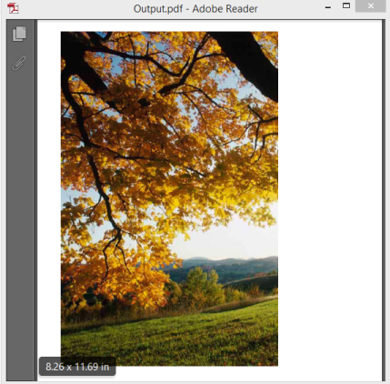

# ImageElement

ImageElement is used to render images in the page of the PDF document. It can also support replacing images; HTML to image and PDF to image. These are explained in the following topics.

{{ '' | markdownify }}
{:.image }

## Insert image into the PDF pages

Adobe PDF supports several image formats and various masking techniques to create high quality reports. Essential PDF supports both raster and vector images. The supported image formats are gas follows:

* Bmp
* Jpeg
* Gif
* Png
* Tif
* Emf, EMF plus and EMF plus Dual

Essential PDF provides you support for loading image streams, files on disk, and System.Drawing.Bitmap objects. You can resize and insert the images into a PDF document at the required size. Also advanced features such as transparency and soft masking are supported.

Images are supported through the PdfImage class that is an abstract base class that provides the common functionality for PdfBitmap and PdfMetafile classes. There are static methods in PdfImage providing the capability to create a PdfImage instance from different sources.

> _Note: Image quality is 100 by default, which increases the resultant file size and quality. Reducing the quality will reduce the file size._

### Working with Bitmap

PdfBitmap class provides functionality of raster images described above. Masks and alpha channels are supported. There are two different kinds of masks: color mask that is implemented by the PdfColorMask class, and image mask that is implemented by the PdfImageMask class. Masks are set by using the Maskproperty of the PdfBitmap object.

DrawImage method of the PdfGraphics class draws a given image at a specified location and contains parameters that provide control over the image alignment and scaling.

[C#]

//Creates a new PDF document.

PdfDocument doc = new PdfDocument();

//Adds a page to the document.

PdfPage page = doc.Pages.Add();

//Creates PDF graphics for the page.

PdfGraphics g = page.Graphics;

//Creates an image object.

PdfBitmap image = new PdfBitmap("Autumn Leaves.jpg");

//Draws the image.

g.DrawImage(image, 0, 0);

//Saves the document.

doc.Save("Output.pdf");

//Closes the document.

doc.Close(true);

[VB]

'Creates a new PDF document.

Dim doc As New PdfDocument()

'Adds a page to the document.

Dim page As PdfPage = doc.Pages.Add()

'Creates PDF graphics for the page.

Dim g As PdfGraphics = page.Graphics

'Creates an image object.

Dim image As New PdfBitmap("Autumn Leaves.jpg")

'Draws the image.

g.DrawImage(image, 0, 0)

'Saves the document.

doc.Save("Output.pdf")

'Closes the document.

doc.Close(True)

## Working with TIFF

Essential PDF provides you the ability to convert single page or multipage TIFF file into PDF document. When you render a MultiFrame image (Gif, Tif), only the active frame of the image is rendered. The following code illustrates how to draw multipage tiff files using Essential PDF API.

[C#]

// Creates a new instance of PdfDocument class.

PdfDocument doc = new PdfDocument();

//Sets margin.

doc.PageSettings.SetMargins(0f);

PdfBitmap image = new PdfBitmap("image.tiff");

int frameCount = image.FrameCount;

for (int i = 0; i < frameCount; i++)

{

//Adds pages to the document.

PdfPage page = doc.Pages.Add();

//Creates PDF graphics for the page.

PdfGraphics g = page.Graphics;

image.ActiveFrame = i;

//Draws the image.

g.DrawImage(image, 0, 0);

}

//Saves the document.

doc.Save("Output.pdf");

//Closes the document.

doc.Close();

[VB]

'Create a new instance of PdfDocument class.

Dim doc As New PdfDocument()

'Sets margin.

doc.PageSettings.SetMargins(0.0F)

Dim image As New PdfBitmap("image.tiff")

Dim frameCount As Integer = image.FrameCount

For i As Integer = 0 To frameCount - 1

'Adds pages to the document.

Dim page As PdfPage = doc.Pages.Add()

'Creates PDF graphics for the page.

Dim g As PdfGraphics = page.Graphics

image.ActiveFrame = i

'Draws the image.

g.DrawImage(image, 0, 0)

Next

'Saves the document.

doc.Save("Output.pdf")

'Closes the document.

doc.Close()

### Working with Metafile

EMF ONLY, EMF PLUS and EMF PLUS DUAL formats are supported by Essential PDF through the PdfMetafile class. PdfMetafile supports multipage layout. In addition, it also supports handling text that does not split across pages.  Enabling SplitTextLines and SplitImages properties of PdfMetafileLayoutFormat class allows splitting the text and images in the PDF document.

The following are the public properties of the PdfMetafileLayoutFormat class.

_List of public properties of PdfMetafileLayoutFormat class_

<table>
<tr>
<td>
Name</td><td>
Description</td></tr>
<tr>
<td>
Break</td><td>
Gets or sets break type of the element. The break has two enums, FitElement and FitPage.FitElement – If the element does not fit in the bounds, it does not draw on the page.FitPage – Fit the element according to the page bounds.</td></tr>
<tr>
<td>
Layout</td><td>
Gets or sets layout type of the element. Layout type has two enums, OnePage and Paginate.OnePage – Draws the element on one page.Paginate – If the element exceeds the page, proceeds on the next page.</td></tr>
<tr>
<td>
PaginateBounds</td><td>
Gets or sets the bounds on the next page.</td></tr>
<tr>
<td>
SplitImages</td><td>
Gets or sets the value indicating whether the images should be split between the pages or not.</td></tr>
<tr>
<td>
SplitTextLines</td><td>
Gets or sets the value indicating whether the text line should be split between the pages or not.</td></tr>
<tr>
<td>
UsePaginateBounds</td><td>
Gets a value that indicates whether PaginateBounds should be used or not.</td></tr>
</table>

[C#]

//Creates a new instance of PdfDocument class.

PdfDocument doc = new PdfDocument();

//Adds pages to the document.

PdfPage page = doc.Pages.Add();

//Creates PDF graphics for the page.

PdfGraphics g = page.Graphics;

//Creates the layout format.

PdfMetafileLayoutFormat format = new PdfMetafileLayoutFormat();

//Splits text and image between pages.

format.SplitImages = true;

format.SplitTextLines = true;

//Creates a metafile instance.

PdfMetafile metafile = new PdfMetafile("metachart.emf");

//Draws the metafile in the page with

metafile.Draw(page,PointF.Empty, format);

//Saves the document.

doc.Save("Output.pdf");

//Closes the document.

doc.Close();

[VB]

'Creates a new instance of PdfDocument class.

Dim doc As New PdfDocument()

'Adds pages to the document.

Dim page As PdfPage = doc.Pages.Add()

'Creates the layout format.

Dim format As New PdfMetafileLayoutFormat()

'Splits text and image between pages.

format.SplitImages = True

format.SplitTextLines = True

'Creates a metafile instance.

Dim metafile As New PdfMetafile("Metafile.emf")

'Draws the metafile in the page with

metafile.Draw(page, PointF.Empty, format)

'Saves the document.

doc.Save("Output.pdf")

'Closes the document.

doc.Close()

### Working with Image Masking

Using an image as a mask, a mask image is simply an image where some of the pixel intensity values are zero, and others are non-zero. Wherever the pixel intensity value is zero in the mask image, then the pixel intensity of the resulting masked image is set to the background value.

A soft mask specifies the transparency level for each pixel of the image. You can create these masks from a grayscale image. The level of gray indicates the level of transparency.

[C#]

//Creates a new instance of PdfDocument class.

PdfDocument doc = new PdfDocument();

//Adds pages to the document.

PdfPage page = doc.Pages.Add();

PdfGraphics graphics = page.Graphics;

//Bitmap with Tiff image mask.

PdfBitmap image = new PdfBitmap("image.tif");

//Creates masking image.

PdfImageMask mask = new PdfImageMask(new PdfBitmap("mask.bmp"));

image.Mask = mask;

graphics.DrawImage(image, 0, 0);

//Saves the document.

doc.Save("Output.pdf");

//Closes the document.

doc.Close();

[VB]

'Creates a new instance of PdfDocument class.

Dim doc As New PdfDocument()

'Adds pages to the document.

Dim page As PdfPage = doc.Pages.Add()

Dim graphics As PdfGraphics = page.Graphics

'Bitmap with Tiff image mask.

Dim image As New PdfBitmap("image.tif")

'Creates masking image.

Dim mask As New PdfImageMask(New PdfBitmap("mask.bmp"))

image.Mask = mask

graphics.DrawImage(image, 0, 0)

'Saves the document.

doc.Save("Output.pdf")

'Closes the document.

doc.Close()

## Replacing images

Essential PDF allows you to replace images in an existing document. The ReplaceImage method of the page collection allows you to replace an image. Once the image is replaced, you can save the Updated PDF document.

[C#]

//Loads the PDF document.

PdfLoadedDocument doc = new PdfLoadedDocument(@"image.pdf");

//Creates image instance.

PdfBitmap bmp = new PdfBitmap(@"Autumn Leaves.jpg");

//Replaces a particular image.

doc.Pages[0].ReplaceImage(0, bmp);

//Saves the document.

doc.Save("Output.pdf");

//Closes the document.

doc.Close();

 [VB]

'Loads the PDF document.

Dim doc As New PdfLoadedDocument("image.pdf")

'Creates image instance.

Dim bmp As New PdfBitmap("Autumn Leaves.jpg")

'Replaces a particular image.

doc.Pages(0).ReplaceImage(0, bmp)

'Saves the document.

doc.Save("Output.pdf")

'Closes the document.

doc.Close()

## HTML to Image

Essential PDF allows you to convert HTML file to Image using ConvertToImage. The ConvertToImage method converts URL into an image. The URL parameter can be a HTTP or HTTPS address such as [http://www.syncfusion.com](http://www.syncfusion.com) or a physical path that refers an HTML file on the disk.

The overloaded ConvertToImage method enables an HTML page to convert into an image with AspectRatio, to maintain the ratio of the image dimension and also enables it to convert an HTML page to a vector image (metafile) or raster image (bitmap) with ImageType.

[C#]

//Creates HTML converter instance.

HtmlConverter html = new HtmlConverter();

//Converts web page to image.

Image image = html.ConvertToImage("http://www.syncfusion.com", ImageType.Bitmap);

//Saves the image.

image.Save("img.jpeg");

html.Dispose();

[VB]

'Creates HTML converter instance.

Dim html As New HtmlConverter()

'Converts web page to image.

Dim image As Image = html.ConvertToImage("http://www.syncfusion.com", ImageType.Bitmap)

'Saves the image.

image.Save("webImage.jpeg")

html.Dispose()

## PDF to Image

Essential PDF allows export of PDF pages as images. PDF viewer instance needs to be created and the PDF document loaded in order to export the images. Specific pages of the PDF document can also be exported.

[C#]

//Creates a new PDF viewer instance.

PdfDocumentView view = new PdfDocumentView();

//Loads the PDF document.

view.Load("Input.pdf");

//Exports all PDF pages to images.

Bitmap[] images = view.ExportAsImage(0, view.PageCount - 1);

//Saves all images to the disk.

foreach (Bitmap image in images)

image.Save(Guid.NewGuid().ToString() + ".png", ImageFormat.Png);

//Disposes the viewer instance.

view.Unload();

view.Dispose();

[VB]

'Creates a new PDF viewer instance.

Dim view As New PdfDocumentView()

'Loads the PDF document.

view.Load("Input.pdf")

'Exports all PDF pages to images.

Dim images As Bitmap() = view.ExportAsImage(0, view.PageCount - 1)

'Saves all images to the disk.

For Each image As Bitmap In images

image.Save(Guid.NewGuid().ToString() + ".png", ImageFormat.Png)

Next

'Disposes the viewer instance.

view.Unload()

