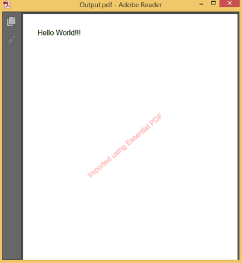

# Stamp and Overlay

You apply stamp to a PDF in much the same way as you apply a rubber stamp to a paper document. You can create your own stamps and can stamp PDF using text or images. Overlay feature is used to overlap two PDF pages one above other.

## Stamp Documents

Essential PDF provides you support to stamp over newly created document as well as an existing PDF document.

### Adding Text Stamp in the PDF document



//Loads the document.

PdfLoadedDocument lDoc = new PdfLoadedDocument("Essential_Studio.pdf");

PdfPageBase lPage = lDoc.Pages[0];

PdfGraphics g = lPage.Graphics;

//Stamps text.

PdfGraphicsState state = g.Save();

g.SetTransparency(0.25f);

g.RotateTransform(-40);

g.DrawString("Imported using Essential PDF", font, PdfPens.Red, PdfBrushes.Red, new PointF(-150, 450));

//Saves the new document.

lDoc.Save("Stamp.pdf");





'Loads the document.

Dim lDoc As New PdfLoadedDocument("Essential_Studio.pdf")

Dim lPage As PdfPageBase = lDoc.Pages(0)

Dim g As PdfGraphics = lPage.Graphics

'Stamps text.

Dim state As PdfGraphicsState = g.Save()

g.SetTransparency(0.25F)

g.RotateTransform(-40)

g.DrawString("Imported using Essential PDF", Font, PdfPens.Red, PdfBrushes.Red, New PointF(-150, 450))

'Saves the new document.

lDoc.Save("Stamp.pdf")


### Adding Image Stamp in the PDF document



//Loads the document.

PdfLoadedDocument lDoc = new PdfLoadedDocument("Essential_Studio.pdf");

PdfPageBase lPage = lDoc.Pages[0];

PdfGraphics g = lPage.Graphics;

//Image watermark.

PdfImage image = new PdfBitmap("Ani.gif");

PdfGraphicsState state = g.Save();

g.SetTransparency(0.25f);

g.DrawImage(image, new PointF(0, 0), lPage.Graphics.ClientSize);

//Saves the new document.

lDoc.Save("Stamp.pdf"); 





'Loads the document.

Dim lDoc As New PdfLoadedDocument("Essential_Studio.pdf")

Dim lPage As PdfPageBase = lDoc.Pages(0)

Dim g As PdfGraphics = lPage.Graphics

'Image watermark.

Dim image As PdfImage = New PdfBitmap("Ani.gif")

Dim state As PdfGraphicsState = g.Save()

g.SetTransparency(0.25F)

g.DrawImage(image, New PointF(0, 0), lPage.Graphics.ClientSize)

'Saves the new document.

lDoc.Save("Stamp.pdf")


## Overlay Documents

Overlay documents support for importing pages from existing PDF documents as templates. This feature can be used to overlap two PDF pages one above the other.



//Creates a new document.

PdfDocument doc = new PdfDocument();

PdfPage page = doc.Pages.Add();

PdfGraphics g = page.Graphics;

//Gets the first template.

PdfPageBase lpage = document1.Pages[0];

PdfTemplate template = lpage.CreateTemplate();

g.DrawPdfTemplate(template, PointF.Empty, page.GetClientSize());

//Gets the second template.

lpage = document2.Pages[0];

template = lpage.CreateTemplate();

g.DrawPdfTemplate(template, PointF.Empty, page.GetClientSize());

//Saves the new document.

doc.Save("NewPDF.pdf");





'Creates a new document.

Dim doc As New PdfDocument()

Dim page As PdfPage = doc.Pages.Add()

Dim g As PdfGraphics = page.Graphics

'Gets the first template.

Dim lpage As PdfPageBase = document1.Pages(0)

Dim template As PdfTemplate = lpage.CreateTemplate()

g.DrawPdfTemplate(template, PointF.Empty, page.GetClientSize())

'Gets the second template.

lpage = document2.Pages(0)

template = lpage.CreateTemplate()

g.DrawPdfTemplate(template, PointF.Empty, page.GetClientSize())

'Saves the new document.

doc.Save("NewPDF.pdf")


## Transform PDF

PDF pages can be converted to PdfTemplate object if you want to create a booklet or just place a few pages onto a single page like an image. You can create the template using the following code.



//Creates a new document.

PdfDocument doc = new PdfDocument();

PdfPage page = doc.Pages.Add();

PdfGraphics g = page.Graphics;

//Gets the first template.

PdfPageBase lpage = document1.Pages[0];

PdfTemplate template = lpage.CreateTemplate();

g.DrawPdfTemplate(template, PointF.Empty, page.GetClientSize());

//Gets the second template.

lpage = document2.Pages[0];

template = lpage.CreateTemplate();

g.DrawPdfTemplate(template, PointF.Empty, page.GetClientSize());

//Saves the new document.

doc.Save("NewPDF.pdf");




'Creates a new document.

Dim doc As New PdfDocument()

Dim page As PdfPage = doc.Pages.Add()

Dim g As PdfGraphics = page.Graphics

'Gets the first template.

Dim lpage As PdfPageBase = document1.Pages(0)

Dim template As PdfTemplate = lpage.CreateTemplate()

g.DrawPdfTemplate(template, PointF.Empty, page.GetClientSize())

'Gets the second template

lpage = document2.Pages(0)

template = lpage.CreateTemplate()

g.DrawPdfTemplate(template, PointF.Empty, page.GetClientSize())

'Saves the new document.

doc.Save("NewPDF.pdf")


N> This template can be scaled, rotated, placed at different coordinates, and so on.

Restrictions 

This above process can also convert annotations, but with some limitations as follows.

* It does not pay attention to the fields 
* It takes the first appearance stream from the annotation's normal appearance dictionary, (if it is not a stream) 
* It places the appearance stream as a template on the page according to its states, say, on, off or some other states. 
* This may lead to unexpected results.

