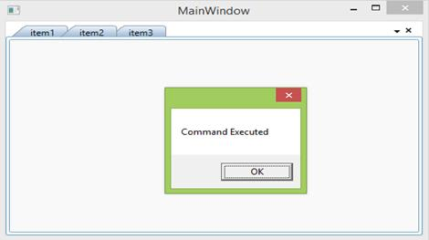
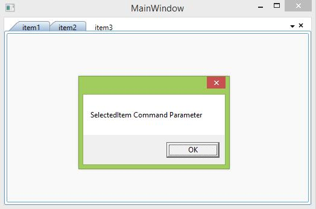

#Pattern and Practices
## MVVM

### Getting Started:

To perform **TabControlExt’s** **selectionChanged** Event in the ViewModel, use the following logic.

Create a Viewmodel and define a Model Collection that is used to bind with the **TabControl’s** **ItemSource** property.

**XAML**__:__


<syncfusion:TabControlExt ItemsSource="{Binding tabcollection}">   <syncfusion:TabControlExt.ItemTemplate>

<DataTemplate>

<TextBlock  Text="{Binding HeaderName}"></TextBlock>

</DataTemplate>

</syncfusion:TabControlExt.ItemTemplate>

</syncfusion:TabControlExt>



**C**__#__**:**


public class ViewModel:NotificationObject

{

private ObservableCollection<model> _tabcollection;

public ObservableCollection<model> tabcollection

{

get

{

return _tabcollection;

}

set

{

_tabcollection = value;

}

}

private void Collection()

{

model model = new model()

{

HeaderName = "item1"

};

model model1 = new model()

{

HeaderName = "item2"

};

model model2 = new model()

{

HeaderName = "item3"

};

tabcollection.Add(model);

tabcollection.Add(model1);

tabcollection.Add(model2);

}

public ViewModel()

{

tabcollection=new ObservableCollection<model>();

Collection();

}

}

public class model:NotificationObject

{

public model()

{

}

private string _headername;

public string HeaderName

{

get

{

return _headername;

}

set

{

_headername = value;

this.RaisePropertyChanged("HeaderName");

}

}

}



And now you need to handle the **SelectionChanged** event of the TabControlExt. So use **TabControlExtSelectionChangedCommand** and define a “SelectionChanged” command in **ViewModel** using **ICommand**. 

**XAML**__:__


<syncfusion:TabControlExt ItemsSource="{Binding tabcollection}"  syncfusion:TabControlExtSelectionChangedCommand.Command="{Binding SelectionChanged}">

<syncfusion:TabControlExt.ItemTemplate>

<DataTemplate>

<TextBlock  Text="{Binding HeaderName}"></TextBlock>

</DataTemplate>

</syncfusion:TabControlExt.ItemTemplate>

</syncfusion:TabControlExt>



**C**__#__**:**


private ICommand selectionchanged;

public ICommand SelectionChanged

{

get

{

return selectionchanged;

}

}

public ViewModel()

{

selectionchanged = new DelegateCommand<object>(PropertyChangedHandled);

}

private void PropertyChangedHandled (object obj)

{

MessageBox.Show("Command Executed”);

}



The following screenshot displays final result.

********### Events and Commands

The following section explains how you can use event commands in code-behind with the help of view model.

### CommandParameter:

**CommandParameter** that you can easily pass an object or bind it to a property of another control. The following code example passes a string through command parameter.

**XAML**__:__


<syncfusion:TabControlExt ItemsSource="{Binding tabcollection}"  syncfusion:TabControlExtSelectionChangedCommand.Command="{Binding SelectionChanged}"                              syncfusion:TabControlExtSelectionChangedCommand.CommandParameter="SelectedItem Command Parameter">



**C**__#__**:**


private void PropertyChangedHandled (object obj)

{

MessageBox.Show(obj.ToString());

}



The following screenshot displays final result.

#### Pass a property value through Command Parameter:

Any property can bind with the Command Parameter to pass it as command in View Model.

**XAML**__:__


<syncfusion:TabControlExt ItemsSource="{Binding tabcollection}"  syncfusion:TabControlExtSelectionChangedCommand.Command="{Binding SelectionChanged}"                                syncfusion:TabControlExtSelectionChangedCommand.CommandParameter="{Binding Path=SelectedItem.HeaderName,RelativeSource={RelativeSource Self}}">



**C**__#__**:**


private void PropertyChangedHandled (object obj)

{

MessageBox.Show("SelectedItem" +obj.ToString());

}



The following screenshot displays final result.

#### Command Target

The element where the command exists can be determined through EventBinding’s CommandTarget property. Refer to [CommandTarget Property](http://msdn.microsoft.com/en-us/library/system.windows.input.icommandsource.commandtarget%28v=vs.110%29.aspx# "") for reference.

