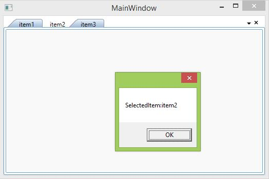

# Pattern and Practices

## Getting Started with MVVM

Essential WPF Controls are suitable for MVVM Pattern. Since the controls are provided with built-in commands. 

DataContext property specifies the default source for Data Binding in MVVM pattern.





<Window.DataContext>
    <local:ViewModel/>
</Window.DataContext> 





public partial class MainWindow : Window
{
    public MainWindow()
    {
        InitializeComponent();
        this.DataContext = new ViewModel();
    }
}





This section explains how to perform TabControlExt’s `selectionChanged` event, by create a ViewModel and define a Model collection that is used to bind with the TabControl’s `ItemSource` property.





<Syncfusion:TabControlExt ItemsSource="{Binding tabcollection}">
	<Syncfusion:TabControlExt.ItemTemplate>
		<DataTemplate>
			<TextBlock  Text="{Binding HeaderName}"></TextBlock>
		</DataTemplate>
	</Syncfusion:TabControlExt.ItemTemplate>
</Syncfusion:TabControlExt>









public class ViewModel:NotificationObject
{
	private ObservableCollection<model> _tabcollection;
	public ObservableCollection<model> tabcollection
	{
		get
		{
			return _tabcollection;
		}
		set
		{
			_tabcollection = value;
		}
	}
	private void Collection()
	{
		model model = new model()
		{
			HeaderName = "item1"
		};
		model model1 = new model()
		{
			HeaderName = "item2"
		};
		model model2 = new model()
		{
			HeaderName = "item3"
		};
		tabcollection.Add(model);
		tabcollection.Add(model1);
		tabcollection.Add(model2);
	}
	public ViewModel()
	{
		tabcollection=new ObservableCollection<model>();
		Collection();
	}
}

public class model:NotificationObject
{
	public model() {}
	private string _headername;
	public string HeaderName
	{
		get
		{
			return _headername;
		}
		set
		{
			_headername = value;
			this.RaisePropertyChanged("HeaderName");
		}
	}
}





Public Class ViewModel
	Inherits NotificationObject
	Private _tabcollection As ObservableCollection(Of model)
	Public Property tabcollection() As ObservableCollection(Of model)
		Get
			Return _tabcollection
		End Get
		Set(ByVal value As ObservableCollection(Of model))
			_tabcollection = value
		End Set
	End Property
	Private Sub Collection()
		Dim model As New model() With {.HeaderName = "item1"}
		Dim model1 As New model() With {.HeaderName = "item2"}
		Dim model2 As New model() With {.HeaderName = "item3"}
		tabcollection.Add(model)
		tabcollection.Add(model1)
		tabcollection.Add(model2)
	End Sub
	Public Sub New()
		tabcollection = New ObservableCollection(Of model)()
		Collection()
	End Sub
End Class

Public Class model
	Inherits NotificationObject
	Public Sub New()
	End Sub
	Private _headername As String
	Public Property HeaderName() As String
		Get
			Return _headername
		End Get
		Set(ByVal value As String)
			_headername = value
			Me.RaisePropertyChanged("HeaderName")
		End Set
	End Property
End Class





To handle the `SelectionChanged` event of the TabControlExt in ViewModel, use `TabControlExtSelectionChangedCommand` and define a SelectionChanged command using `ICommand`. 
The `TabControlExtSelectionChangedCommand` command is available in `Syncfusion.Tools.MVVM.WPF` assembly. And it requires `Syncfusion.Shared.MVVM.WPF` as dependency assembly.  





<Syncfusion:TabControlExt ItemsSource="{Binding tabcollection}"
                          Syncfusion:TabControlExtSelectionChangedCommand.Command="{Binding SelectionChanged}">
	<Syncfusion:TabControlExt.ItemTemplate>
		<DataTemplate>
			<TextBlock  Text="{Binding HeaderName}"/>
		</DataTemplate>
	</Syncfusion:TabControlExt.ItemTemplate>
</Syncfusion:TabControlExt>









private ICommand selectionchanged;
public ICommand SelectionChanged
{
    get
	{
		return selectionchanged;
	}
}
public ViewModel()
{
	selectionchanged = new DelegateCommand<object>(PropertyChangedHandled);
}
private void PropertyChangedHandled (object obj)
{
	MessageBox.Show("Command Executed");
}





Private selectionchanged_Renamed As ICommand
Public ReadOnly Property SelectionChanged() As ICommand
	Get
		Return selectionchanged_Renamed
	End Get
End Property
Public Sub New()
	selectionchanged_Renamed = New DelegateCommand(Of Object)(AddressOf PropertyChangedHandled)
End Sub
Private Sub PropertyChangedHandled(ByVal obj As Object)
	MessageBox.Show("Command Executed")
End Sub 





## MVVM Commands

The following section covers usage of commands in code-behind with the help of ViewModel.

### CommandParameter:

`CommandParameter` can easily pass an object or bind it to a property of another control. The following code example passes a string through CommandParameter.





<Syncfusion:TabControlExt ItemsSource="{Binding tabcollection}"
            Syncfusion:TabControlExtSelectionChangedCommand.Command="{Binding SelectionChanged}"
			Syncfusion:TabControlExtSelectionChangedCommand.CommandParameter="SelectedItem Command Parameter">









private void PropertyChangedHandled (object obj)
{
	MessageBox.Show(obj.ToString());
}





Private Sub PropertyChangedHandled(ByVal obj As Object)
	MessageBox.Show(obj.ToString())
End Sub





#### Pass a property value through Command Parameter:

Any property can bind with the `CommandParameter` to pass it as command in ViewModel.





<Syncfusion:TabControlExt ItemsSource="{Binding tabcollection}"
            Syncfusion:TabControlExtSelectionChangedCommand.Command="{Binding SelectionChanged}"
			Syncfusion:TabControlExtSelectionChangedCommand.CommandParameter="{Binding Path=SelectedItem.HeaderName,
			RelativeSource={RelativeSource Self}}">









private void PropertyChangedHandled (object obj)
{
	MessageBox.Show("SelectedItem" +obj.ToString());
}





Private Sub PropertyChangedHandled(ByVal obj As Object)
	MessageBox.Show("SelectedItem" & obj.ToString())
End Sub 





#### Command Target

The element where the command exists can be determined through EventBinding’s `CommandTarget` property. Refer to [CommandTarget Property](http://msdn.microsoft.com/en-us/library/system.windows.input.icommandsource.commandtarget%28v=vs.110%29.aspx) for reference.

