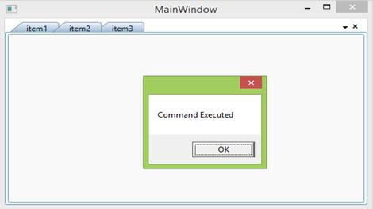
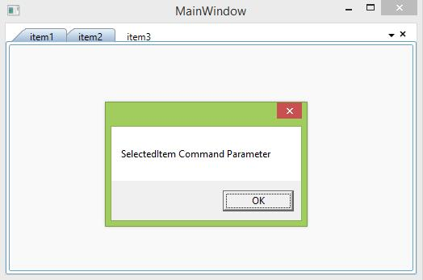
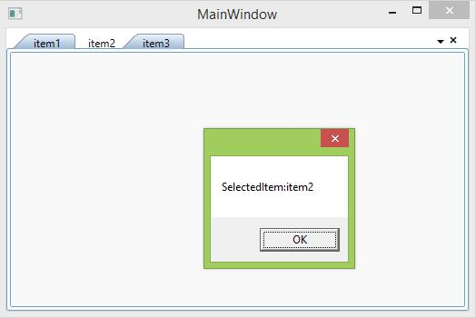

# Pattern and Practices

## Getting Started with MVVM

Essential&reg; WPF controls are suitable for the MVVM pattern. The controls provide built-in commands for MVVM support.

The `DataContext` property specifies the default source for data binding in the MVVM pattern.

### Setting the DataContext





<Window.DataContext>
    <local:ViewModel/>
</Window.DataContext> 





public partial class MainWindow : Window
{
    public MainWindow()
    {
        InitializeComponent();
        this.DataContext = new ViewModel();
    }
}





This section explains how to handle the TabControlExt `SelectionChanged` event by creating a ViewModel and defining a Model collection that is used to bind with the TabControl's `ItemsSource` property.





<Syncfusion:TabControlExt ItemsSource="{Binding TabCollection}">
    <Syncfusion:TabControlExt.ItemTemplate>
        <DataTemplate>
            <TextBlock Text="{Binding HeaderName}"/>
        </DataTemplate>
    </Syncfusion:TabControlExt.ItemTemplate>
</Syncfusion:TabControlExt>









public class ViewModel : NotificationObject
{
    private ObservableCollection<Model> _tabCollection;
    public ObservableCollection<Model> TabCollection
    {
        get
        {
            return _tabCollection;
        }
        set
        {
            _tabCollection = value;
            this.RaisePropertyChanged("TabCollection");
        }
    }
    private void PopulateCollection()
    {
        var model1 = new Model() { HeaderName = "item1" };
        var model2 = new Model() { HeaderName = "item2" };
        var model3 = new Model() { HeaderName = "item3" };
        TabCollection.Add(model1);
        TabCollection.Add(model2);
        TabCollection.Add(model3);
    }
    public ViewModel()
    {
        TabCollection = new ObservableCollection<Model>();
        PopulateCollection();
    }
}

public class Model : NotificationObject
{
    public Model() { }
    private string _headerName;
    public string HeaderName
    {
        get
        {
            return _headerName;
        }
        set
        {
            _headerName = value;
            this.RaisePropertyChanged("HeaderName");
        }
    }
}





Public Class ViewModel
    Inherits NotificationObject
    Private _tabCollection As ObservableCollection(Of Model)
    Public Property TabCollection() As ObservableCollection(Of Model)
        Get
            Return _tabCollection
        End Get
        Set(ByVal value As ObservableCollection(Of Model))
            _tabCollection = value
            Me.RaisePropertyChanged("TabCollection")
        End Set
    End Property
    Private Sub PopulateCollection()
        Dim model1 As New Model() With {.HeaderName = "item1"}
        Dim model2 As New Model() With {.HeaderName = "item2"}
        Dim model3 As New Model() With {.HeaderName = "item3"}
        TabCollection.Add(model1)
        TabCollection.Add(model2)
        TabCollection.Add(model3)
    End Sub
    Public Sub New()
        TabCollection = New ObservableCollection(Of Model)()
        PopulateCollection()
    End Sub
End Class

Public Class Model
    Inherits NotificationObject
    Public Sub New()
    End Sub
    Private _headerName As String
    Public Property HeaderName() As String
        Get
            Return _headerName
        End Get
        Set(ByVal value As String)
            _headerName = value
            Me.RaisePropertyChanged("HeaderName")
        End Set
    End Property
End Class





To handle the `SelectionChanged` event of the TabControlExt in the ViewModel, use `TabControlExtSelectionChangedCommand` and define a `SelectionChanged` command using `ICommand`.
The `TabControlExtSelectionChangedCommand` command is available in the `Syncfusion.Tools.MVVM.WPF` assembly. It also requires `Syncfusion.Shared.MVVM.WPF` as a dependency assembly.





<Syncfusion:TabControlExt ItemsSource="{Binding TabCollection}"
                          Syncfusion:TabControlExtSelectionChangedCommand.Command="{Binding SelectionChanged}">
    <Syncfusion:TabControlExt.ItemTemplate>
        <DataTemplate>
            <TextBlock Text="{Binding HeaderName}"/>
        </DataTemplate>
    </Syncfusion:TabControlExt.ItemTemplate>
</Syncfusion:TabControlExt>









private ICommand selectionChanged;
public ICommand SelectionChanged
{
    get
    {
        return selectionChanged;
    }
}
public ViewModel()
{
    selectionChanged = new DelegateCommand<object>(OnSelectionChanged);
}
private void OnSelectionChanged(object obj)
{
    MessageBox.Show("Command Executed");
}





Private _selectionChanged As ICommand
Public ReadOnly Property SelectionChanged() As ICommand
    Get
        Return _selectionChanged
    End Get
End Property
Public Sub New()
    _selectionChanged = New DelegateCommand(Of Object)(AddressOf OnSelectionChanged)
End Sub
Private Sub OnSelectionChanged(ByVal obj As Object)
    MessageBox.Show("Command Executed")
End Sub





## MVVM Commands

The following section covers how to use commands in code-behind using ViewModel.

### CommandParameter

`CommandParameter` can be used to easily pass an object or bind it to a property of another control. The following code example passes a string using `CommandParameter`.





<Syncfusion:TabControlExt ItemsSource="{Binding TabCollection}"
            Syncfusion:TabControlExtSelectionChangedCommand.Command="{Binding SelectionChanged}"
			Syncfusion:TabControlExtSelectionChangedCommand.CommandParameter="SelectedItem Command Parameter">









private void OnSelectionChanged(object obj)
{
    MessageBox.Show(obj.ToString());
}





Private Sub OnSelectionChanged(ByVal obj As Object)
    MessageBox.Show(obj.ToString())
End Sub





#### Pass a property value through Command parameter

Any property can be bound to `CommandParameter` to pass its value to the command in the ViewModel.





<Syncfusion:TabControlExt ItemsSource="{Binding TabCollection}"
            Syncfusion:TabControlExtSelectionChangedCommand.Command="{Binding SelectionChanged}"
            Syncfusion:TabControlExtSelectionChangedCommand.CommandParameter="{Binding Path=SelectedItem.HeaderName,
            RelativeSource={RelativeSource Self}}">
    <Syncfusion:TabControlExt.ItemTemplate>
        <DataTemplate>
            <TextBlock Text="{Binding HeaderName}"/>
        </DataTemplate>
    </Syncfusion:TabControlExt.ItemTemplate>
</Syncfusion:TabControlExt>









private void OnSelectionChanged(object obj)
{
    MessageBox.Show("SelectedItem: " + obj.ToString());
}





Private Sub OnSelectionChanged(ByVal obj As Object)
    MessageBox.Show("SelectedItem: " & obj.ToString())
End Sub





#### Command target

The element where the command exists can be determined using the EventBinding’s `CommandTarget` property. Refer to [CommandTarget Property](https://docs.microsoft.com/en-us/dotnet/api/system.windows.input.icommandsource.commandtarget?redirectedfrom=MSDN&view=net-5.0#System_Windows_Input_ICommandSource_CommandTarget), for more reference.

