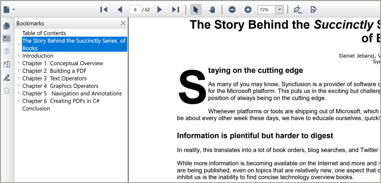

# Bookmark Navigation in WPF Pdf Viewer

PDF Viewer control allows users to navigate to the bookmarks present in the loaded PDF document at UI level. 

## Steps to perform bookmark navigation in PdfViewerControl.

1.	Open the bookmarks contained PDF document to enable the bookmark button in `PdfViewerControl`.
2.	Clicking on the bookmark button from the left pane, will list the bookmarks present in the PDF document.
3.	To jump to a specific section, click its name in the bookmark pane.
4.	If the bookmark has some children, you can explore them by clicking on the “+” button to the left of it.

  

## Programmatically navigate to a bookmark destination

You can navigate to a desired bookmark destination using the `GotoBookmark(PdfBookmark)` method in `PdfDocumentView`. The target/destination bookmark should be provided as the parameter to this method. Refer to the following code sample.




//Loads the PDF document in PdfLoadedDocument
PdfLoadedDocument loadedDocument = new PdfLoadedDocument(documentStream);

//Retrieves the bookmark collection from the loaded PDF document
PdfBookmarkBase bookmark = loadedDocument.Bookmarks;

//Navigate to the specified bookmark destination offset
pdfDocumentView.GoToBookmark(bookmark[0]);




Loads the PDF document in PdfLoadedDocument
Dim loadedDocument As PdfLoadedDocument = New PdfLoadedDocument(documentStream)

`Retrieves the bookmark collection from the loaded PDF document
Dim bookmark As PdfBookmarkBase = loadedDocument.Bookmarks

`Navigate to the specified bookmark destination offset
pdfDocumentView.GoToBookmark(bookmark(0))




You can also perform the same in [PdfViewerControl](https://help.syncfusion.com/cr/wpf/Syncfusion.Windows.PdfViewer.PdfViewerControl.html) using the [GotoBookmark(PdfBookmark)](https://help.syncfusion.com/cr/wpf/Syncfusion.Windows.PdfViewer.PdfViewerControl.html#Syncfusion_Windows_PdfViewer_PdfViewerControl_GoToBookmark_Syncfusion_Pdf_Interactive_PdfBookmark_) method. Refer to the following code sample.




//Loads the PDF document in PdfLoadedDocument
PdfLoadedDocument loadedDocument = new PdfLoadedDocument(documentStream);

//Retrieves the bookmark collection from the loaded PDF document
PdfBookmarkBase bookmark = loadedDocument.Bookmarks;

//Navigate to the specified bookmark destination offset
pdfViewerControl.GoToBookmark(bookmark[0]);




`Loads the PDF document in PdfLoadedDocument
Dim loadedDocument As PdfLoadedDocument = New PdfLoadedDocument(documentStream)

`Retrieves the bookmark collection from the loaded PDF document
Dim bookmark As PdfBookmarkBase = loadedDocument.Bookmarks

`Navigate to the specified bookmark destination offset
pdfViewerControl.GoToBookmark(bookmark(0))




## Enabling and disabling bookmark feature

You can enable and disable the bookmark button from the built-in toolbar using the `IsBookmarkEnabled` property available in `PdfViewerControl`.

<table>
<tr>
<th>
Property</th><th>
Action</th></tr>
<tr>
<td>
{{'[IsBookmarkEnabled](https://help.syncfusion.com/cr/wpf/Syncfusion.Windows.PdfViewer.PdfViewerControl.html#Syncfusion_Windows_PdfViewer_PdfViewerControl_IsBookmarkEnabled)'| markdownify }}</td><td>
Enables or disables the bookmark feature.</td></tr>
</table>

This property removes the bookmark button and disable the bookmark feature, when it is set to false and vice versa.




//Bookmark feature is disabled
pdfViewerControl.IsBookmarkEnabled = false;




'Bookmark feature is disabled
pdfViewerControl.IsBookmarkEnabled = false




The following screenshot shown the Bookmark navigation in `PdfViewerControl`,

