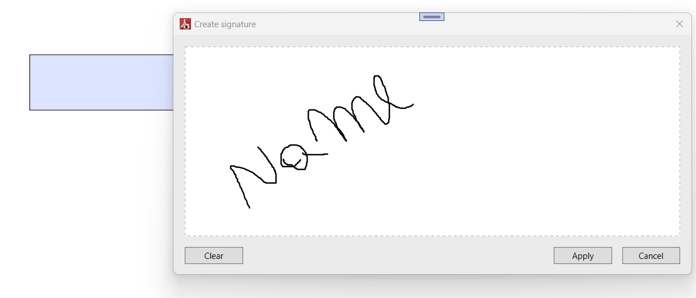
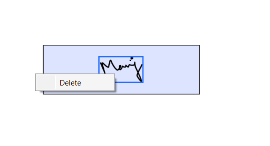

# Form Filling in PDF Files in WPF Pdf Viewer

PDF Viewer provides the ability to Fill, Edit, Flatten, and Save the `AcroForm` fields in PDF files.

## Supported form fields

You can load and fill the following form fields in a PDF document using the PDF Viewer.

1.	Text box.
2.	Password box.
3.	Checkbox.
4.	Radio button.
5.	Combo box.
6.	List box.
7.	Signature box.

## Retrieve the form field details 

You can retrieve the details of a form field through the [FormFieldClicked](https://help.syncfusion.com/cr/wpf/Syncfusion.Windows.PdfViewer.PdfViewerControl.html#Syncfusion_Windows_PdfViewer_PdfViewerControl_FormFieldClicked) event of [PdfViewerControl](https://help.syncfusion.com/cr/wpf/Syncfusion.Windows.PdfViewer.PdfViewerControl.html) by simply clicking on the field. The [FormField](https://help.syncfusion.com/cr/wpf/Syncfusion.Windows.PdfViewer.FormFieldClickedEventArgs.html#Syncfusion_Windows_PdfViewer_FormFieldClickedEventArgs_FormField) property of the [FormFieldClickedEventArgs](https://help.syncfusion.com/cr/wpf/Syncfusion.Windows.PdfViewer.FormFieldClickedEventArgs.html) needs to be typecast to the respective control.The following code snippet explains how to retrieve details for all [supported form fields](https://help.syncfusion.com/wpf/pdf-viewer/form-filling-in-pdf#supported-form-fields) using the FormFieldClicked event.




//Wire the `FormFieldClicked` event.
pdfViewer.FormFieldClicked += PdfViewer_FormFieldClicked;

private void PdfViewer_FormFieldClicked(object sender, FormFieldClickedEventArgs args)
{
    if (args.FormField is TextBox)
            {
                //Typecast the `FormField` property to `System.Windows.Controls.TextBox`
                TextBox text = args.FormField as TextBox;
                //{Insert your code here}
            }
            else if (args.FormField is PasswordBox)
            {
                //Typecast the `FormField` property to `System.Windows.Controls.PasswordBox`
                PasswordBox PasstextBox = args.FormField as PasswordBox;
                //{Insert your code here}
            }          
            else if (args.FormField is ListBox)
            {
                //Typecast the `FormField` property to `System.Windows.Controls.ListBox`
                ListBox listBox = args.FormField as ListBox;
                //{Insert your code here}
            }         
            else if (args.FormField is ComboBox)
            {
                //Typecast the `FormField` property to `System.Windows.Controls.ComboBox`
                ComboBox comboBox = args.FormField as ComboBox;
                //{Insert your code here}
            }
            else if (args.FormField is CheckBox)
            {
                //Typecast the `FormField` property to `System.Windows.Controls.CheckBox`
                CheckBox checkBox = args.FormField as CheckBox;
                //{Insert your code here}
            }
            else if (args.FormField is RadioButton)
            {
                //Typecast the `FormField` property to `System.Windows.Controls.RadioButton`
                RadioButton radiobtn = args.FormField as RadioButton;
                //{Insert your code here}
            }	 
}




N> The sample project of PDF form filling using the Syncfusion&reg; PDF Viewer is available in the [GitHub](https://github.com/syncfusion/wpf-demos/tree/master/pdfviewer).

## Import and Export Form Data

In WPF, the PDF viewer allows the users to import and export form data to and from the PDF documents.

### Import Form Data

Follow the below steps to import date to PDF document with `AcroForm`.

1.	Click the form data tool button in the left pane, the form data toolbar will appear as a secondary toolbar in the [PdfViewerControl](https://help.syncfusion.com/cr/wpf/Syncfusion.Windows.PdfViewer.PdfViewerControl.html).
2.	Select **Import** option in form data toolbar to import the PDF form data.

  

The following code shows how to import form data in code behind.




private void button1_Click(object sender, RoutedEventArgs e)
{
    //Import PDF form data
    pdfviewer.ImportFormData("Import.fdf", Syncfusion.Pdf.Parsing.DataFormat.Fdf);
}




Private Sub button1_Click(sender As Object, e As RoutedEventArgs)
    'Import PDF form data
    pdfviewer.ImportFormData("Import.fdf", Syncfusion.Pdf.Parsing.DataFormat.Fdf)
End Sub




### Export Form Data

Follow the below steps to export data from PDF document

1. Select **Export** option in the form data toolbar, to save the completed PDF form data as a file in another file format.
2. In Export Form Data As dialog box, you can select the desired format to save the form data (FDF, XFDF, XML, and JSON).

N> If the PDF document is loaded as a stream, the [PdfViewerControl](https://help.syncfusion.com/cr/wpf/Syncfusion.Windows.PdfViewer.PdfViewerControl.html) will request for the form name when exporting.

The following code shows how to export form data in code behind.




private void button1_Click(object sender, RoutedEventArgs e)
{
    //Export PDF form data
    pdfviewer.ExportFormData("Export.fdf", Syncfusion.Pdf.Parsing.DataFormat.Fdf, "SourceForm.pdf");
}




Private Sub button1_Click(sender As Object, e As RoutedEventArgs)
    'Export PDF form data
    pdfviewer.ExportFormData("Export.fdf", Syncfusion.Pdf.Parsing.DataFormat.Fdf, "SourceForm.pdf")
End Sub




## Add Form Fields at Runtime

The PDF Viewer allows users to programmatically add form fields without user interaction at runtime.

The following code sample explains how to add the form field textbox at runtime. Similarly, you can implement this for all other form fields.




private void AddTextbox_Click(object sender, RoutedEventArgs e)
{
    if (pdfViewer.LoadedDocument.Form != null)
    {
        PdfLoadedPage page = pdfViewer.LoadedDocument.Pages[0] as PdfLoadedPage;
        //Create a textbox field and add the properties.
        PdfTextBoxField textBoxField = new PdfTextBoxField(page, "FirstName");
        textBoxField.Bounds = new RectangleF(0, 0, 100, 20);
        //Add the form field to the document.
        pdfViewer.LoadedDocument.Form.Fields.Add(textBoxField);
    }
}




Private Sub AddTextbox_Click(sender As Object, e As RoutedEventArgs)
    If pdfViewer.LoadedDocument.Form IsNot Nothing Then
        Dim page As PdfLoadedPage = TryCast(pdfViewer.LoadedDocument.Pages(0), PdfLoadedPage)
        `Create a textbox field and add the properties.
        Dim textBoxField As PdfTextBoxField = New PdfTextBoxField(page, "FirstName")
        textBoxField.Bounds = New RectangleF(0, 0, 100, 20)
        `Add the form field to the document.
        pdfViewer.LoadedDocument.Form.Fields.Add(textBoxField)
    End If
End Sub




## Remove Form Fields at Runtime

The PDF Viewer allows users to programmatically remove form fields without user interaction at runtime.

The following code sample explains how to remove the form field during runtime.




private void RemoveAt_Click(object sender, RoutedEventArgs e)
{
	if (pdfViewer.LoadedDocument.Form.Fields.Count > 0)
		//Remove the field at index 0.
        pdfViewer.LoadedDocument.Form.Fields.RemoveAt(0); 
}




Private Sub RemoveAt_Click(sender As Object, e As RoutedEventArgs)
	If pdfViewer.LoadedDocument.Form.Fields.Count > 0 Then
		`Remove the field at index 0.
        pdfViewer.LoadedDocument.Form.Fields.RemoveAt(0)
    End If
End Sub




## Modify the Existing Form Field at Runtime

The PDF Viewer allows users to programmatically modify existing form fields without user interaction at runtime.

The following code sample explains how to modify properties of the form field textbox during runtime. Similarly, you can implement this for all other form fields.




private void ModifyTextbox_Click(object sender, RoutedEventArgs e)
{
    if (pdfViewer.LoadedDocument.Form != null)
    {
            if (pdfViewer.LoadedDocument.Form.Fields[0] is PdfLoadedTextBoxField)
            {
                (pdfViewer.LoadedDocument.Form.Fields[0] as PdfLoadedTextBoxField).Text = "Syncfusion";
            }
    }
}




Private Sub ModifyTextbox_Click(sender As Object, e As RoutedEventArgs)
If pdfViewer.LoadedDocument.Form IsNot Nothing Then
 		If TypeOf pdfViewer.LoadedDocument.Form.Fields(0) Is PdfLoadedTextBoxField Then
    			Dim textBoxField As PdfLoadedTextBoxField = TryCast(pdfViewer.LoadedDocument.Form.Fields(0), PdfLoadedTextBoxField)
			textBoxField.Text = "Syncfusion"
		End If
End If
End Sub




## Signature Form Field

PDF viewer WPF allows the user to add the signature in the PDF document and provides options to remove the included signature in the signature field of the PDF document.

### Add a signature from signature field

Clicking the signature box will open the signature pad, requesting the user to draw the signature. clicking on the apply button will add the drawn signature to the signature field.

### Deleting a signature from signature field

Selecting the delete option from the context menu, which is displayed when right-clicking on the selected signature, would delete the respective signature from the signature field.

## Keyboard Shortcuts:

The below keyboard shortcuts are used to navigate through the form fields present in the PDF document.

*	Tab key – Navigates to the next form field present in the PDF document.
*	Shift + Tab – Navigates to the previous form field present in the PDF document.
*	Ctrl + Z - Performs form field value undo functionality for recently performed operations.
*	Ctrl + Y - Performs form field value redo functionality for recently performed operations. 

N> You can refer to our [WPF PDF Viewer](https://www.syncfusion.com/wpf-controls/pdf-viewer) feature tour page for its groundbreaking feature representations. You can also explore our [WPF PDF Viewer example](https://github.com/syncfusion/wpf-demos) to know how to render and configure the pdfviewer.