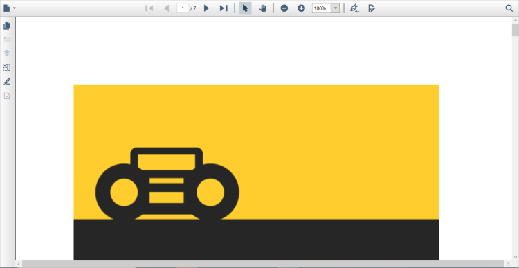
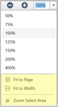
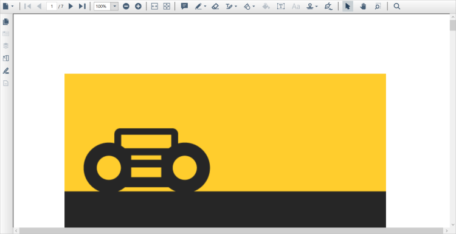

# Change the current toolbar design to the old toolbar design

From 21.1.0.X onwards, PDFViewer toolbar design was changed for better user interface and visual. The current toolbar design is shown as follows.
 
  
 
In order to change the new toolbar design back to the old toolbar design, set the customized style “SyncfusionPdfViewerCustomControlStyle”(refer to this style definition in the sample download link) to the [PdfViewerControl](https://help.syncfusion.com/cr/wpf/Syncfusion.Windows.PdfViewer.PdfViewerControl.html) as follows.




<syncfusion:PdfViewerControl x:Name="pdfViewer"
                             Style="{StaticResource SyncfusionPdfViewerCustomControlStyle}">
</syncfusion:PdfViewerControl>




The customized style of the PdfViewer toolbar re-arranges the toolbar icons as of the old design. However, it needs three new buttons to be added in the custom style to perform fit page, fit Width, and Marquee Zoom operations. The above mentioned three buttons are inside the zoom level combo box of the new toolbar design as follows.

  
 
So, the events for the above mentioned three buttons needs to trigger to achieve their functionalities as same in the old toolbar design. After applying the “SyncfusionPdfViewerCustomControlStyle” style to the PdfViewerControl, it will look as follows.
 
  
  
N> The sample for changing the current toolbar deign to the old toolbar design is present in the [GitHub](https://github.com/SyncfusionExamples/WPF-PDFViewer-Examples/tree/master/Toolbar/ChangeCurrentToolbarToOldToolbar).