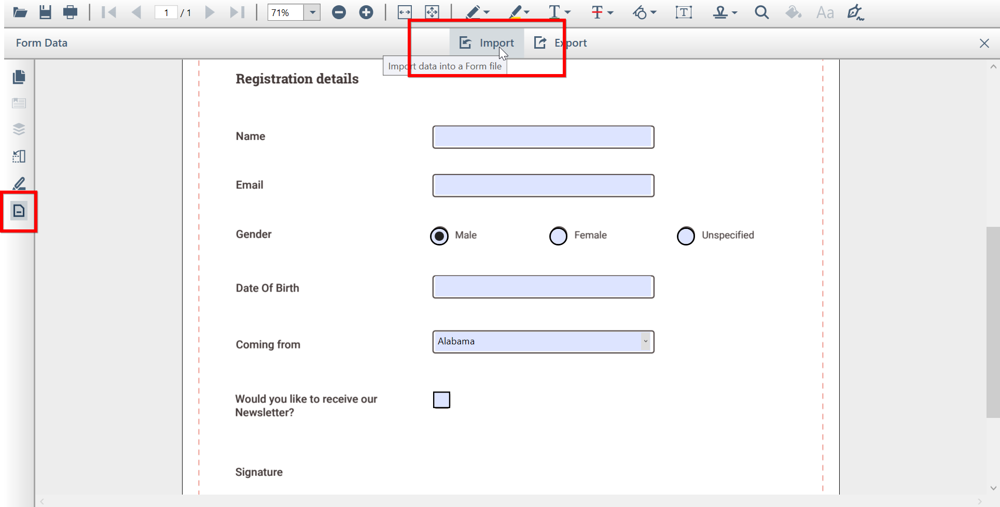

# Import, Export Form Data using PDF Viewer

PDF viewer WPF allows the users to import and export form data to and from the PDF documents.

## Import Form Data

Follow below steps to import date to PDF document with AcroForm.

1.	Click on the form data tool button in the left pane, the form data toolbar will appear as a secondary toolbar in `PdfViewerControl`.
2.	Select **Import** option in form data toolbar to import the PDF form data.

  

The following code shows how to import form data in code behind.




private void button1_Click(object sender, RoutedEventArgs e)
{
    //Import PDF form data
    pdfviewer.ImportFormData("Import.fdf", Syncfusion.Pdf.Parsing.DataFormat.Fdf);
}




Private Sub button1_Click(sender As Object, e As RoutedEventArgs)
    'Import PDF form data
    pdfviewer.ImportFormData("Import.fdf", Syncfusion.Pdf.Parsing.DataFormat.Fdf)
End Sub




## Export Form Data

Select **Export** option in form data toolbar, to save the completed PDF form data as a file in another file format.

In Export Form Data As dialog box, you can select the desired format to save the form data (FDF, XFDF, XML, JSON).

N> If PDF document is loaded as a stream, the `PdfViewerControl` will request for the form name while exporting.

The following code shows how to export form data in code behind.




private void button1_Click(object sender, RoutedEventArgs e)
{
    //Export PDF form data
    pdfviewer.ExportFormData("Export.fdf", Syncfusion.Pdf.Parsing.DataFormat.Fdf, "SourceForm.pdf");
}




Private Sub button1_Click(sender As Object, e As RoutedEventArgs)
    'Export PDF form data
    pdfviewer.ExportFormData("Export.fdf", Syncfusion.Pdf.Parsing.DataFormat.Fdf, "SourceForm.pdf")
End Sub


