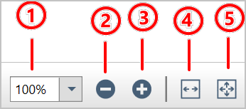

# Adjust the magnification of PDF documents using WPF PDF Viewer

The WPF PDF Viewer has predefined set of zoom tools in the built-in toolbar, that allows you to change magnifications of the PDF document that is being displayed.

1.	**Combo box**: It allows you to select a zoom percentage from the pre-defined set of values listed in the dropdown. Since it is editable, you can also provide your own zoom values by double editing the text area.
2.	**Zoom out button**: It allows you to reduce the zoom value 25% from the current zoom percentage.
3.	**Zoom in button**: It allows you to increase the zoom value 25% from the current zoom percentage.
4.	**Fit to width button**: It allows you to fit the document to the width of the control.
5.	**Fit to page button**: It allows you to fit a whole page in the window and to view only one page at a time.

## Hide the zoom tools in the toolbar

You can hide the zoom tools in the toolbar by setting the value `false` to the [ShowZoomTools](https://help.syncfusion.com/cr/wpf/Syncfusion.Windows.PdfViewer.PdfViewerToolbarSettings.html#Syncfusion_Windows_PdfViewer_PdfViewerToolbarSettings_ShowZoomTools) property of [ToolbarSettings](https://help.syncfusion.com/cr/wpf/Syncfusion.Windows.PdfViewer.PdfViewerControl.html#Syncfusion_Windows_PdfViewer_PdfViewerControl_ToolbarSettings). Refer to the following code to hide the zoom tools.



// Hide the zoom tools
pdfViewer.ToolbarSettings.ShowZoomTools = false;



## Customization through APIs

If you are using [PdfDocumentView](https://help.syncfusion.com/cr/wpf/Syncfusion.Windows.PdfViewer.PdfDocumentView.html) control or do not want to use the built-in toolbar, you can still accomplish the functions, using the PDF Viewer's APIs. 

### Magnify the document to a given zoom percentage

You can magnify the document to a given zoom percentage by using the [ZoomTo](https://help.syncfusion.com/cr/wpf/Syncfusion.Windows.PdfViewer.PdfViewerControl.html#Syncfusion_Windows_PdfViewer_PdfViewerControl_ZoomTo_System_Int32_) function of the PDF Viewer. Refer to the following code to apply the specific zoom percentage based on the page contents.



//Zoom to 235 percentage.
pdfViewer.ZoomTo(235);



The [ZoomPercentage](https://help.syncfusion.com/cr/wpf/Syncfusion.Windows.PdfViewer.PdfViewerControl.html#Syncfusion_Windows_PdfViewer_PdfViewerControl_ZoomPercentage) property can be used to get the control's current zoom percentage.



//Get the current zoom percentage.
int currentZoomPercnetage = pdfViewer.ZoomPercentage;



## Zoom modes

As stated above, the PDF Viewer supports the fit to page and fit to width zoom modes. You can change the zoom mode, using the [ZoomMode](https://help.syncfusion.com/cr/wpf/Syncfusion.Windows.PdfViewer.PdfViewerControl.html#Syncfusion_Windows_PdfViewer_PdfViewerControl_ZoomMode) property of the PDF Viewer. Refer to the following code to change zoom mode.



//To apply fit-to-page zoom mode.
pdfViewer.ZoomMode = ZoomMode.FitPage;

// To apply fit-to-width zoom mode.
pdfViewer.ZoomMode = ZoomMode.FitWidth;



## Define the minimum and maximum zoom percentage

The default minimum and maximum zoom percentage of the PDF Viewer is 50 and 400 respectively. However, the PDF Viewer allows you to customize the minimum and maximum zoom percentage values based on your requirement.

You can customize the minimum zoom percentage of the PDF viewer using the [MinimumZoomPercentage](https://help.syncfusion.com/cr/wpf/Syncfusion.Windows.PdfViewer.PdfViewerControl.html#Syncfusion_Windows_PdfViewer_PdfViewerControl_MinimumZoomPercentage) property. Its default value is 50. Refer to the following code to set the property and apply the customized minimum zoom percent to the PDF Viewer

N> The allowed value of this property ranges from 10 to the value of the [MaximumZoomPercentage](https://help.syncfusion.com/cr/wpf/Syncfusion.Windows.PdfViewer.PdfViewerControl.html#Syncfusion_Windows_PdfViewer_PdfViewerControl_MaximumZoomPercentage) of PDF Viewer.



//Load PDF document.
pdfViewer.Load(@"../../Data/Barcode.pdf");

//Set the minimum zoom percentage.
pdfViewer.MinimumZoomPercentage = 20;

//Magnify the document to minimum zoom percentage.
pdfViewer.ZoomTo(pdfviewer.MinimumZoomPercentage);



Similarly, you can customize the maximum zoom percentage of the PDF viewer using the [MaximumZoomPercentage](https://help.syncfusion.com/cr/wpf/Syncfusion.Windows.PdfViewer.PdfViewerControl.html#Syncfusion_Windows_PdfViewer_PdfViewerControl_MaximumZoomPercentage) property. Its default value is 400. Refer to the following code to set the property and apply the customized maximum zoom percentage to PDF Viewer.

N> The allowed value of this property ranges from the value of [MinimumZoomPercentage](https://help.syncfusion.com/cr/wpf/Syncfusion.Windows.PdfViewer.PdfViewerControl.html#Syncfusion_Windows_PdfViewer_PdfViewerControl_MinimumZoomPercentage) of the PDF Viewer up to 6400 for PDFium rendering engine and 800 for SfPdf rendering engine respectively.



// Load PDF document.
pdfviewer.Load(@"../../Data/Barcode.pdf");

//Set the maximum zoom percentage.
pdfviewer.MaximumZoomPercentage = 600;

//Magnify the document to maximum zoom percentage.
pdfviewer.ZoomTo(pdfviewer.MaximumZoomPercentage);



## Zoom changes notification

You can be notified whenever the magnification is changed in the PDF Viewer though the [ZoomChanged](https://help.syncfusion.com/cr/wpf/Syncfusion.Windows.PdfViewer.PdfViewerControl.html#Syncfusion_Windows_PdfViewer_PdfViewerControl_ZoomChanged) event. You can also obtain the current zoom percentage through the [ZoomEventArgs](https://help.syncfusion.com/cr/wpf/Syncfusion.Windows.PdfViewer.ZoomEventArgs.html) of the event. Refer to the following code to wire and handle the event.



void WireZoomChangedEvent()
{
    pdfViewer.ZoomChanged += PdfViewer_ZoomChanged;
}

private void PdfViewer_ZoomChanged(object sender, ZoomEventArgs args)
{
    int currentZoomPercentage = args.ZoomPercentage;
}



## Active view port rendering at higher zoom percentages

From the 19.3 version, the maximum zoom percentage of the PDF viewer can be extended up to 6400% with the support of active view port rendering at higher zoom percentages. It renders only the part of PDF file that is visible on screen and ignoring the parts that are outside the viewport. The mode will be automatically enabled when the page size or zoom increased exceeds a specified limit on zooming.  This approach will be helpful to open the large-size pages containing PDF document at higher zoom levels.

N> This is applicable only for the Pdfium rendering engine.