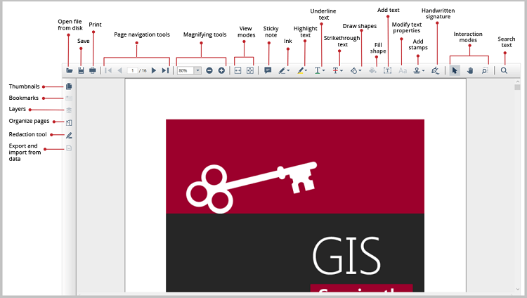

# WPF Pdf Viewer Overview

The PDF Viewer control supports viewing, reviewing, and printing PDF files in the WPF applications. The thumbnail, bookmark, hyperlink, and table of contents support provide easy navigation within and outside the PDF files. The form-filling support provides a platform to fill, flatten, save, and print PDF files with AcroForm. The PDF files can be reviewed with the abundantly available annotation tools.

## Key features

* **Open PDF files**: Opens PDF files, both normal and protected, with AES and RC4 encryption algorithms (password-protected). Open PDF files from the stream, file path, and PdfLoadedDocument objects.
* **Instant loading**: Loads the PDF files with thousands of pages instantly.
* **Less runtime memory**: On-demand loading, and virtualization mean the control holds only the minimum required pages at runtime to reduce the memory consumption.
* **Virtualized pages**: Renders pages on demand to help reduce the initial load time when working with large documents.
* **Printing**: Supports both the silent printing as well as printing using the print dialog.
* **Select and copy text**: Allows you to select and copy text from the PDF files.
* **Search text**: Allows you to locate a word or phrase easily in a PDF file.
* **Annotations**: Allows you to review and annotate the PDF files using a rich set of annotating tools.
* **Navigations**: Supports many types of internal and external navigations such as bookmarks, thumbnails, hyperlinks, and table of contents navigations.
* **Form Filling**: Provides the ability to fill, edit, flatten, and save AcroForms fields in the PDF files.
* **Organize pages**: Allows you to rotate, rearrange, and delete pages in a PDF file using a miniature preview of the PDF pages.
* **Redaction**: Allows you to remove the sensitive text and graphics from a PDF file.
* **PDF Layers**: Supports displaying the layer contents (adding, modifying, or deleting annotations) over the layers and adding, modifying, or deleting layers in a PDF file.
* **Exporting**: Supports exporting the PDF pages to image and exporting form data.

N> You can refer to our [WPF PDF Viewer](https://www.syncfusion.com/wpf-controls/pdf-viewer) feature tour page for its groundbreaking feature representations. You can also explore our [WPF PDF Viewer example](https://github.com/syncfusion/wpf-demos) to know how to render and configure the pdfviewer.