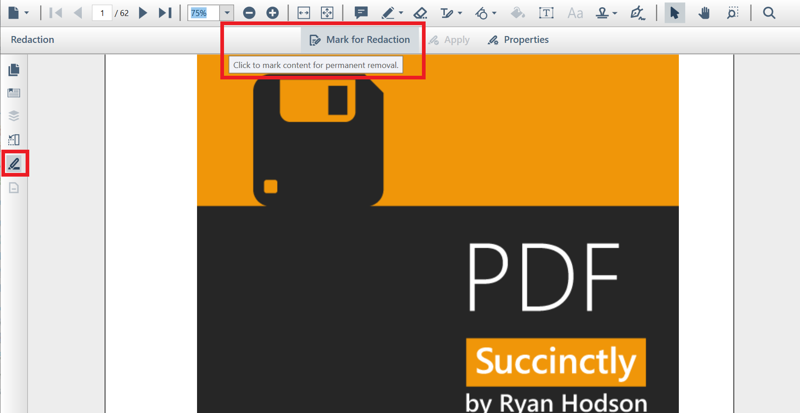
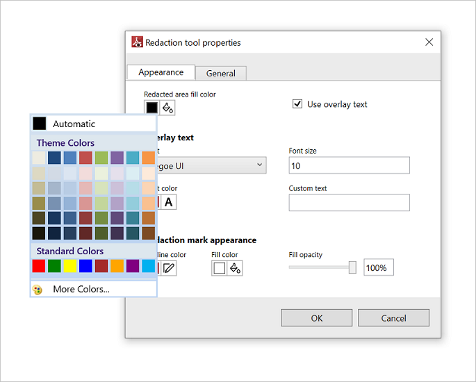
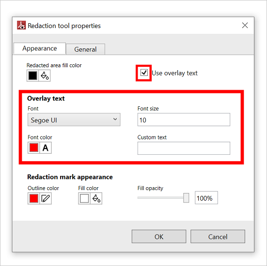
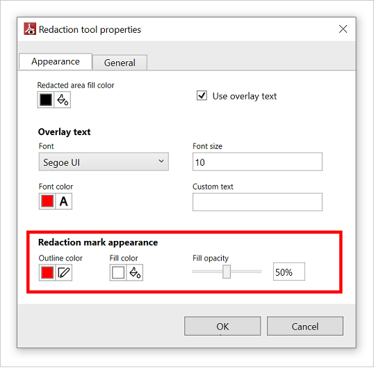
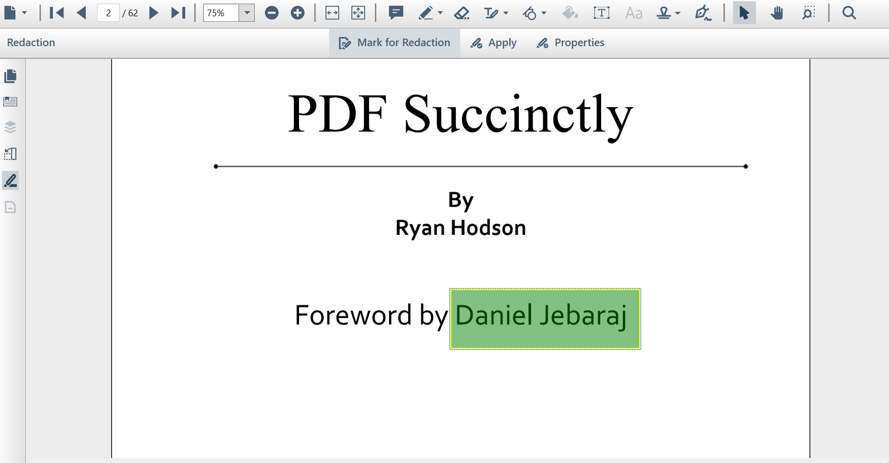
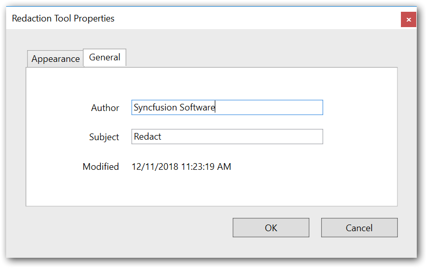
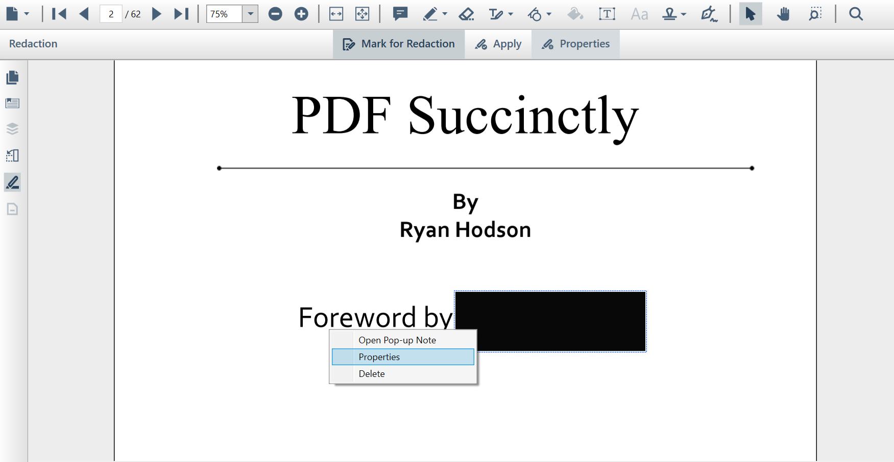
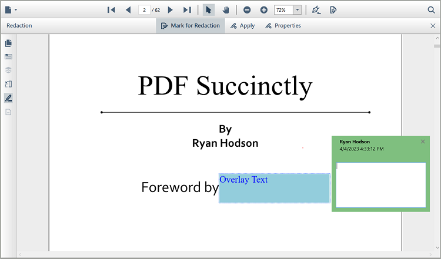
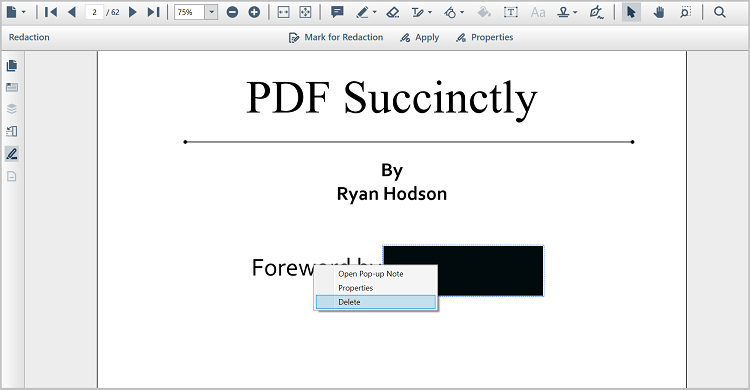

# Redact PDF contents in WPF Pdf Viewer

Redaction support allows you to remove sensitive/confidential information in text, images, and graphics from a PDF document.

## Enable redaction mode

The following code shows how to switch to redaction mode in code behind.




private void button1_Click(object sender, RoutedEventArgs e)
{
      //Enables redaction mode
      pdfviewer.PageRedactor.EnableRedactionMode = true;
}




Private Sub button1_Click(sender As Object, e As RoutedEventArgs)
     'Enables redaction mode
     pdfviewer.PageRedactor.EnableRedactionMode = true
End Sub




## Mark region to redact

Use the following steps to perform redaction in the PDF document page:

1.	Click the redaction tool button in the left pane, this displays the redaction toolbar as a secondary toolbar in the `PdfViewerControl`.
2.	Select **Mark for Redaction** from redaction toolbar to select the region or text to be redacted

	  

3.	Use the mouse pointer to select the region or the text to be redacted. This operation will create a mark in the region selected.
4.	Choose Apply in the redaction toolbar to redact the marked region.

N> Undo and redo can only be performed before applying the redaction, these operations cannot be performed after applying redaction. 

### Mark regions for redaction without UI interaction

You can also mark regions for redaction without UI interaction from the code behind using the `MarkRegions` method. Refer to the following code to mark the regions by passing the page index and the list of rectangle regions to be marked in the particular page for redaction.




private void Button_Click(object sender, RoutedEventArgs e)
{            
	List<RectangleF> rectangles = new List<RectangleF>();

	rectangles = new List<RectangleF>() { new RectangleF(100, 100, 100, 100) };

	// Appends regions to the existing marked regions, marking regions if it does not already exist.
	pdfViewerControl.PageRedactor.MarkRegions(0, rectangles, false);

	// Enable the redaction mode.
	pdfViewerControl.PageRedactor.EnableRedactionMode = true;
}




N> You can overwrite the existing marked regions with the new regions, By passing the value `true` for the `clearExisting` parameter of `MarkRegions` method.

## Customizing redaction appearance 

Choosing **Properties** from the redaction toolbar will show the default Redaction Tool Properties window, which contain two tabs:

•	Appearance
•	General

### Appearance tab

The redacted area fill color, overlay text, and redaction mark area appearances can be customized using the options in the Appearance tab.

#### Redaction appearance 

The following image illustrates how to change the fill color of the redacted area.

The following code shows how to change the redacted area fill color from code behind.




private void button1_Click(object sender, RoutedEventArgs e)
{
      //Sets the redacted area fill color
     pdfviewer.RedactionSettings.FillColor = Colors.AliceBlue;
}




Private Sub button1_Click(sender As Object, e As RoutedEventArgs)
         'Sets the redacted area fill color
         pdfviewer.RedactionSettings.FillColor = Colors.AliceBlue
End Sub




The following image illustrates how to change the overlay text appearance of the redacted area. You can disable the overlay text appearance by unchecking the **Use Overlay Text** checkbox.

The following code shows how to customize the overlay text appearance from code behind.




private void button1_Click(object sender, RoutedEventArgs e)
{
    //Set the overlay text
    pdfviewer.RedactionSettings.OverlayText = "overlay text";

    //Sets the overlay text font color 
    pdfviewer.RedactionSettings.FontColor = Colors.Blue;

    //Sets the overlay text font family 
    pdfviewer.RedactionSettings.FontFamily = new System.Windows.Media.FontFamily("Times new Roman");

    //Sets the overlay text font size
    pdfviewer.RedactionSettings.FontSize = 17;

    //Enable the overlay text appearance 
    pdfviewer.RedactionSettings.UseOverlayText = true;

}




Private Sub button1_Click(sender As Object, e As RoutedEventArgs)
    'Set the overlay text
    pdfviewer.RedactionSettings.OverlayText = "overlay text"

    'Sets the overlay text font color 
    pdfviewer.RedactionSettings.FontColor = Colors.Blue

    'Sets the overlay text font family 
    pdfviewer.RedactionSettings.FontFamily = new System.Windows.Media.FontFamily("Times new Roman")

    'Sets the overlay text font size
    pdfviewer.RedactionSettings.FontSize = 17

    'Enable the overlay text appearance 
    pdfviewer.RedactionSettings.UseOverlayText = true
End Sub




#### Marked redaction appearance

The marked redaction appearance represents the appearance of the region or text marked for redaction before the redaction is being applied. The fill color, border color, and fill color opacity of the redaction marked area can also be customized.

The following image illustrates how to customize the appearance of the redaction marked area. 

The following code shows how to customize the appearance of mark for redaction area from code behind.




private void button1_Click(object sender, RoutedEventArgs e)
{
     //Sets the redact mark area fill color
    pdfviewer.RedactionSettings.MarkAppearance.FillColor = Colors.Green;

    //Sets the redact mark area fill color opacity
    pdfviewer.RedactionSettings.MarkAppearance.FillOpacity = 0.5f;

    //Sets the redact mark area outline color 
    pdfviewer.RedactionSettings.MarkAppearance.OutlineColor = Colors.Yellow;
}




Private Sub button1_Click(sender As Object, e As RoutedEventArgs)
    'Sets the redact mark area fill color
    pdfviewer.RedactionSettings.MarkAppearance.FillColor = Colors.Green

    'Sets the redact mark area fill color opacity
    pdfviewer.RedactionSettings.MarkAppearance.FillOpacity = 0.5f

    'Sets the redact mark area outline color 
    pdfviewer.RedactionSettings.MarkAppearance.OutlineColor = Colors.Yellow
End Sub




The following image illustrates the appearance changes in redaction marked region.

### General tab

You can add or edit the Author and Subject of the redaction using General tab of the Redaction Tool Properties window.
The following image illustrates the customization of Author and Subject of the redaction.

## Appearance of the included redaction

Selecting the properties option from the context menu that is displayed when right-clicking the selected redaction will show the Redaction Tool Properties window of selected redaction.
The following image illustrates how to customize the appearance of the included redaction.

## Open pop-ups

Notes can be added to the redaction marked region by choosing Open Pop-up note option from the context menu. The following image illustrates the notes added to the redaction marked region.

## Delete redaction marked region

Select the delete option from the context menu that is displayed when right-clicking the selected redaction marked region will delete the respective redaction from the PDF document.
The following image illustrates how to delete the included redaction from the PDF document.

## Events

### Redaction applied notification

The `RedactionApplied` event notifies you when the marked regions of the page(s) are redacted. It provides the details of the redacted region through the `RedactionEventArgs`. The following code shows how to wire the event in [PdfViewerControl](https://help.syncfusion.com/cr/windowsforms/Syncfusion.Windows.Forms.PdfViewer.PdfViewerControl.html).




using Syncfusion.Windows.PdfViewer;
using System.Collections.Generic;
using System.Windows;

namespace RedactionAppliedEventDemo
{    
    public partial class MainWindow : Window
    {
        public MainWindow()
        {
            InitializeComponent();
            pdfViewerControl.PageRedactor.RedactionApplied += PageRedactor_RedactionApplied;
            pdfViewerControl.Load(@"../../Data/PDF_Succinctly.pdf");
        }
        private void PageRedactor_RedactionApplied(object sender, Syncfusion.Windows.PdfViewer.RedactionEventArgs args)
        {
            //Collection of redacted regions for pdf pages
             List<RedactionMark> RedactedMarks = args.Marks;

            foreach (RedactionMark redactionMark in RedactedMarks)
            {
                //Bounds of the redacted region
                System.Drawing.RectangleF RedactedRegion = redactionMark.Bounds;

                //Brush color used to fill the redacted region
                System.Windows.Media.Color Fillcolor = redactionMark.Fill;

                //Page index of the redaction mark
                int pageIndex = redactionMark.PageIndex;
            }
        }
    }
}




## Keyboard shortcuts

The following keyboard shortcuts are available to customize the marked redaction in the PDF document:
•	Delete key: Deletes the selected mark redaction from the PDF document.
•	Ctrl + Z: Performs undo functionality for recently performed operations.
•	Ctrl + Y: Performs redo functionality for recently performed operations.

N> All these operations can only be performed before applying the redaction.