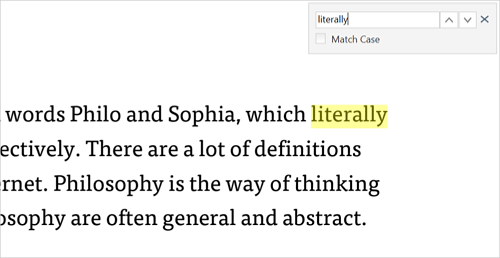

# Search text in PDF files using WPF PDF Viewer

N> From version 19.4.0.48, we have updated our default text extraction engine to PDFium for extracting text information from PDF documents. Based on the text information, we perform text search in PDF documents. Please refer to the [link](https://help.syncfusion.com/wpf/pdf-viewer/text-extraction-engines) for more details.

The WPF PDF Viewer allows you to search and highlight the text in the PDF files. The search box appears when Ctrl+F is pressed and searches the text in the PDF document as displayed in the following screenshot.

N> [PdfDocumentView](https://help.syncfusion.com/cr/wpf/Syncfusion.Windows.PdfViewer.PdfDocumentView.html) is used to view the PDF documents without the toolbar. So, make use of [PdfViewerControl](https://help.syncfusion.com/cr/wpf/Syncfusion.Windows.PdfViewer.PdfViewerControl.html) to search the text using search box.

## Search text in PDF programmatically

The WPF PDF Viewer also allows a user to search for text in the PDF document programmatically using the following methods

*  SearchText method
*  FindText method

## Search Text method

The [SearchText](https://help.syncfusion.com/cr/wpf/Syncfusion.Windows.PdfViewer.PdfViewerControl.html#Syncfusion_Windows_PdfViewer_PdfViewerControl_SearchText_System_String_) method allows the user to search and highlight a specific text in the PDF document after loading the document in the [PdfViewerControl](https://help.syncfusion.com/cr/wpf/Syncfusion.Windows.PdfViewer.PdfViewerControl.html).

### Search the initial occurrence of the text

The [SearchText(String)](https://help.syncfusion.com/cr/wpf/Syncfusion.Windows.PdfViewer.PdfViewerControl.html#Syncfusion_Windows_PdfViewer_PdfViewerControl_SearchText_System_String_) method finds the occurrences of the target text and highlights the first occurrence of the search in the UI. A user can also search the text with case sensitivity by passing the Boolean parameter as ‘true’ to the [SearchText(String, Boolean)](https://help.syncfusion.com/cr/wpf/Syncfusion.Windows.PdfViewer.PdfViewerControl.html#Syncfusion_Windows_PdfViewer_PdfViewerControl_SearchText_System_String_System_Boolean_) method. The below code illustrates how to search a text in a PDF programmatically.



 
//Handle the DocumentLoaded event of PdfViewerControl
private void PdfViewer_DocumentLoaded(object sender, System.EventArgs args)
{
    //Search the text in the PDF and highlight the first occurrence in UI
    pdfViewer.SearchText("Target Text");
}




### Search the next occurrence of the text

The [SearchNextText(String)](https://help.syncfusion.com/cr/wpf/Syncfusion.Windows.PdfViewer.PdfViewerControl.html#Syncfusion_Windows_PdfViewer_PdfViewerControl_SearchNextText_System_String_) method highlights the next occurrence of the highlighted search in the UI. If there is no highlighted search, it will highlight the first occurrence of the search. A user can also search the text with case sensitivity by passing the Boolean parameter as ‘true’ to the [SearchNextText(String, Boolean)](https://help.syncfusion.com/cr/wpf/Syncfusion.Windows.PdfViewer.PdfViewerControl.html#Syncfusion_Windows_PdfViewer_PdfViewerControl_SearchNextText_System_String_System_Boolean_) method. The below code snippet illustrates how to search the next occurrence of the text programmatically.



 
private void SearchNext_Click(object sender, RoutedEventArgs e)
{
    //Search and highlight the next occurrence of the target text
    pdfViewer.SearchNextText("Target text");
}




### Search the previous occurrence of the text

The [SearchPreviousText(String)](https://help.syncfusion.com/cr/wpf/Syncfusion.Windows.PdfViewer.PdfViewerControl.html#Syncfusion_Windows_PdfViewer_PdfViewerControl_SearchPreviousText_System_String_) method highlights the previous occurrence of the highlighted search in the UI. The user can also search the text with case sensitivity bypassing the Boolean parameter as ‘true’ to the [SearchPreviousText(String, Boolean)](https://help.syncfusion.com/cr/wpf/Syncfusion.Windows.PdfViewer.PdfViewerControl.html#Syncfusion_Windows_PdfViewer_PdfViewerControl_SearchPreviousText_System_String_System_Boolean_) method. The below code snippet illustrates how to search the previous occurrence of the text programmatically.



 
private void SearchPrevious_Click(object sender, RoutedEventArgs e)
{
    //Search and highlight the previuos occurrence of the target text
    pdfViewer.SearchPreviousText("Target text");
}




## Find text method

N> From version 27.1.x, we have used text extraction engine for find text from PDF documents. By default text extraction engine uses PDFium for extracting text information. Please refer to the [link](https://help.syncfusion.com/wpf/pdf-viewer/text-extraction-engines) for more details.

The [FindText](https://help.syncfusion.com/cr/wpf/Syncfusion.Windows.PdfViewer.PdfViewerControl.html#Syncfusion_Windows_PdfViewer_PdfViewerControl_FindText_System_String_System_Collections_Generic_Dictionary_System_Int32_System_Collections_Generic_List_System_Drawing_RectangleF____) method allows the user to search a particular text and get its bounds after loading the document in the [PdfViewerControl](https://help.syncfusion.com/cr/wpf/Syncfusion.Windows.PdfViewer.PdfViewerControl.html). The [FindText](https://help.syncfusion.com/cr/wpf/Syncfusion.Windows.PdfViewer.PdfViewerControl.html#Syncfusion_Windows_PdfViewer_PdfViewerControl_FindText_System_String_System_Collections_Generic_Dictionary_System_Int32_System_Collections_Generic_List_System_Drawing_RectangleF____) method returns ‘true’ when the given text is found in the document; else, it returns ‘false’.

### Find and get the bounds of a text

The [FindText(String, out Dictionary<Int32, List<RectangleF>>)](https://help.syncfusion.com/cr/wpf/Syncfusion.Windows.PdfViewer.PdfViewerControl.html#Syncfusion_Windows_PdfViewer_PdfViewerControl_FindText_System_String_System_Collections_Generic_Dictionary_System_Int32_System_Collections_Generic_List_System_Drawing_RectangleF____) method takes the input argument as the given text. It provides a dictionary that contains the page index and the list of rectangular coordinates(bounds) of the text found on that page. The below code snippet shows how to get the bounds of the given text:



 
private void PdfViewer_DocumentLoaded(object sender, EventArgs args)
{
    //Get the occurrences of the target text and location.
    Dictionary<int, List<RectangleF>> textSearch = new Dictionary<int, List<RectangleF>>();

    //Return true, if the given text is found
    bool isMatchFound = pdfViewer.FindText("FindText", out textSearch);
    if (isMatchFound)
    {
        //Get the list of bounds in the first page
        List<RectangleF> bounds = textSearch[0];
    }
}




### Find and get the bounds of a text on the desired page

The [FindText(String, Int32, out List<RectangleF>)](https://help.syncfusion.com/cr/wpf/Syncfusion.Windows.PdfViewer.PdfViewerControl.html#Syncfusion_Windows_PdfViewer_PdfViewerControl_FindText_System_String_System_Int32_System_Collections_Generic_List_System_Drawing_RectangleF___) method takes the input arguments as the text to be found along with the desired page index and provides a list of values that contains the rectangular coordinates(bounds) of the found text. The below code snippet shows how to get the bounds of the given text on a particular page:



 
private void PdfViewer_DocumentLoaded(object sender, EventArgs args)
{
    //Get the occurrences of the target text and location.
    List<RectangleF> textSearch = new List<RectangleF>();

    //Return true, if the given text is found in the particular page
    bool isMatchFound = pdfViewer.FindText("FindText",0, out textSearch);
    if (isMatchFound)
    {
        //Get the bounds of the first occurance in the particluar page
        RectangleF bounds = textSearch[0];
    }
}




### Find and get the bounds of the list of text

The [FindText(List<String>, out Dictionary<Int32, List<TextSearchResult>>)](https://help.syncfusion.com/cr/wpf/Syncfusion.Windows.PdfViewer.PdfViewerControl.html#Syncfusion_Windows_PdfViewer_PdfViewerControl_FindText_System_Collections_Generic_List_System_String__System_Collections_Generic_Dictionary_System_Int32_System_Collections_Generic_List_Syncfusion_Windows_PdfViewer_TextSearchResult____) method takes the input argument as the list of text that needs to be found. It provides a list of ‘TextSearchResult’, which contains the found text and its rectangular coordinates(bounds). The below code snippet shows how to get the bounds of the found text from the Text Search Result:



 
private void PdfViewer_DocumentLoaded(object sender, EventArgs args)
{
    //Get the occurrences of the target text and location.
    Dictionary<int, List<TextSearchResult>> searchResult = new Dictionary<int, List<TextSearchResult>>();
    //List of text need to be found
    List<string> findText = new List<string>() {"Find","Text"};;

    //Return true, if the given text is found in the particular page
    bool isMatchFound = pdfViewer.FindText(findText, out searchResult);
    if (isMatchFound)
    {
        //Get the bounds of the first TextSearchResult
        RectangleF bounds = searchResult[0][0].Bounds;
    }
}




### Find and get the bounds of the list of text on the desired page

The [FindText(List<String>, Int32, out List<MatchedItem>)](https://help.syncfusion.com/cr/wpf/Syncfusion.Windows.PdfViewer.PdfViewerControl.html#Syncfusion_Windows_PdfViewer_PdfViewerControl_FindText_System_Collections_Generic_List_System_String__System_Int32_System_Collections_Generic_List_Syncfusion_Pdf_Parsing_MatchedItem___) method takes the input argument as the list of text to be found along with the desired page index and provides the list of [MatchedItem](https://help.syncfusion.com/cr/wpf/Syncfusion.Pdf.Parsing.MatchedItem.html), which contains the matched text, and its rectangular coordinates(bounds). The below code snippet illustrates how to get the bounds of the text from the matched item:



 
private void PdfViewer_DocumentLoaded(object sender, EventArgs args)
{
    //Get the occurrences of the target text and location.
    List<MatchedItem> searchResult = new List<MatchedItem>();
    //List of text need to be found
    List<string> findText = new List<string>() {"Find","Text"};

    //Return true, if the given text is found in the particular page
    bool isMatchFound = pdfViewer.FindText(findText,0, out searchResult);
    if (isMatchFound)
    {
        //Get the bounds of the first MatchedItem on the desired page
        RectangleF bounds = searchResult[0].Bounds;
    }
}




N> You can refer to our [WPF PDF Viewer](https://www.syncfusion.com/wpf-controls/pdf-viewer) feature tour page for its groundbreaking feature representations. You can also explore our [WPF PDF Viewer example](https://github.com/syncfusion/wpf-demos) to know how to render and configure the pdfviewer.