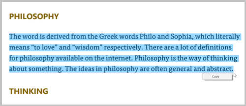

# Select and Copy Text in WPF Pdf Viewer

In PDF Viewer, text can be selected by clicking the mouse left button and dragging the mouse pointer over the text in any direction.

## Detecting the completion of text selection

When the text selection is completed, the [TextSelectionCompleted](https://help.syncfusion.com/cr/wpf/Syncfusion.Windows.PdfViewer.PdfViewerControl.html) event will be raised. The selected text can be retrieved as string from the `args` parameter of the event handler.




private void PdfViewer_TextSelectionCompleted(object sender, TextSelectionCompletedEventArgs args) 
{
      //Get the whole selected text 
      string selectedText = args.SelectedText;
      //Get the selected text and its rectangular bounds for each page separately if the          selection is made on multiple pages 
      Dictionary<int, Dictionary<string, Rectangle>> selectedTextInformation = args.SelectedTextInformation; 
}




## Copying the selected text

The selected text can be copied by clicking the copy from the context menu, which appears when clicking the right mouse button after the text is selected.

The selected text can also be copied using the keyboard shortcut Ctrl + C.
