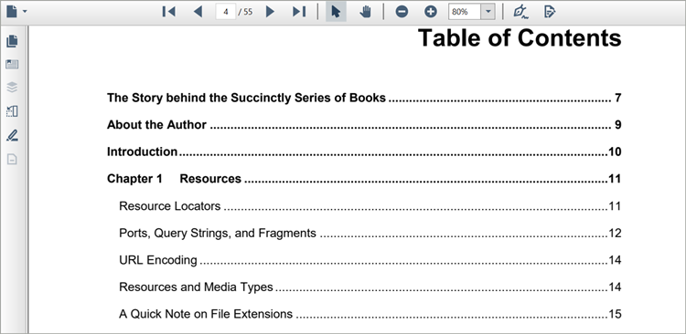

# Table of contents navigation in WPF Pdf Viewer

Table of contents navigation support in PDF Viewer control allows users to navigate to a particular destination of the contents present in the table of contents(TOC) of the loaded PDF document at UI level.

For additinal information about how the Table of contents navigation navigates to the destination location, please refer to the [bookmark feature](https://help.syncfusion.com/wpf/pdf-viewer/bookmark-navigation) of the PDF Viewer.

N> You can refer to our [WPF PDF Viewer](https://www.syncfusion.com/wpf-controls/pdf-viewer) feature tour page for its groundbreaking feature representations. You can also explore our [WPF PDF Viewer example](https://github.com/syncfusion/wpf-demos) to know how to render and configure the pdfviewer.