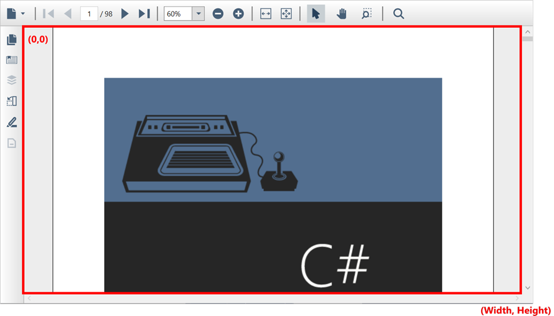
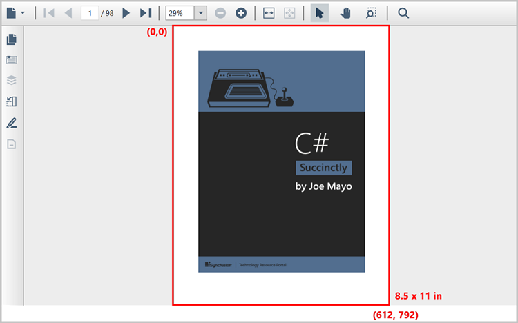

# Working With PDF Coordinates in the WPF PDF Viewer

The WPF PDF Viewer allows users to obtain the PDF page coordinates relative to the PDF Viewer's client coordinates and vice versa. It also allows you to get the scroll point relative to the PDF page coordinates and bring a specific region into view.

## Client coordinates

The WPF PDF Viewer specifies the position of points in the client area(viewport) using client coordinates. The upper-left corner of the client area (viewport) of the control is the origin for client coordinates. The dimensions of the client area(viewport) are also known as **client rectangle**, which is the bounds of the control without non-client elements such as toolbars and scroll bars. The client rectangle in the WPF PDF Viewer is represented by the red rectangle in the following figure.

  	

The client rectangle can be obtained by the [ClientRectangle](https://help.syncfusion.com/cr/wpf/Syncfusion.Windows.PdfViewer.PdfViewerControl.html#Syncfusion_Windows_PdfViewer_PdfViewerControl_ClientRectangle) property of the PDF Viewer.




//Retrieve the coordinates of the PDF Viewer's client area (viewport)
Rectangle clientRectangle = pdfViewerControl.ClientRectangle;




## PDF page coordinates

PDF page coordinates are represented in terms of a device-independent coordinate system called user space, which is independent of the output device that will be used for printing or display. The user space coordinate system is initialized to its default state for each page of a PDF document. The length of a unit is 1/72 inches, which is approximately the same as a unit of **point(pt)**. As an example, the following figure shows the dimensions of a letter-sized paper in the PDF page coordinates with the WPF PDF Viewer.

  	

## Get and set the scroll coordinates

The user can navigate to the specified vertical and horizontal scroll offset coordinates in PDF Viewer using [ScrollTo](https://help.syncfusion.com/cr/wpf/Syncfusion.Windows.PdfViewer.PdfViewerControl.html#Syncfusion_Windows_PdfViewer_PdfViewerControl_ScrollTo_System_Double_System_Double_) method and the user can also retrieve the current horizontal and vertical offset position by using the [HorizontalOffset](https://help.syncfusion.com/cr/wpf/Syncfusion.Windows.PdfViewer.PdfViewerControl.html#Syncfusion_Windows_PdfViewer_PdfViewerControl_HorizontalOffset) and [VerticalOffset](https://help.syncfusion.com/cr/wpf/Syncfusion.Windows.PdfViewer.PdfViewerControl.html#Syncfusion_Windows_PdfViewer_PdfViewerControl_VerticalOffset) properties respectively. The following code snippet explains how to get and set the scroll coordinates.




//Retrieve the current horizontal offset of the PdfViewerControl
m_currentHorizontalOffset = pdfViewerControl.HorizontalOffset;
//Retrieve the current vertical offset of the PdfViewerControl
m_currentVerticalOffset = pdfViewerControl.VerticalOffset;
//Scroll the content to the specified offset position in the PdfViewerControl
pdfViewerControl.ScrollTo(m_currentHorizontalOffset+10, m_currentVerticalOffset+10);




## Convert PDF Viewer's coordinates to PDF page coordinates

The user can convert the client coordinates to the PDF page coordinates using the [ConvertClientPointToPagePoint](https://help.syncfusion.com/cr/wpf/Syncfusion.Windows.PdfViewer.PdfViewerControl.html#Syncfusion_Windows_PdfViewer_PdfViewerControl_ConvertClientPointToPagePoint_System_Windows_Point_System_Int32_) method by passing the client rectangle point and page number as input parameters. The user can get the page number of the client area using the [GetPageNumberFromClientPoint](https://help.syncfusion.com/cr/wpf/Syncfusion.Windows.PdfViewer.PdfViewerControl.html#Syncfusion_Windows_PdfViewer_PdfViewerControl_GetPageNumberFromClientPoint_System_Windows_Point_) method by passing the client rectangle point as the input parameter. The following code snippet explains how to convert the clicked client area position to a page point.




// Handle the Page Clicked Event
private void PdfViewerControl_PageClicked(object sender, PageClickedEventArgs e)
{
    //Retrieve the clicked client area position
    Point clientPoint = e.Position;
    //Retrieve the page number that corresponds to the client point
    int pageNumber = pdfViewerControl.GetPageNumberFromClientPoint(clientPoint)
 
    //Retrieve the page point
    Point pagePoint = pdfViewerControl.ConvertClientPointToPagePoint(clientPoint, pageNumber);
} 




## Convert PDF page coordinates to PDF Viewer's coordinates

The user can also convert the PDF page coordinates to the client coordinates using the [ConvertPagePointToClientPoint](https://help.syncfusion.com/cr/wpf/Syncfusion.Windows.PdfViewer.PdfViewerControl.html#Syncfusion_Windows_PdfViewer_PdfViewerControl_ConvertPagePointToClientPoint_System_Windows_Point_System_Int32_) method by passing the page point and page number as input parameters. The following code snippet explains how to convert a shape annotation's position in the page coordinates to a client point.




//Handle the shape annotation change event
private void PdfViewer_ShapeAnnotationChanged(object sender, ShapeAnnotationChangedEventArgs e)
{
    //Get the bounds of the shape annotation
    RectangleF bounds = e.OldBounds;
    //Create the point from the bounds
    Point pagePoint = new Point(bounds.X, bounds.Y);
    //Get the Page Number from the event arguments
    int pageNumber = e.PageNumber;

    //Convert the page point to client point
    Point clientPoint = pdfViewerControl.ConvertPagePointToClientPoint(pagePoint, pageNumber);
}




## Convert PDF page coordinates to scroll coordinates

The user can obtain the scroll coordinates using the [ConvertPagePointToScrollPoint](https://help.syncfusion.com/cr/wpf/Syncfusion.Windows.PdfViewer.PdfViewerControl.html#Syncfusion_Windows_PdfViewer_PdfViewerControl_ConvertPagePointToScrollingPoint_System_Windows_Point_System_Int32_) method by passing the page point and page number as input parameters. The following code example explains how to convert a shape annotation’s position in the page coordinates to a scroll point in the PDF Viewer.




//Handle the shape annotation change event
private void PdfViewer_ShapeAnnotationChanged(object sender, ShapeAnnotationChangedEventArgs e)
{
    //Get the bounds of the shape annotation
    RectangleF bounds = e.OldBounds;
    //Create the point from the bounds
    Point pagePoint = new Point(bounds.X, bounds.Y);
    //Get the Page Number from the event arguments
    int pageNumber = e.PageNumber;

    //Convert the page point to scroll point
    Point scrollPoint = pdfViewerControl.ConvertPagePointToScrollPoint(pagePoint, pageNumber);
}




## Bring a particular region into view

The user can bring the given rectangular region into view and zoom in to the document to fit the region in the PDF Viewer's client area (viewport) using the [ZoomToRect](https://help.syncfusion.com/cr/wpf/Syncfusion.Windows.PdfViewer.PdfViewerControl.html#Syncfusion_Windows_PdfViewer_PdfViewerControl_ZoomToRect_System_Windows_Rect_) method by passing the rectangular region as an input parameter. The following code snippet explains how to bring a particular region into view.




//Create a bound with respect to client area
Rect bounds = new Rect(400 , 300, 200, 400)
//Pass the converted rectangle in client coordinates to the ZoomToRect method. 
pdfViewerControl.ZoomToRect(bounds);




N> You can refer to our [WPF PDF Viewer](https://www.syncfusion.com/wpf-controls/pdf-viewer) feature tour page for its groundbreaking feature representations. You can also explore our [WPF PDF Viewer example](https://github.com/syncfusion/wpf-demos) to know how to render and configure the pdfviewer.