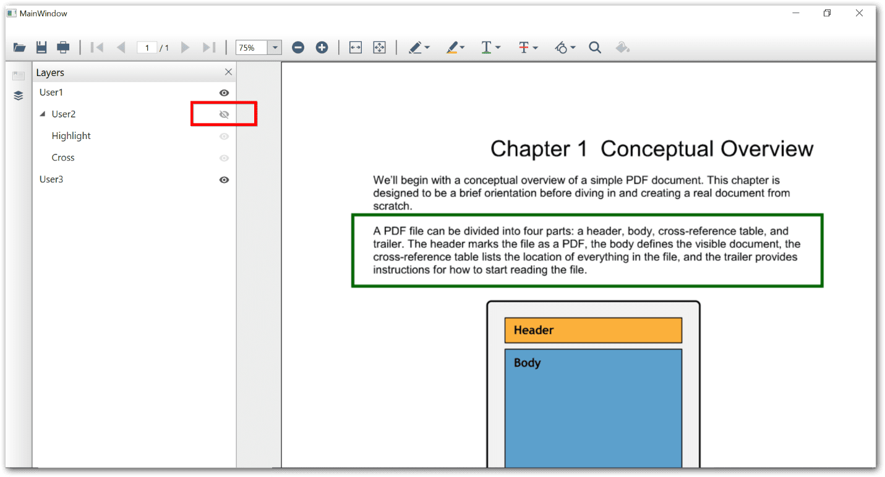

# Working with PDF Layers in WPF Pdf Viewer

The layer support in PDF viewer allows users to toggle the visibility of individual and group of layers in the PDF document to view, print, save, and export as image.

## Toggling the visibility of a PDF layer

To toggle the visibility of PDF layers individually, click the eye icon associated with each layer in the layers pane. 

## Toggling the visibility of the group of layers

To toggle the visibility of a group of PDF layers, click the eye icon associated with parent layer in the layers pane.  

## Disabling the layers

You can disable the display of the layers present in the PDF document by setting the EnableLayers property to false. Refer to the following code example.




private void Window_Loaded(object sender, RoutedEventArgs e)
{
    PdfLoadedDocument pdf = new PdfLoadedDocument("PdfLayers.pdf");
    pdfViewer.Load(pdf);
    pdfViewer.EnableLayers = false;

}





Private Sub Window_Loaded(sender As Object, e As RoutedEventArgs)
    Dim pdf As New PdfLoadedDocument("PdfLayers.pdf")
    pdfViewer.Load(pdf) 
    pdfViewer.EnableLayers = false;
End Sub




You can also achieve the same in XAML using the DependencyProperty illustrated as follows.



<syncfusion:PdfViewerControl x:Name="pdfViewer" EnableLayers="False" />



N> By default, the layer feature is enabled in PDF viewer.
