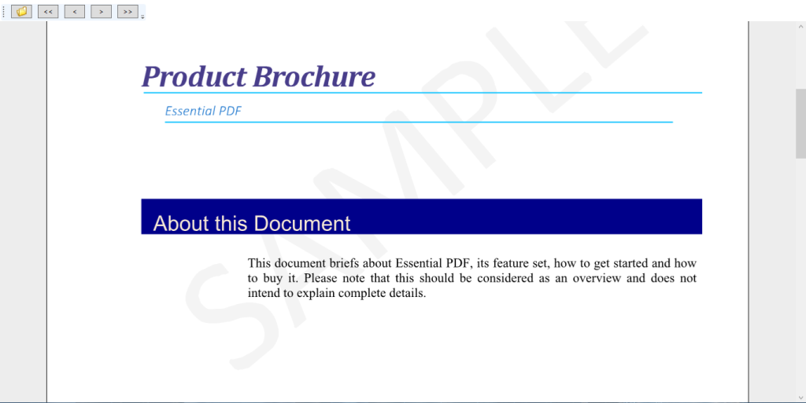

# Getting Started

This Section explains about the Assemblies deployment, Subsequent sections that take you through the structure of the PdfViewerControl component and explains how to create Simple application with PdfViewerControl, how to create a custom Viewer using the PdfDocumentView control.

## Assemblies Deployment

This topic explains about the assembly that is required in your WPF application when you want to use PdfViewerControl. The following is the list of assemblies.

### Assemblies Table

<table>
<tr>
<th>
Required Assemblies</th><th>
Description</th></tr>
<tr>
<td>
Syncfusion.Compression.Base</td><td>
This library takes care of various compression and decompression operations that is internally used in PDF file.</td></tr>
<tr>
<td>
Syncfusion.Core</td><td>
The licensing component.</td></tr>
<tr>
<td>
Syncfusion.Pdf.Base</td><td>
The base library that contains the PDF reader and creator that supports the PdfViewerControl.</td></tr>
<tr>
<td>
Syncfusion.PdfViewer.Wpf</td><td>
The PDF Viewer component that contains the rendering area and other related UI elements.</td></tr>
<tr>
<td>
Syncfusion.Shared.Wpf</td><td>
The component provides various UI styles and themes used in the PdfViewer control.</td></tr>
</table>

## Feature Summary

Supported features include:

* Support for viewing and printing PDF files.
* Support for various PDF objects such as text, lines, curves, color spaces, and JPEG images with DCTDecode, CCITTFaxDecode, and FlateDecode filters.
* Support for exporting PDF pages as raster images.

Supported and non-supported elements of Essential PDF Viewer for Windows Forms, WPF and ASP.NET MVC are listed in the following table.

### Supported and non-supported elements

<table>
<tr>
<th>
Features</th><th>
Windows</th><th>
WPF</th><th>
ASP.NET MVC</th></tr>
<tr>
<td>
Text</td><td>
Yes</td><td>
Yes</td><td>
Yes</td></tr>
<tr>
<td>
Graphical Elements (Line, Curve etc.)</td><td>
Yes</td><td>
Yes</td><td>
Yes</td></tr>
<tr>
<td colspan = "4">
Image Formats</td></tr>
<tr>
<td>
JPEG</td><td>
Yes </td><td>
Yes</td><td>
Yes</td></tr>
<tr>
<td>
PNG</td><td>
Yes</td><td>
Yes</td><td>
Yes</td></tr>
<tr>
<td>
TIFF</td><td>
Yes</td><td>
Yes</td><td>
Yes</td></tr>
<tr>
<td>
Inline Images</td><td>
Yes</td><td>
Yes</td><td>
Yes</td></tr>
<tr>
<td colspan = "4">
Encoding Techniques</td></tr>
<tr>
<td>
Soft mask</td><td>
Yes</td><td>
Yes</td><td>
Yes</td></tr>
<tr>
<td>
Image mask</td><td>
Yes</td><td>
Yes</td><td>
Yes</td></tr>
<tr>
<td colspan = "4">
Fonts </td></tr>
<tr>
<td>
Standard Fonts</td><td>
Yes</td><td>
Yes</td><td>
Yes</td></tr>
<tr>
<td>
TrueType Fonts</td><td>
Yes</td><td>
Yes</td><td>
Yes</td></tr>
<tr>
<td>
Type 0, Type 1,Type 3</td><td>
Yes</td><td>
Yes</td><td>
Yes</td></tr>
<tr>
<td>
Embedded Fonts</td><td>
Yes</td><td>
Yes</td><td>
Yes</td></tr>
<tr>
<td colspan = "4">
Color Space</td></tr>
<tr>
<td>
RGB</td><td>
Yes</td><td>
Yes</td><td>
Yes</td></tr>
<tr>
<td>
CMYK</td><td>
Yes</td><td>
Yes</td><td>
Yes</td></tr>
<tr>
<td>
Gray</td><td>
Yes</td><td>
Yes</td><td>
Yes</td></tr>
<tr>
<td>
ICC</td><td>
Yes</td><td>
Yes</td><td>
Yes</td></tr>
<tr>
<td>
Indexed </td><td>
Yes</td><td>
Yes</td><td>
Yes</td></tr>
<tr>
<td>
CalRGB* </td><td>
Yes</td><td>
Yes</td><td>
Yes</td></tr>
<tr>
<td>
CalGray*</td><td>
Yes</td><td>
Yes</td><td>
Yes</td></tr>
<tr>
<td>
Lab*</td><td>
Yes</td><td>
Yes</td><td>
Yes</td></tr>
<tr>
<td>
Separation* </td><td>
Yes</td><td>
Yes</td><td>
Yes</td></tr>
<tr>
<td>
DeviceN*</td><td>
Yes</td><td>
Yes</td><td>
Yes</td></tr>
<tr>
<td>
Pattern*</td><td>
Yes</td><td>
Yes</td><td>
Yes</td></tr>
<tr>
<td colspan = "4">
Compression Filters</td></tr>
<tr>
<td>
DCTDecode (Image, Content)</td><td>
Yes </td><td>
Yes</td><td>
Yes</td></tr>
<tr>
<td>
CCITTFaxDecode (Image)</td><td>
Yes</td><td>
Yes</td><td>
Yes</td></tr>
<tr>
<td>
FlateDecode (Image, Content)</td><td>
Yes </td><td>
Yes</td><td>
Yes</td></tr>
<tr>
<td>
LZWDecode (Content only)</td><td>
Yes </td><td>
Yes</td><td>
Yes</td></tr>
<tr>
<td>
ASCII85Decode (Content only)</td><td>
Yes </td><td>
Yes</td><td>
Yes</td></tr>
<tr>
<td>
ASCIIHexDecode (Image)</td><td>
Yes</td><td>
Yes</td><td>
Yes</td></tr>
<tr>
<td>
JBIG2Decode (Image)</td><td>
Yes</td><td>
Yes</td><td>
Yes</td></tr>
<tr>
<td colspan = "4">
Interactive Features</td></tr>
<tr>
<td>
Actions</td><td>
No</td><td>
No</td><td>
No</td></tr>
<tr>
<td>
Annotations</td><td>
Yes**</td><td>
Yes**</td><td>
No</td></tr>
<tr>
<td>
Attachments</td><td>
No</td><td>
No</td><td>
No</td></tr>
<tr>
<td>
Bookmarks</td><td>
No</td><td>
No</td><td>
No</td></tr>
<tr>
<td>
Form</td><td>
No</td><td>
No</td><td>
No</td></tr>
<tr>
<td>
Page Navigation</td><td>
Yes</td><td>
Yes</td><td>
Yes</td></tr>
<tr>
<td>
Zoom</td><td>
Yes</td><td>
Yes</td><td>
Yes</td></tr>
<tr>
<td>
Navigation Pane</td><td>
No</td><td>
No</td><td>
No</td></tr>
<tr>
<td>
Selection (Keyboard & Mouse)</td><td>
No</td><td>
No</td><td>
No</td></tr>
<tr>
<td>
Search</td><td>
Yes</td><td>
Yes</td><td>
No</td></tr>
<tr>
<td>
Document Information</td><td>
No</td><td>
No</td><td>
No</td></tr>
<tr>
<td>
Conformance</td><td>
Yes</td><td>
Yes</td><td>
Yes</td></tr>
<tr>
<td>
Encrypted Documents</td><td>
Yes</td><td>
Yes</td><td>
Yes</td></tr>
<tr>
<td>
Edit</td><td>
No</td><td>
No</td><td>
No</td></tr>
<tr>
<td>
Touch Support</td><td>
No</td><td>
Yes***</td><td>
No</td></tr>
<tr>
<td colspan = "4">
Print</td></tr>
<tr>
<td>
Silent Printing</td><td>
Yes</td><td>
Yes</td><td>
Yes</td></tr>
<tr>
<td>
Send to Printer</td><td>
Yes</td><td>
Yes</td><td>
Yes</td></tr>
<tr>
<td colspan = "4">
Export</td></tr>
<tr>
<td>
Image </td><td>
Yes (raster and vector formats)</td><td>
Yes (raster format only)</td><td>
No</td></tr>
</table>

*Supports only Brushes (text and shapes).

**Supports only URI annotation.

***Supported in 4.0 and higher framework.

## Appearance and Structure of the Control

The following screenshot is a pictorial representation of PDF Viewer. 

Structure of PDF Viewer
{:.caption}

ToolStrip

Structure of ToolStrip
{:.caption}

1. File Open Dialog
2. Save File Dialog
3. Show Print Dialog
4. Goto first page
5. Goto previous page
6. Page Indicator
7. Goto next page
8. Goto last page
9. Increase magnification
10. Decrease magnification
11. Preset magnification
12. Fill window
13. Fit page to window

## Create a Simple Application with Essential PDF Viewer

Following steps demonstrate how to create a simple application with Essential PdfViewer for WPF and load a PDF document.

1. Create new WPF application in Visual Studio.
2. Open the Visual Studio tool box. Navigate to “Syncfusion WPF Toolbox” tab, and drag the PdfViewerControl toolbox item to the Designer window. 

   

    PDF Viewer control in toolbox

   When you drag the PdfViewerControl toolbox item to the window, it automatically adds the required references to the current application.

3. To add the PdfViewerControl using code, add the following assemblies as reference to the project.
   1. Syncfusion.Compression.Base
   2. Syncfusion.Core
   3. Syncfusion.Pdf.Base
   4. Syncfusion.PdfViewer.Wpf
   5. Syncfusion.Shared.Wpf
4. Add the following highlighted Syncfusion namespace in XAML to make use of PdfViewerControl. 

   ~~~xaml

		<Window

		xmlns="http://schemas.microsoft.com/winfx/2006/xaml/presentation"

		xmlns:x="http://schemas.microsoft.com/winfx/2006/xaml"

		xmlns: Syncfusion ="clr-namespace:Syncfusion.Windows.PdfViewer;assembly=Syncfusion.PdfViewer.WPF" 

		x:Class="GettingStartedWPF.MainWindow"

		Title="MainWindow" Height="350" Width="525">

   ~~~		

5. Add the following code in XAML

   ~~~xaml

		<syncfusion:PdfViewerControl Name="pdfViewerControl1"/>

   ~~~
   
6. PdfViewerControl’s ItemSource property allows you to bind PDF documents in XAML. The ItemsSource property accepts a stream input that can be bound to the viewer during initialization.

   1. Create a simple class that loads a PDF report and provides the stream as a property that can bound to the Viewer as illustrated in the following code example. Save the class file as PdfReport.cs

   ~~~csharp

		public class PdfReport : INotifyPropertyChanged

		{

		private Stream docStream;

		public event PropertyChangedEventHandler PropertyChanged;

		public Stream DocumentStream

		{

		get

		{

		return docStream;

		}

		set

		{

		docStream = value;

		OnPropertyChanged(new PropertyChangedEventArgs("DocumentStream"));

		}

		}

		public PdfReport()

		{

		//Load the stream from the local system.

		docStream = new FileStream("Barcode.pdf", FileMode.OpenOrCreate);           

		}

		public void OnPropertyChanged(PropertyChangedEventArgs e)

		{

		if (PropertyChanged != null)

		PropertyChanged(this, e);

		}

		}

   ~~~

   2. In order to bind the DocumentStream property of the PdfReport class, set the DataContext for the Window. To add the DataContext in XAML, use the following code example.

   ~~~xaml

		<Window.DataContext>

		<local:PdfReport/>

		</Window.DataContext>

   ~~~

   3. Once the DataContext has been set, the ItemSource dependency property can be set by using the following code example in XAML.

   

    <Syncfusion:PdfViewerControl ItemSource="{Binding DocumentStream}"/>

   

7. Alternatively, the Open button from the toolbar can also be used to load documents at runtime.

## Customize PDF Viewer by using PdfDocumentView

In addition to the PdfViewerControl, Syncfusion also provides PdfDocumentView control. Using that, you can design your own customized PDF viewer using the available API. The PdfDocumentView control does not have a default toolbar, but provides a set of properties and methods using that a completely customized PDF viewer can be created. This section provides the step-by-step procedure for creating a simple customized PDF viewer using the PdfDocumentView control.

1. Drag the PdfDocumentView control from the toolbox and drop it into the application’s window. Name the control as documentViewer.

   

   Toolbox showing the PdfDocumentView control

2. The PdfDocumentView control has the rendering area where the pages are displayed in a virtualized scroll viewer.
3. The following XAML code illustrates how the PdfDocumentView control is added to the application.

   ~~~xaml

	<Syncfusion:PdfDocumentView Name="documentViewer"/>

   ~~~
   
   Loading a document

   To load a document in the PdfDocumentView control, add a button to your application by dragging the Button control available in the toolbox. Name the button as openButton. In the click event of the button, add the following C# code.

   ~~~csharp
   
        private void openButton_Click(object sender, RoutedEventArgs e)

        {             

            //Create a OpenFileDialog

            OpenFileDialog dialog = new OpenFileDialog();

            dialog.Filter = "Pdf Files (.pdf)|*.pdf";

            dialog.ShowDialog();

            //Load the document from the open file dialog

            if (!string.IsNullOrEmpty(dialog.FileName))

            {

                PdfLoadedDocument ldoc = new PdfLoadedDocument(dialog.FileName);

                documentViewer.Load(ldoc);

            }

        }

   ~~~

The following table displays the set of APIs available for loading and unloading PDF documents.

### Method Table

<table>
<tr>
<th>
Method </th><th>
Description </th><th>
Parameters </th><th>
Type </th><th>
Return Type </th></tr>
<tr>
<td>
Load</td><td>
This method is used to load the PDF to the viewer.</td><td>
Overloads: (string filePath) (string filePath, string password)(PdfLoadedDocument doc)(Stream file)</td><td>
N/A </td><td>
Void </td></tr>
<tr>
<td>
Unload</td><td>
Unloads the loaded PDF.</td><td>
-</td><td>
N/A</td><td>
Void</td></tr>
</table>

## Page Navigation

In addition to the virtualized page view in a scroll viewer, PdfDocumentView control also provides GoToPage and GoToPageAtIndex methods for page navigation. To add page navigation buttons to your application, add two buttons that helps in navigation for next and previous pages. Name them as gotoNextPageButton and gotoPrevPageButton respectively. In the click event of the buttons, add the following code.



	private void gotoNextPageButton_Click(object sender, RoutedEventArgs e)

	{

	//Check if the current page is not the last page and then navigate to the next page

	if (documentViewer.CurrentPageIndex != documentViewer.PageCount)

	{

	documentViewer.GoToPageAtIndex(documentViewer.CurrentPageIndex + 1);

	}

	}

	private void gotoPrevPageButton_Click(object sender, RoutedEventArgs e)

	{

	//Check if the current page is not the first page and then navigate to the previous page

	if (documentViewer.CurrentPageIndex != 1)

	{

	documentViewer.GoToPageAtIndex(documentViewer.CurrentPageIndex -1);

	}

        }


## Magnification Operations

The PdfDocumentView control also provides various magnification operations through ZoomMode, and ZoomPercentage properties. To add magnifying buttons to the application, add two buttons and name them as fitPageButton and fitWidthButton. In the click event of the buttons, add the following C# code.



private void fitPageButton_Click(object sender, RoutedEventArgs e)

{

documentViewer.ZoomMode = Syncfusion.Windows.PdfViewer.ZoomMode.FitPage;

}

private void fitWidthButton_Click(object sender, RoutedEventArgs e)

{

documentViewer.ZoomMode = Syncfusion.Windows.PdfViewer.ZoomMode.FitWidth;

}


## Printing a Document

The PdfDocumentView control also provides the Print APIs, to print the PDF documents programmatically using the PdfDocumentView control, add the following C# code to the click event of your print button.



private void printButton_Click(object sender, RoutedEventArgs e)

{

System.Windows.Controls.PrintDialog dialog = new System.Windows.Controls.PrintDialog();

if(dialog.ShowDialog()== true)

{

dialog.PrintDocument(documentViewer.PrintDocument.DocumentPaginator, "Print Document");

}          

}


The following screenshot illustrates the completely customized PDF Viewer created by using the PdfDocumentView control

A customized PDF Viewer using PdfDocumentView control
{:.caption}

