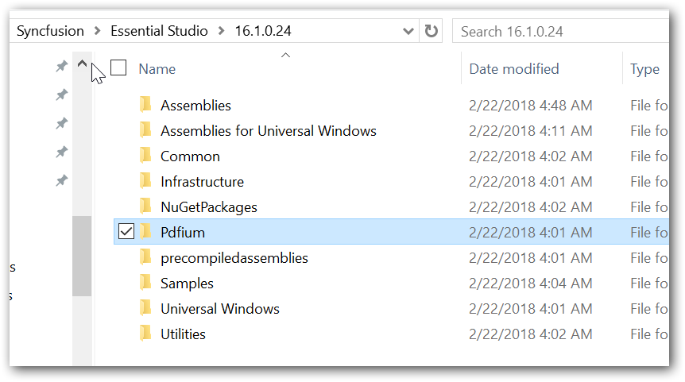
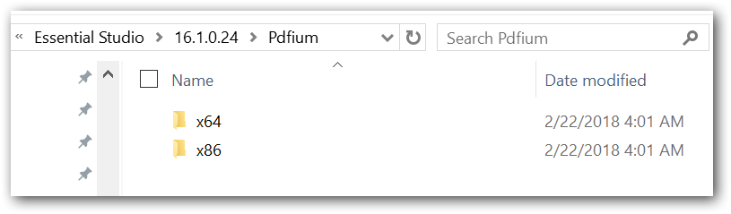

## Use PDFium rendering engine

From Essential Studio 16.1.0.24 PDF viewer control provides a robust rendering of PDF document using PDFium rendering engine. Please follow the below steps to use PDFium PDF rendering in Syncfusion PDF viewer.

1.	Copy the Pdfium assembly’s folder to a local folder from the installation path. The folder name must be “Pdfium”.

	The Pdfium assemblies will be available in 
    {$SystemDrive}:\Program Files (x86)\Syncfusion\Essential Studio\{Essential Studio version}\Pdfium 
	
	
	
	N> The Pdfium folder will contain two folders namely x86 and x64, both would contain pdfium.dll assembly for the respective architecture. The Syncfusion PDF viewer is designed to detect the architecture of the target machine in which it is deployed and would pick corresponding pdfium.dll to use it. 
	
	
	
2.	Then, the ReferencePath property of the PDF Viewer should be set to locate the “Pdfium” folder. 

	The following code snippet illustrates the same.

	


	PdfViewerControl pdfViewerControl1 = new PdfViewerControl ();
   //Specify the path for PDFium assembly. 
	pdfViewerControl1.ReferencePath = @"D:\Reference path";
   //Specify the PDF rendering engine as PDFium.
	pdfViewerControl1.RenderingEngine =PdfRenderingEngine.Pdfium; 
	//Load the PDF document 
	pdfViewerControl1.Load("Sample.pdf");





	Dim pdfViewerControl1 As New PdfViewerControl()
    'Specify the path for PDFium assembly
	pdfViewerControl1.ReferencePath = @"D:\Reference path"
    'Specify the PDF rendering engine as PDFium
	pdfViewerControl1.RenderingEngine =PdfRenderingEngine.Pdfium 
	'Load the PDF document 
	pdfViewerControl1.Load("Sample.pdf")

