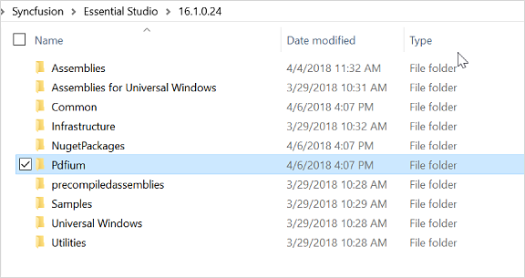
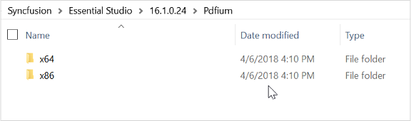

## Use Pdfium rendering engine

From Essential Studio 16.1.0.24 PDF viewer control provides a robust rendering of PDF document using Pdfium rendering engine. 

### Compatibility

<table>
<tr>
<th>
Operating Systems</th></tr>
<tr>
<td>
Windows Server 2008 (32 bit and 64 bit), Windows Vista (32 bit and 64 bit), Windows 2003, Windows 7,Windows 8, Windows 8.1

N> Pdfium is not supported in Windows XP
</td></tr>
</table>

Please follow the below steps to use Pdfium PDF rendering in Syncfusion PDF viewer.

1.	Copy the Pdfium assembly&#39;s folder to a local folder from the installation path. The folder name must be &#34;Pdfium&#34;.

	The Pdfium assemblies will be available in 
    {$SystemDrive}:\Program Files (x86)\Syncfusion\Essential Studio\{Essential Studio version}\Pdfium 
	
	
	
	N> The Pdfium folder will contain two folders namely x86 and x64, both would contain pdfium.dll assembly for the respective architecture. The Syncfusion PDF viewer is designed to detect the architecture of the target machine in which it is deployed and would pick corresponding pdfium.dll to use it. 
	
	
	
2.	Then, the ReferencePath property of the PDF Viewer should be set to locate the &#34;Pdfium&#34; folder. 

	N>  
	* If ReferencePath property is not defined explicitly, Pdfium folder will be generated in the application’s base directory,where the Pdfium assemblies will be extracted and be referred automatically. We recommend leaving the ReferencePath as blank, but if there is any access restriction to provide access to the application’s base directory, then you shall use ReferencePath property. 
	* The RenderingEngine property of the PDF viewer is set to Pdfium by default, but if you wish to use Syncfusion PDF Rendering engine, then this property must be set to SfPdf. 

The following code snippet illustrates the same, you can also find the project sample in the below link. Here the &#34;Pdfium&#34; folder is placed inside the D:\ReferencePath\ folder.




	PdfViewerControl pdfViewerControl1 = new PdfViewerControl ();
	//Specify the path for Pdfium assembly. 
pdfViewerControl1.ReferencePath = @"D:\ReferencePath\";
	//Specify the PDF rendering engine as Pdfium.
	pdfViewerControl1.RenderingEngine =PdfRenderingEngine.Pdfium; 
	//Load the PDF document 
	pdfViewerControl1.Load("Sample.pdf");





	Dim pdfViewerControl1 As New PdfViewerControl()
    'Specify the path for Pdfium assembly
pdfViewerControl1.ReferencePath = @"D:\ReferencePath\"
    'Specify the PDF rendering engine as Pdfium
	pdfViewerControl1.RenderingEngine =PdfRenderingEngine.Pdfium 
	'Load the PDF document 
	pdfViewerControl1.Load("Sample.pdf")




Please find the demo from the following link.

<http://www.syncfusion.com/downloads/support/directtrac/general/ze/PdfiumDemo-647256412>
