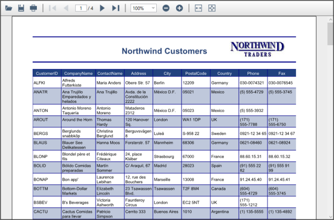

# PDFViewer

Introduction to PDF Viewer

Essential PDF Viewer is a 100% managed .NET component that has the ability to view and print PDF files from your WPF application.

Use Case Scenario

You can embed the PDF viewer within the .NET application using this feature. The PDF Viewer can also be used as a stand-alone application.

## Prerequisites and Compatibility

This section covers the requirements that are mandatory for using Syncfusion Essential PDF Viewer. It also lists operating systems and browsers that are compatible with the product.

### Prerequisites

<table>
<tr>
<th>
Development Environments</th><th>
.NET Framework versions</th></tr>
<tr>
<td>
Visual Studio 2013 (Ultimate, Premium, Professional and Express)Visual Studio 2012 (Ultimate, Premium, Professional and Express)Visual Studio 2010 (Ultimate, Premium, Professional and Express)Visual Studio 2008 (Team System, Professional, Standard & Express)Visual Studio 2005 (Professional, Standard & Express)Microsoft Expression Blend</td><td>
.NET Framework version 4.5.1.NET Framework version 4.5.NET Framework version 4.0.NET Framework version 3.5 with Service Pack 1.NET Framework version 2.0</td></tr>
</table>

### Compatibility

<table>
<tr>
<th>
Operating Systems</th></tr>
<tr>
<td>
Windows Server 2008 (32 bit and 64 bit), Windows Vista (32 bit and 64 bit), Windows XP, Windows 2003, Windows 7, Windows 8, Windows 8.1, Windows 10
</td></tr>
</table>

### Documentation

<table>
<tr>
<th>
Type of Documentation</th><th>
Location</th></tr>
<tr>
<td>
Readme</td><td>
[drive:]\ProgramFiles\Syncfusion\Essential Studio\x.x.x.x\Infrastructure\Read Me\Reporting_WPF.html</td></tr>
<tr>
<td>
Release Notes</td><td>
[drive:]\Program Files\Syncfusion\Essential Studio\x.x.x.x\Infrastructure\Release Notes\Reporting.html#WPF-PdfViewer</td></tr>
<tr>
<td>
User Guide (this document)</td><td>
Online {{ '<http://help.syncfusion.com/wpf/pdfviewer>' | markdownify }} (Navigate to the PDF Viewer for WPF User Guide.)> {{ '_Note: Click Download as PDF to access a PDF version._' | markdownify }}Installed DocumentationDashboard -> Documentation -> Installed Documentation. </td></tr>
<tr>
<td>
Class Reference</td><td>
Online {{ '<http://help.syncfusion.com/wpf>' | markdownify }} (Navigate to the Reporting WPF User Guide. Select {{ '_PDF Viewer_' | markdownify }}, and then click the Class Reference link found in the upper right section of the page.)Installed DocumentationDashboard -> Documentation -> Installed Documentation.</td></tr>
</table>

