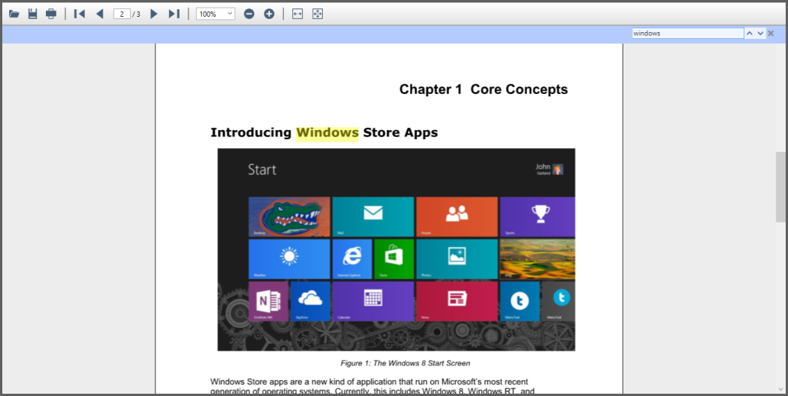

# Searching Text

Essential PDF Viewer allows you to search and highlight the text in the PDF document. The search box appears when Ctrl+F is pressed and searches the text in the PDF document as displayed in the following screenshot.

N>
* PdfDocumentView is used to view the PDF documents without the toolbar. So, make use of PdfViewerControl to search the text using search box.

The PDF Viewer control also supports searching text in the PDF document with the help of the following API. The [FindText](https://help.syncfusion.com/cr/cref_files/wpf/Syncfusion.PdfViewer.WPF~Syncfusion.Windows.PdfViewer.PdfViewerControl~FindText(String,Dictionary%7BInt32,List%7BRectangleF%7D%7D).html) method returns true when the text given is found in the document. The dictionary contains the page index and the list of rectangular coordinates of the text found in that page. The following code example illustrates how text search can be achieved in the PDF Viewer control.




bool IsMatchFound;

//Initialize PDF Viewer.

PdfViewerControl pdfViewerControl1 = new PdfViewerControl();

//Load the PDF.

pdfViewerControl1.Load("../../Data/Barcode.pdf");

//Get the occurrences of the target text and location.

Dictionary<int, List<RectangleF>> 

          textSearch = new Dictionary<int, List<RectangleF>>();

IsMatchFound = pdfViewerControl1.FindText("targetText", out textSearch);





Dim IsMatchFound As Boolean

'Initialize PDF Viewer.

Private pdfViewerControl1 As New PdfViewerControl()

'Load the PDF.

pdfViewerControl1.Load("../../Data/Barcode.pdf")

'Get the occurrences of the target text and location.

Dim textSearch As New Dictionary(Of Integer, List(Of RectangleF))()

IsMatchFound = pdfViewerControl1.FindText("targetText", textSearch)


