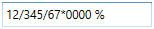
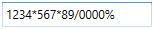

# Culture and Formatting in WPF Percent TextBox

Value of `PercentTextBox` can be formatted in following ways:

* Culture
* NumberFormatInfo
* Dedicated properties (PercentGroupSeparator, PercentGroupSizes, PercentDecimalDigits, PercentDecimalSeparator)

## Culture based formatting

The [PercentTextBox](https://www.syncfusion.com/wpf-ui-controls/percent-textbox) provides support for globalization by using the [Culture](https://help.syncfusion.com/cr/wpf/Syncfusion.Windows.Shared.EditorBase.html#Syncfusion_Windows_Shared_EditorBase_Culture) property. The `Culture` property is used to format the decimal separator and group separator of the `PercentTextBox` value based on the respective culture.




<syncfusion:PercentTextBox x:Name="percentTextBox" Height="25" Width="150" 
                           Culture="bs-Latn" PercentValue="1234567"/>




PercentTextBox percentTextBox = new PercentTextBox();
percentTextBox.Width = 150;
percentTextBox.Height = 25;
percentTextBox.PercentValue = 1234567;

//Setting Latin culture for percent textbox.
percentTextBox.Culture = new CultureInfo("bs-Latn");




By default the US culture uses “,” as the `PercentGroupSeparator` and "." as the `PercentDecimalSeparator` where as the Latin culture uses “.” as the `PercentGroupSeparator` and "," as the `PercentDecimalSeparator`. 

**Default Culture**

**Latin Culture**

## NumberFormatInfo based formatting

The number formatting of `PercentTextBox` can be customized by setting [NumberFormat](https://help.syncfusion.com/cr/wpf/Syncfusion.Windows.Shared.EditorBase.html#Syncfusion_Windows_Shared_EditorBase_NumberFormat) property.




<syncfusion:PercentTextBox x:Name="percentTextBox" Height="25" Width="150" PercentValue="1234567">
    <syncfusion:PercentTextBox.NumberFormat >
        <numberformat:NumberFormatInfo PercentGroupSeparator="/"
                                       PercentSymbol="%"
                                       PercentDecimalDigits="4" 
                                       PercentDecimalSeparator="*" />
    </syncfusion:PercentTextBox.NumberFormat>
</syncfusion:PercentTextBox>




PercentTextBox percentTextBox = new PercentTextBox();
percentTextBox.Width = 150;
percentTextBox.Height = 25;
percentTextBox.PercentValue = 1234567;
percentTextBox.NumberFormat = new NumberFormatInfo()
{
    PercentGroupSeparator = "/",
    PercentDecimalDigits = 4,
    PercentDecimalSeparator = "*",
    PercentSymbol = "%"
};




The following code illustrate how to set percent group size by using the `NumberFormat` property.




PercentTextBox percentTextBox = new PercentTextBox();
percentTextBox.Width = 150;
percentTextBox.Height = 25;
percentTextBox.PercentValue = 123456789;           
percentTextBox.NumberFormat = new NumberFormatInfo()
{
    PercentGroupSeparator = "/",
    PercentDecimalDigits = 4,
    PercentDecimalSeparator = "*",
    PercentSymbol = "%",

    // Adding the Number group size via NumberFormat property.    
    PercentGroupSizes = new int[] { 2, 3, 4 }
};




## Formatting with dedicated properties

The number formatting of `PercentTextBox` can also be customized by setting the [PercentGroupSeparator](https://help.syncfusion.com/cr/wpf/Syncfusion.Windows.Shared.PercentTextBox.html#Syncfusion_Windows_Shared_PercentTextBox_PercentGroupSeparator), [PercentGroupSizes](https://help.syncfusion.com/cr/wpf/Syncfusion.Windows.Shared.PercentTextBox.html#Syncfusion_Windows_Shared_PercentTextBox_PercentGroupSizes), [PercentDecimalDigits](https://help.syncfusion.com/cr/wpf/Syncfusion.Windows.Shared.PercentTextBox.html#Syncfusion_Windows_Shared_PercentTextBox_PercentDecimalDigits), [PercentDecimalSeparator](https://help.syncfusion.com/cr/wpf/Syncfusion.Windows.Shared.PercentTextBox.html#Syncfusion_Windows_Shared_PercentTextBox_PercentDecimalSeparator), `PercentNegativePattern`, `PercentPositivePattern`, and [PercentageSymbol](https://help.syncfusion.com/cr/wpf/Syncfusion.Windows.Shared.PercentTextBox.html#Syncfusion_Windows_Shared_PercentTextBox_PercentageSymbol) properties of PercentTextBox. You can show the group separator by setting the [GroupSeperatorEnabled](https://help.syncfusion.com/cr/wpf/Syncfusion.Windows.Shared.PercentTextBox.html#Syncfusion_Windows_Shared_PercentTextBox_GroupSeperatorEnabled) property to `true`.

The following code illustrate how to format using the `PercentDecimalSeparator`, `PercentDecimalDigits`, `PercentGroupSeparator`, `PercentGroupSizes` property of the `PercentTextBox`.




PercentTextBox percentTextBox = new PercentTextBox();
percentTextBox.Width = 150;
percentTextBox.Height = 25;
percentTextBox.PercentValue = 123456789;
percentTextBox.GroupSeperatorEnabled = true;
percentTextBox.PercentageSymbol = "%";
percentTextBox.PercentDecimalDigits = 4;
percentTextBox.PercentDecimalSeparator = "/";
percentTextBox.PercentGroupSeparator = "*";

// Adding the percent group size via NumberGroupSizes property.
percentTextBox.PercentGroupSizes = new Int32Collection() { 4, 3, 2};




N> When you use both the `NumberFormat` and the dedicated properties (`PercentGroupSeparator`, `PercentageSymbol`, `PercentDecimalDigits`, `PercentDecimalSeparator` and `PercentGroupSizes`) to format the value of `PercentTextBox`, the `PercentGroupSeparator`and `PercentGroupSizes` properties have higher priority.

N> When you use both `NumberFormat` and  `Culture`, the `NumberFormat` will have a higher priority.

## Positive Value Pattern

You can use the [PercentPositivePattern](https://help.syncfusion.com/cr/wpf/Syncfusion.Windows.Shared.PercentTextBox.html#Syncfusion_Windows_Shared_PercentTextBox_PercentPositivePattern) property to customize the location of the percent symbol and the positive percent values. In the table below,"%" denotes the symbol of the percent, and "n" denotes the number.

**PercentPositivePattern table**

<table>
<tr>
<th>
Value</th><th>
Associated Pattern</th></tr>
<tr>
<td>
0</td><td>
n %</td></tr>
<tr>
<td>
1</td><td>
n%</td></tr>
<tr>
<td>
2</td><td>
%n</td></tr>
<tr>
<td>
3</td><td>
% n</td></tr>
</table>




<syncfusion:PercentTextBox x:Name="percentTextBox" Height="25" Width="150" 
            PercentValue="1234" PercentPositivePattern="3"/>




PercentTextBox percentTextBox = new PercentTextBox();
percentTextBox.Width = 150;
percentTextBox.Height = 25;
percentTextBox.Value = 1234;
percentTextBox.PercentPositivePattern = 3;





## Negative Value Pattern

You can use the [PercentNegativePattern](https://help.syncfusion.com/cr/wpf/Syncfusion.Windows.Shared.PercentTextBox.html#Syncfusion_Windows_Shared_PercentTextBox_PercentNegativePattern) property to customize the location of the percent symbol and the negative percent values. In the table below,"%" denotes the symbol of the percent, and "n" denotes the number.

**PercentNegativePattern table**

<table>
<tr>
<th>
Value</th><th>
Associated Pattern</th></tr>
<tr>
<td>
0</td><td>
-n %</td></tr>
<tr>
<td>
1</td><td>
-n%</td></tr>
<tr>
<td>
2</td><td>
-%n</td></tr>
<tr>
<td>
3</td><td>
%-n</td></tr>
<tr>
<td>
4</td><td>
%n-</td></tr>
<tr>
<td>
5</td><td>
n-%</td></tr>
<tr>
<td>
6</td><td>
n%-</td></tr>
<tr>
<td>
7</td><td>
-% n</td></tr>
<tr>
<td>
8</td><td>
n %-</td></tr>
<tr>
<td>
9</td><td>
% n-</td></tr>
<tr>
<td>
10</td><td>
% -n</td></tr>
<tr>
<td>
11</td><td>
n- %</td></tr>
</table>




<syncfusion:PercentTextBox x:Name="percentTextBox" Height="25" Width="150" 
            PercentValue="1234" PercentNegativePattern="7"/>




PercentTextBox percentTextBox = new PercentTextBox();
percentTextBox.Width = 150;
percentTextBox.Height = 25;
percentTextBox.PercentValue = 1234;
percentTextBox.PercentNegativePattern = 7;





