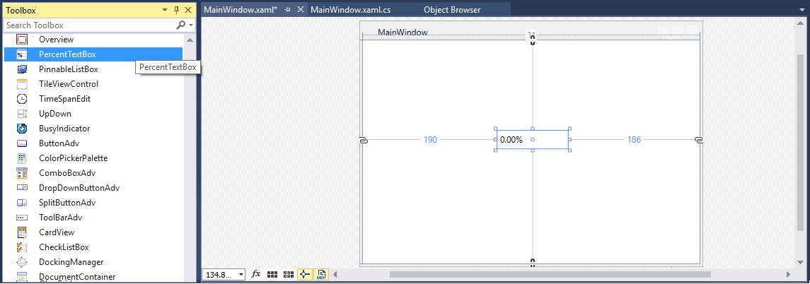
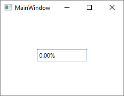
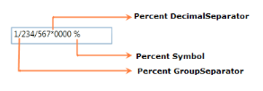

# Getting started with WPF PercentTextBox

This section explains how to create a WPF `PercentTextBox` control and its features.

## Assembly deployment

Refer to the [control dependencies](https://help.syncfusion.com/wpf/control-dependencies#percenttextbox) section to get the list of assemblies or NuGet package that needs to be added as a reference to use the control in any application.

You can find more details about installing the NuGet package in a WPF application in the following link: 

[How to install nuget packages](https://help.syncfusion.com/wpf/nuget-packages)

## Adding WPF PercentTextBox via designer

You can add the [PercentTextBox](https://www.syncfusion.com/wpf-ui-controls/percent-textbox) control to an application by dragging it from the toolbox to a view of the designer. The following dependent assembly will be added automatically:

* Syncfusion.Shared.WPF

## Adding WPF PercentTextBox via XAML

To add the PercentTextBox control manually in XAML, follow these steps:
1. Create a new WPF project in Visual Studio.

2. Add the **Syncfusion.Shared.WPF** assembly references to the project.
 
3. Import Syncfusion WPF schema **http://schemas.syncfusion.com/wpf** and declare the `PercentTextBox` control in XAML page.



<Window xmlns="http://schemas.microsoft.com/winfx/2006/xaml/presentation"
        xmlns:x="http://schemas.microsoft.com/winfx/2006/xaml"
        xmlns:syncfusion="http://schemas.syncfusion.com/wpf" 
        x:Class="PercentTextBoxSample.MainWindow"
        Title="PercentTextBox Sample" Height="350" Width="525">
    <Grid>
        <!--Adding PercentTextBox control -->
        <syncfusion:PercentTextBox x:Name="percentTextBox" Width="100" Height="25" VerticalAlignment="Center" HorizontalAlignment="Center"/>
    </Grid>
</Window>



## Adding WPF PercentTextBox via C\#

To add the PercentTextBox control manually in C#, follow these steps:

1. Create a new WPF application via Visual Studio.

2. Add the **Syncfusion.Shared.WPF** assembly references to the project.

3. Include the required namespace.




using Syncfusion.Windows.Shared;




4. Create an instance of PercentTextBox and add it to the window.




//Creating an instance of PercentTextBox control

PercentTextBox percentTextBox = new PercentTextBox();

// Setting height and width to PercentTextBox

percentTextBox.Height = 25;
percentTextBox.Width = 100;

//Adding PercentTextBox as window content

this.Content = percentTextBox;




## Setting Value

The percent value of the `PercentTextBox` can be set by using the [PercentValue](https://help.syncfusion.com/cr/wpf/Syncfusion.Windows.Shared.PercentTextBox.html#Syncfusion_Windows_Shared_PercentTextBox_PercentValue) property.




<syncfusion:PercentTextBox x:Name="percentTextBox" Width="100" Height="23" PercentValue="100"/>




PercentTextBox percentTextBox = new PercentTextBox();
percentTextBox.Width = 100;
percentTextBox.Height = 23;
percentTextBox.PercentValue = 100;




N> Do not use the [Text](https://docs.microsoft.com/en-us/dotnet/api/system.windows.controls.textbox.text?redirectedfrom=MSDN&view=netframework-4.7.2#System_Windows_Controls_TextBox_Text) property to set the percent value for the PercentTextBox. Use only the `PercentValue` property.

### Binding Value

Data binding is the method of forming a connection between the application  UI and business logic. Data binding can be unidirectional (source -> target or target <- source) or bidirectional (source <-> target). You can bind data to the `PercentTextBox` using the `Value` Property.

The following code snippets illustrate the percent value binding from one `PercentTextBox` to another.



<StackPanel>
<syncfusion:PercentTextBox x:Name="percentTextBox1" Height="25" Width="100" PercentValue="{Binding MyValue,UpdateSourceTrigger=PropertyChanged}"/>
<syncfusion:PercentTextBox x:Name="percentTextBox2" Width="100" Height="25" PercentValue="{Binding MyValue,UpdateSourceTrigger=PropertyChanged}" />
</StackPanel>



ViewModel.cs




class ViewModel : NotificationObject
{
    private double myValue;
    public double MyValue
    {
        get
        {
            return myValue;
        }
        set
        {
            myValue = value;
            RaisePropertyChanged("MyValue");
        }
    }
}




## Value Changed Notification

The `PercentTextBox` control can notifies the percent value changes through the [PercentValueChanged](https://help.syncfusion.com/cr/wpf/Syncfusion.Windows.Shared.PercentTextBox.html) event. You can get old percent value and new percent value from `OldValue` and `NewValue` properties in `PercentValueChanged` event.




<syncfusion:PercentTextBox PercentValueChanged="PercentTextBox_PercentValueChanged"/>


 

PercentTextBox percentTextBox = new PercentTextBox();
percentTextBox.PercentValueChanged += new PropertyChangedCallback(PercentTextBox_PercentValueChanged);




You can handle the event as follows:




private void PercentTextBox_PercentValueChanged(DependencyObject d, DependencyPropertyChangedEventArgs e)
{
    // Get old and new percent value
    var newValue = e.NewValue;
    var oldValue = e.OldValue;
}




## Min Max Value Restriction

The `PercentValue` of `PercentTextBox` can be restricted within maximum and minimum limit. You can define the minimum and maximum values by setting the [MinValue](https://help.syncfusion.com/cr/wpf/Syncfusion.Windows.Shared.PercentTextBox.html#Syncfusion_Windows_Shared_PercentTextBox_MinValue) and [MaxValue](https://help.syncfusion.com/cr/wpf/Syncfusion.Windows.Shared.PercentTextBox.html#Syncfusion_Windows_Shared_PercentTextBox_MaxValue) properties. It allows the user to enter the percent value between `MinValue` and `MaxValue`. 




<syncfusion:PercentTextBox x:Name="percentTextBox" Width="100" Height="25" PercentValue="100" MaxValue="999.99" MinValue="-999.99"/>



PercentTextBox percentTextBox = new PercentTextBox();
percentTextBox.Width = 100;
percentTextBox.Height = 25;
//Setting minimum value
percentTextBox.MinValue = -999.99;
//Setting maximum value
percentTextBox.MaxValue = 999.99;
percentTextBox.PercentValue = 100;




## Step Interval to increase or decrease the value

The `PercentTextBox` control allows to increase or decrease the percent value by pressing up and down arrow keys in keyboard or mouse wheel over the control. The [ScrollInterval](https://help.syncfusion.com/cr/wpf/Syncfusion.Windows.Shared.PercentTextBox.html#Syncfusion_Windows_Shared_PercentTextBox_ScrollInterval) property is used to specify the increment or decrement intervals. The default value of `ScrollInterval` is 1.




<syncfusion:PercentTextBox x:Name="percentTextBox" Width="150" Height="25" PercentValue="8" 
                          IsScrollingOnCircle="True" ScrollInterval="4"/>




PercentTextBox percentTextBox = new PercentTextBox();
percentTextBox.Width = 150;
percentTextBox.Height = 25;
percentTextBox.MinValue = 0;
percentTextBox.MaxValue = 100;
percentTextBox.PercentValue = 8;
percentTextBox.IsScrollingOnCircle = true;
percentTextBox.ScrollInterval = 4;




## Formatting the value

You can customize the number format by either setting the [NumberFormat](https://help.syncfusion.com/cr/wpf/Syncfusion.Windows.Shared.EditorBase.html#Syncfusion_Windows_Shared_EditorBase_NumberFormat) property or the [PercentGroupSeparator](https://help.syncfusion.com/cr/wpf/Syncfusion.Windows.Shared.PercentTextBox.html#Syncfusion_Windows_Shared_PercentTextBox_PercentGroupSeparator), [PercentGroupSizes](https://help.syncfusion.com/cr/wpf/Syncfusion.Windows.Shared.PercentTextBox.html#Syncfusion_Windows_Shared_PercentTextBox_PercentGroupSizes), [PercentDecimalDigits](https://help.syncfusion.com/cr/wpf/Syncfusion.Windows.Shared.PercentTextBox.html#Syncfusion_Windows_Shared_PercentTextBox_PercentDecimalDigits), [PercentDecimalSeparator](https://help.syncfusion.com/cr/wpf/Syncfusion.Windows.Shared.PercentTextBox.html#Syncfusion_Windows_Shared_PercentTextBox_PercentDecimalSeparator), [PercentNegativePattern](https://help.syncfusion.com/cr/wpf/Syncfusion.Windows.Shared.PercentTextBox.html#Syncfusion_Windows_Shared_PercentTextBox_PercentNegativePattern), [PercentPositivePattern](https://help.syncfusion.com/cr/wpf/Syncfusion.Windows.Shared.PercentTextBox.html#Syncfusion_Windows_Shared_PercentTextBox_PercentPositivePattern), and [PercentageSymbol](https://help.syncfusion.com/cr/wpf/Syncfusion.Windows.Shared.PercentTextBox.html#Syncfusion_Windows_Shared_PercentTextBox_PercentageSymbol) properties of `PercentTextBox`.



<syncfusion:PercentTextBox x:Name="percentTextBox" Height="25" Width="150" PercentValue="1234567" PercentageSymbol="%" PercentDecimalDigits="4" PercentDecimalSeparator="*" PercentGroupSeparator="/"/>


PercentTextBox percentTextBox = new PercentTextBox();
percentTextBox.Width = 150;
percentTextBox.Height = 25;
percentTextBox.PercentValue = 1234567;
percentTextBox.PercentageSymbol = "%";
percentTextBox.PercentDecimalDigits = 4;
percentTextBox.PercentDecimalSeparator = "/";
percentTextBox.PercentGroupSeparator = "*";



## Setting the Culture

The `PercentTextBox` provides support for globalization by using the [Culture](https://help.syncfusion.com/cr/wpf/Syncfusion.Windows.Shared.EditorBase.html#Syncfusion_Windows_Shared_EditorBase_Culture) property. The `Culture` is used to format the decimal separator and group separator of the `PercentTextBox` percent value based on the respective culture.


 

<syncfusion:PercentTextBox x:Name="percentTextBox" Height="25" Width="150" Culture="en-US" PercentValue="1234567"/>


 

PercentTextBox percentTextBox = new PercentTextBox();
percentTextBox.Width = 150;
percentTextBox.Height = 25;
percentTextBox.PercentValue = 1234567;
percentTextBox.Culture = new System.Globalization.CultureInfo("en-US");




N> When you use both `NumberFormat` and  `Culture`, the `NumberFormat` will have a higher priority.

## Theme

PercentTextBox supports various built-in themes. Refer to the below links to apply themes for the PercentTextBox,

  * [Apply theme using SfSkinManager](https://help.syncfusion.com/wpf/themes/skin-manager)
	
  * [Create a custom theme using ThemeStudio](https://help.syncfusion.com/wpf/themes/theme-studio#creating-custom-theme)