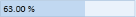
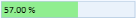

# Range Adorner in WPF Percent TextBox

The [PercentTextBox](https://www.syncfusion.com/wpf-controls/percent-textbox) control provides a range-adorner feature that visually indicates the [PercentValue](https://help.syncfusion.com/cr/wpf/Syncfusion.Windows.Shared.PercentTextBox.html#Syncfusion_Windows_Shared_PercentTextBox_PercentValue) like a progress bar. This feature is disabled by default. You can show the adorner over the `PercentTextBox` control by setting the [EnableRangeAdorner](https://help.syncfusion.com/cr/wpf/Syncfusion.Windows.Shared.EditorBase.html#Syncfusion_Windows_Shared_EditorBase_EnableRangeAdorner) property to `true`. The default value of `EnableRangeAdorner` is `false`. The adorner fills the control area based on the minimum and maximum values, considering the current value. The Range Adorner is not displayed when the `MinValue` or `MaxValue` property is not set.




<syncfusion:PercentTextBox x:Name="percentTextBox" MinValue="0" PercentValue="63" MaxValue="100" EnableRangeAdorner="True" />




PercentTextBox percentTextBox = new PercentTextBox();
percentTextBox.MinValue = 0;
percentTextBox.MaxValue = 100;
percentTextBox.PercentValue = 63;
percentTextBox.EnableRangeAdorner =true;




## Changing background of range-adorner

You can change the background color of the range adorner using [RangeAdornerBackground](https://help.syncfusion.com/cr/wpf/Syncfusion.Windows.Shared.EditorBase.html#Syncfusion_Windows_Shared_EditorBase_RangeAdornerBackground) property.




<syncfusion:PercentTextBox x:Name="percentTextBox" MinValue="0" MaxValue="100" PercentValue="57" EnableRangeAdorner="True" RangeAdornerBackground="LightGreen"/>




PercentTextBox percentTextBox = new PercentTextBox();
percentTextBox.MinValue = 0;
percentTextBox.MaxValue = 100;
percentTextBox.PercentValue = 57;
percentTextBox.EnableRangeAdorner = true;
percentTextBox.RangeAdornerBackground = Brushes.LightGreen;




