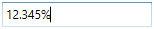

# Restriction or Validation in WPF Percent TextBox

This section explains how to validate or restrict the `PercentTextBox` control value.

## Restrict the value within minimum and maximum value

The [PercentValue](https://help.syncfusion.com/cr/wpf/Syncfusion.Windows.Shared.PercentTextBox.html#Syncfusion_Windows_Shared_PercentTextBox_PercentValue) of the [PercentTextBox](https://www.syncfusion.com/wpf-ui-controls/percent-textbox) can be restricted within the maximum and minimum limits. Once the percent value has reached the maximum or minimum value , the value does not exceed the limit. We can change the maximum and minimum limits by using the [MinValue](https://help.syncfusion.com/cr/wpf/Syncfusion.Windows.Shared.PercentTextBox.html#Syncfusion_Windows_Shared_PercentTextBox_MinValue) property and [MaxValue](https://help.syncfusion.com/cr/wpf/Syncfusion.Windows.Shared.PercentTextBox.html#Syncfusion_Windows_Shared_PercentTextBox_MaxValue) property.

You can choose when to validate the maximum and minimum limits while changing the percent values by using the [MinValidation](https://help.syncfusion.com/cr/wpf/Syncfusion.Windows.Shared.EditorBase.html#Syncfusion_Windows_Shared_EditorBase_MinValidation) and [MaxValidation](https://help.syncfusion.com/cr/wpf/Syncfusion.Windows.Shared.EditorBase.html#Syncfusion_Windows_Shared_EditorBase_MaxValidation) properties.

* `OnKeyPress` — When setting the `MaxValidation` or `MinValidation` to `OnKeyPress`, the percent value in the `PercentTextBox` will be validated shortly after pressing a key. So, it is not possible to provide any invalid input at all and the percent value does not exceed the maximum and minimum limits.

* `OnLostFocus` - When setting `MaxValidation` or `MinValidation` to `OnLostFocus`, the percent value in the `PercentTextBox` is validated, when the `PercentTextBox` loses the focus. That is, the `PercentTextBox` will accept any percent value, validation will only take place after the `PercentTextBox` has lost its keyboard focus. After validation, when the percent value of the `PercentTextBox` is greater than the `MaxValue` or less than the `MinValue`, the percent value will be automatically set to `MaxValue` or `MinValue`.

* [MaxValueOnExceedMaxDigit](https://help.syncfusion.com/cr/wpf/Syncfusion.Windows.Shared.EditorBase.html#Syncfusion_Windows_Shared_EditorBase_MaxValueOnExceedMaxDigit) - When you give input greater than specified maximum limit, `MaxValueOnExceedMaxDigit` property will decide either it should retain the old percent value or reset to maximum limit that is specified. For example, if `MaxValue` is set to 100 and you are trying to input 200. `PercentValue` will changed to 100 when `MaxValueOnExceedMaxDigit` is `true`. When `MaxValueOnExceedMaxDigit` is `false`, 20 will be retained and last entered 0 will be ignored.

  N> `MaxValueOnExceedMinDigit` property will be enabled only when the `MaxValidation` is set to `OnKeyPress`.

* [MinValueOnExceedMinDigit](https://help.syncfusion.com/cr/wpf/Syncfusion.Windows.Shared.EditorBase.html#Syncfusion_Windows_Shared_EditorBase_MinValueOnExceedMinDigit) - When you give input less than specified minimum limit, `MinValueOnExceedMinDigit` property will decide either it should retain the old percent value or reset to minimum limit that is specified. For example, if `MinValue` is set to 200 and the `PercentValue` is 205 and you are trying change the percent value to 20. `PercentValue` will changed to 200 when `MinValueOnExceedMinDigit` is `true`. When `MinValueOnExceedMinDigit` is `false`, Old percent value 205 will be retained.

  N> `MinValueOnExceedMinDigit` will be enabled only when the `MinValidation` is set to `OnKeyPress`.




<syncfusion:PercentTextBox x:Name="percentTextBox" Width="150" MaxValue="100" MinValue="10"
                          MinValueOnExceedMinDigit="True" MaxValueOnExceedMaxDigit="True"
                          MinValidation="OnKeyPress" MaxValidation="OnLostFocus"/>




PercentTextBox percentTextBox = new PercentTextBox();
percentTextBox.Width = 150;
percentTextBox.Height = 25;
percentTextBox.MinValue = 10;
percentTextBox.MaxValue =100;
percentTextBox.MinValidation = MinValidation.OnKeyPress;
percentTextBox.MaxValidation = MaxValidation.OnLostFocus;
percentTextBox.MinValueOnExceedMinDigit = true;
percentTextBox.MaxValueOnExceedMaxDigit = true;




`MinValidation` is set to OnKeyPress, it cannot let to enter a percent value less than the `MinValue`. If try to enter a percent value less than the `MinValue`, then the `MinValue` will set to the `PercentValue` property because `MinValueOnExceedMinDigit` is set to `true`.

`MaxValidation` is set to OnLostFocus, so the `MaxValidation` will be performed only in the lost focus.

## Restrict number of decimal digit

The `PercentTextBox` allows the user to customize the number of digits to be displayed after the decimal point of `PercentTextBox` percent value
by using [PercentDecimalDigits](https://help.syncfusion.com/cr/wpf/Syncfusion.Windows.Shared.PercentTextBox.html#Syncfusion_Windows_Shared_PercentTextBox_PercentDecimalDigits) property.
The decimal digit can be restricted within the maximum and minimum limits. Once the decimal digit has reached the maximum or minimum digit, the decimal digits does not exceed the limit. We can change the maximum and minimum decimal digits limit by using the [MinPercentDecimalDigits](https://help.syncfusion.com/cr/wpf/Syncfusion.Windows.Shared.PercentTextBox.html#Syncfusion_Windows_Shared_PercentTextBox_MinPercentDecimalDigits) and [MaxPercentDecimalDigits](https://help.syncfusion.com/cr/wpf/Syncfusion.Windows.Shared.PercentTextBox.html#Syncfusion_Windows_Shared_PercentTextBox_MaxPercentDecimalDigits)



<syncfusion:PercentTextBox x:Name="percentTextBox" Height="25" Width="150" 
                          PercentDecimalDigits = "3" MinPercentDecimalDigits = "2"
                          MaxPercentDecimalDigits = "5"/>



PercentTextBox percentTextBox = new PercentTextBox();
percentTextBox.Width = 150;
percentTextBox.Height = 25;
percentTextBox.MinValue = 0;
percentTextBox.MaxValue = 100;
percentTextBox.PercentDecimalDigits = 3;
percentTextBox.MinPercentDecimalDigits = 2;
percentTextBox.MaxPercentDecimalDigits = 5;



N> `PercentDecimalDigits` property value will be allows set based on the in-between range of `MinPercentDecimalDigits` and `MaxPercentDecimalDigits` property values.

## Read only mode

The `PercentTextBox` cannot allow the user input, edits when [IsReadOnly](https://docs.microsoft.com/en-us/dotnet/api/system.windows.controls.primitives.textboxbase.isreadonly?redirectedfrom=MSDN&view=netframework-4.7.2#System_Windows_Controls_Primitives_TextBoxBase_IsReadOnly) property is sets to `true`. The user can still select text and display the cursor on the `PercentTextBox` by setting the [IsReadOnlyCaretVisible](https://docs.microsoft.com/en-us/dotnet/api/system.windows.controls.primitives.textboxbase.isreadonlycaretvisible?view=netframework-4.8) property to `true`. However, value can be changed programmatically in readonly mode.




<syncfusion:PercentTextBox x:Name="percentTextBox" IsReadOnly="True" PercentValue="10" IsReadOnlyCaretVisible="True"/>




PercentTextBox percentTextBox = new PercentTextBox();
percentTextBox.PercentValue = 10;
percentTextBox.IsReadOnly = true;
percentTextBox.IsReadOnlyCaretVisible = true;




