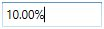
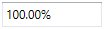
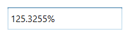
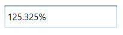

# Restriction or Validation in WPF Percent TextBox

This section explains how to validate or restrict the `PercentTextBox` control value.

## Restrict the value within minimum and maximum value

The [PercentValue](https://help.syncfusion.com/cr/wpf/Syncfusion.Windows.Shared.PercentTextBox.html#Syncfusion_Windows_Shared_PercentTextBox_PercentValue) of the [PercentTextBox](https://www.syncfusion.com/wpf-ui-controls/percent-textbox) can be restricted within the maximum and minimum limits. Once the percent value has reached the maximum or minimum value, the value will not exceed the limit. You can change the maximum and minimum limits by using the [MinValue](https://help.syncfusion.com/cr/wpf/Syncfusion.Windows.Shared.PercentTextBox.html#Syncfusion_Windows_Shared_PercentTextBox_MinValue) and [MaxValue](https://help.syncfusion.com/cr/wpf/Syncfusion.Windows.Shared.PercentTextBox.html#Syncfusion_Windows_Shared_PercentTextBox_MaxValue) properties.

You can choose when to validate the maximum and minimum limits while changing the percent values by using the [MinValidation](https://help.syncfusion.com/cr/wpf/Syncfusion.Windows.Shared.EditorBase.html#Syncfusion_Windows_Shared_EditorBase_MinValidation) and [MaxValidation](https://help.syncfusion.com/cr/wpf/Syncfusion.Windows.Shared.EditorBase.html#Syncfusion_Windows_Shared_EditorBase_MaxValidation) properties. The default value of both properties is `OnKeyPress`.

* `OnKeyPress` — When setting the `MaxValidation` or `MinValidation` to `OnKeyPress`, the percent value in the `PercentTextBox` will be validated shortly after pressing a key. So, it is not possible to provide any invalid input at all, and the percent value will not exceed the maximum and minimum limits.

* `OnLostFocus` - When setting `MaxValidation` or `MinValidation` to `OnLostFocus`, the percent value in the `PercentTextBox` is validated when the `PercentTextBox` loses focus. That is, the `PercentTextBox` will accept any percent value; validation will only take place after the `PercentTextBox` has lost its keyboard focus. After validation, when the percent value of the `PercentTextBox` is greater than the `MaxValue` or less than the `MinValue`, the percent value will be automatically set to `MaxValue` or `MinValue`.

* [MaxValueOnExceedMaxDigit](https://help.syncfusion.com/cr/wpf/Syncfusion.Windows.Shared.EditorBase.html#Syncfusion_Windows_Shared_EditorBase_MaxValueOnExceedMaxDigit) - When you give input greater than the specified maximum limit, the `MaxValueOnExceedMaxDigit` property will decide whether to retain the old percent value or reset to the maximum limit. For example, if `MaxValue` is set to 100 and you are trying to input 200, `PercentValue` will be changed to 100 when `MaxValueOnExceedMaxDigit` is `true`. When `MaxValueOnExceedMaxDigit` is `false`, 20 will be retained and the last entered 0 will be ignored.

  N> `MaxValueOnExceedMaxDigit` property is enabled only when the `MaxValidation` is set to `OnKeyPress`.

* [MinValueOnExceedMinDigit](https://help.syncfusion.com/cr/wpf/Syncfusion.Windows.Shared.EditorBase.html#Syncfusion_Windows_Shared_EditorBase_MinValueOnExceedMinDigit) - When you give input less than the specified minimum limit, the `MinValueOnExceedMinDigit` property will decide whether to retain the old percent value or reset to the minimum limit. For example, if `MinValue` is set to 200 and the `PercentValue` is 205 and you are trying to change the percent value to 20, `PercentValue` will be changed to 200 when `MinValueOnExceedMinDigit` is `true`. When `MinValueOnExceedMinDigit` is `false`, the old percent value 205 will be retained.

  N> `MinValueOnExceedMinDigit` is enabled only when the `MinValidation` is set to `OnKeyPress`.




<syncfusion:PercentTextBox x:Name="percentTextBox" Width="150" MaxValue="100" MinValue="10"
                          MinValueOnExceedMinDigit="True" MaxValueOnExceedMaxDigit="True"
                          MinValidation="OnKeyPress" MaxValidation="OnLostFocus"/>




PercentTextBox percentTextBox = new PercentTextBox();
percentTextBox.Width = 150;
percentTextBox.Height = 25;
percentTextBox.MinValue = 10;
percentTextBox.MaxValue =100;
percentTextBox.MinValidation = MinValidation.OnKeyPress;
percentTextBox.MaxValidation = MaxValidation.OnLostFocus;
percentTextBox.MinValueOnExceedMinDigit = true;
percentTextBox.MaxValueOnExceedMaxDigit = true;




`MinValidation` is set to `OnKeyPress`, so it will not allow entering a percent value less than the `MinValue`. If you try to enter a percent value less than the `MinValue`, then the `MinValue` will be set to the `PercentValue` property because `MinValueOnExceedMinDigit` is set to `true`.

`MaxValidation` is set to `OnLostFocus`, so the `MaxValidation` will be performed only on lost focus.

## Restrict number of decimal digits

You can format the decimal digits in the [PercentTextBox](https://www.syncfusion.com/wpf-ui-controls/percent-textbox) control using the [PercentDecimalDigits](https://help.syncfusion.com/cr/wpf/Syncfusion.Windows.Shared.PercentTextBox.html#Syncfusion_Windows_Shared_PercentTextBox_PercentDecimalDigits) property. You can restrict the decimal digits of the text within maximum and minimum limits in the `PercentTextBox` control using the [MinPercentDecimalDigits](https://help.syncfusion.com/cr/wpf/Syncfusion.Windows.Shared.PercentTextBox.html#Syncfusion_Windows_Shared_PercentTextBox_MinPercentDecimalDigits) and [MaxPercentDecimalDigits](https://help.syncfusion.com/cr/wpf/Syncfusion.Windows.Shared.PercentTextBox.html#Syncfusion_Windows_Shared_PercentTextBox_MaxPercentDecimalDigits) properties. The default value of the `MinPercentDecimalDigits`, `MaxPercentDecimalDigits`, and `DoubleDecimalDigits` properties is **-1** (unrestricted). `DoubleDecimalDigits` controls the decimal digits used to display the underlying double value when the control is not focused.

N> If the value of the `MinPercentDecimalDigits` property is greater than the value of the `MaxPercentDecimalDigits` property, the text of `PercentTextBox` will be updated based on the value of the `MinPercentDecimalDigits` property.




<syncfusion:PercentTextBox PercentValue="125.32545" HorizontalAlignment="Center" VerticalAlignment="Center"
                            MaxPercentDecimalDigits="4"
                            MinPercentDecimalDigits="1" />




PercentTextBox percentTextBox = new PercentTextBox();
percentTextBox.PercentValue = 125.32545;
percentTextBox.MaxPercentDecimalDigits = 4;
percentTextBox.MinPercentDecimalDigits = 1;




When the values of `MinPercentDecimalDigits`, `MaxPercentDecimalDigits`, and `PercentDecimalDigits` are specified, the `PercentDecimalDigits` property takes higher precedence and updates the text of the `PercentTextBox` property. 




<syncfusion:PercentTextBox PercentValue="125.32545" HorizontalAlignment="Center" VerticalAlignment="Center"
                            MaxPercentDecimalDigits="4"
                            MinPercentDecimalDigits="1" 
                            PercentDecimalDigits="3"
                            />




PercentTextBox percentTextBox = new PercentTextBox();
percentTextBox.PercentValue = 125.32545;
percentTextBox.MaxPercentDecimalDigits = 4;
percentTextBox.MinPercentDecimalDigits = 1;
percentTextBox.PercentDecimalDigits = 3;




## Read only mode

The `PercentTextBox` does not allow user input or edits when the [IsReadOnly](https://docs.microsoft.com/en-us/dotnet/api/system.windows.controls.primitives.textboxbase.isreadonly?redirectedfrom=MSDN&view=netframework-4.7.2#System_Windows_Controls_Primitives_TextBoxBase_IsReadOnly) property is set to `true`. The user can still select text and display the cursor on the `PercentTextBox` by setting the [IsReadOnlyCaretVisible](https://docs.microsoft.com/en-us/dotnet/api/system.windows.controls.primitives.textboxbase.isreadonlycaretvisible?view=netframework-4.8) property to `true`. However, the value can be changed programmatically in read-only mode.




<syncfusion:PercentTextBox x:Name="percentTextBox" IsReadOnly="True" PercentValue="10" IsReadOnlyCaretVisible="True"/>




PercentTextBox percentTextBox = new PercentTextBox();
percentTextBox.PercentValue = 10;
percentTextBox.IsReadOnly = true;
percentTextBox.IsReadOnlyCaretVisible = true;




