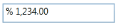

# Culture and Number Formats

## Culture

PercentTextBox provides globalization support through the Culture property. 



<syncfusion:PercentTextBox x:Name="percentTextBox" Height="25" Width="150"                       
   Culture="en-US" PercentValue="1234567"/>
   


PercentTextBox percentTextBox = new PercentTextBox();
percentTextBox.Width = 150;percentTextBox.Height = 25;
percentTextBox.PercentValue = 1234567;
percentTextBox.Culture = new CultureInfo("en-US");





<syncfusion:PercentTextBox x:Name="percentTextBox" Height="25" Width="150"    
                      Culture="bs-Latn" PercentValue="1234567"/>
					  
			


PercentTextBox percentTextBox = new PercentTextBox();
percentTextBox.Width = 150;percentTextBox.Height = 25;
percentTextBox.PercentValue = 1234567;
percentTextBox.Culture = new CultureInfo("bs-Latn");



As you have seen in these samples whenever you change the Culture property the PercentValue is formatted based on the Culture.

## Number format

You can customize the Number Format either by using the Number Format property or the PercentGroupSeparator, PercentGroupSizes, PercentDecimalDigits, PercentDecimalSeparator, PercentNegativePattern, PercentPositivePattern, and PercentageSymbol properties.



<syncfusion:PercentTextBox x:Name="percentTextBox" Height="25" Width="150"    
         PercentValue="1234567">    <syncfusion:PercentTextBox.NumberFormat>   
		 <numberformat:NumberFormatInfo PercentGroupSeparator="/"    
		 PercentDecimalDigits="4" PercentDecimalSeparator="*"      
		 PercentSymbol="%"/>    
		 </syncfusion:PercentTextBox.NumberFormat>


PercentTextBox percentTextBox = new PercentTextBox();
percentTextBox.Width = 150;percentTextBox.Height = 25;p
percentTextBox.PercentValue = 1234567;percentTextBox.NumberFormat = new NumberFormatInfo(){    PercentGroupSeparator = "/",    PercentDecimalDigits = 4,    PercentDecimalSeparator = "*",    PercentSymbol = "%"};





<syncfusion:PercentTextBox x:Name="percentTextBox" Height="25" Width="150"   
 PercentValue="1234567"          
 PercentageSymbol="%" PercentDecimalDigits="4"   
 PercentDecimalSeparator="*" PercentGroupSeparator="/"/>
						 


PercentTextBox percentTextBox = new PercentTextBox();
percentTextBox.Width = 150;
percentTextBox.Height = 25;
percentTextBox.PercentValue = 1234567;percentTextBox.PercentageSymbol = "%";
percentTextBox.PercentDecimalDigits = 4;percentTextBox.PercentDecimalSeparator = "/";
percentTextBox.PercentGroupSeparator = "*";



## PercentPositivePattern

Gets or sets the format pattern for the positive percent values. In the table displayed below “%” denotes the Percent symbol and n denotes the number.

<table>
<tr>
<th>
Value</th><th>
Associated Pattern</th></tr>
<tr>
<td>
0</td><td>
n %</td></tr>
<tr>
<td>
1</td><td>
n%</td></tr>
<tr>
<td>
2</td><td>
%n</td></tr>
<tr>
<td>
3</td><td>
% n</td></tr>
</table>




<syncfusion:PercentTextBox x:Name="percentTextBox" Height="25" Width="150" 
            PercentValue="1234" PercentPositivePattern="3"/>




## PercentNegativePattern

Gets or sets the format pattern for the negative percent values. In the table displayed below “%” denotes the Percent symbol and n denotes the number.

<table>
<tr>
<th>
Value</th><th>
Associated Pattern</th></tr>
<tr>
<td>
0</td><td>
-n %</td></tr>
<tr>
<td>
1</td><td>
-n%</td></tr>
<tr>
<td>
2</td><td>
-%n</td></tr>
<tr>
<td>
3</td><td>
%-n</td></tr>
<tr>
<td>
4</td><td>
%n-</td></tr>
<tr>
<td>
5</td><td>
n-%</td></tr>
<tr>
<td>
6</td><td>
n%-</td></tr>
<tr>
<td>
7</td><td>
-% n</td></tr>
<tr>
<td>
8</td><td>
n %-</td></tr>
<tr>
<td>
9</td><td>
% n-</td></tr>
<tr>
<td>
10</td><td>
% -n</td></tr>
<tr>
<td>
11</td><td>
n- %</td></tr>
</table>




<syncfusion:PercentTextBox x:Name="percentTextBox" Height="25" Width="150" 
            PercentValue="1234" PercentNegativePattern="7"/>




