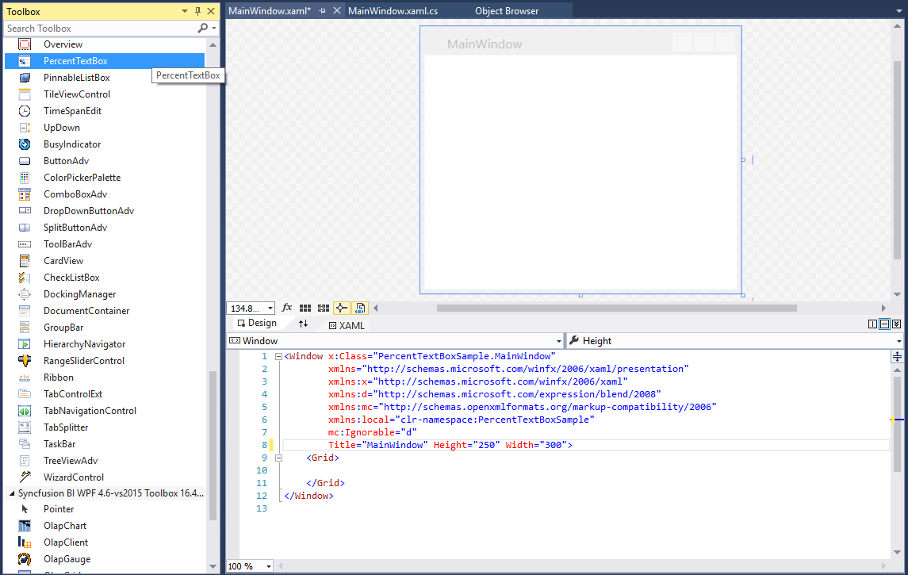
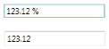

# Getting Started

## Assembly deployment

Refer to the [control dependencies](https://help.syncfusion.com/wpf/control-dependencies#percenttextbox) section to get the list of assemblies or NuGet package that needs to be added as a reference to use the control in any application.

You can find more details about installing the NuGet package in a WPF application in the following link:

[How to install nuget packages](https://help.syncfusion.com/wpf/nuget-packages)

## Create a simple application with PercentTextBox

You can create a WPF application with the PercentTextBox control using the following steps:

## Create a project

Create a new WPF project in Visual Studio to display the PercentTextBox control with functionalities.

## Add control through designer

The PercentTextBox control can be added to an application by dragging it from the toolbox to a designer view. The **Syncfusion.Shared.WPF** assembly reference will be added automatically.

## Adding control manually in XAML

To add the control manually in XAML, follow the given steps:

1. Add the **Syncfusion.Shared.WPF** assembly reference to the project.
2. Import Syncfusion WPF schema http://schemas.syncfusion.com/wpf in the XAML page.
3. Declare the PercentTextBox control in the XAML page.



<Window xmlns="http://schemas.microsoft.com/winfx/2006/xaml/presentation"
        xmlns:x="http://schemas.microsoft.com/winfx/2006/xaml"
        xmlns:syncfusion="http://schemas.syncfusion.com/wpf" 
        x:Class="PercentTextBoxSample.MainWindow"
        Title="PercentTextBox Sample" Height="350" Width="525">
    <Grid>
        <!-- Adding PercentTextBox control -->
        <syncfusion:PercentTextBox x:Name="percentTextBox" HorizontalAlignment="Center" VerticalAlignment="Center" Width="100"/>
    </Grid>
</Window>



## Adding control manually in C\#

To add the control manually in C#, follow the given steps:

1. Add the **Syncfusion.Shared.WPF** assembly reference to the project. 
2. Import the PercentTextBox namespace **using Syncfusion.Windows.Shared;**.
3. Create a PercentTextBox instance, and add it to the window.



using Syncfusion.Windows.Shared;
namespace PercentTextBoxSample
{
    /// 

    /// Interaction logic for MainWindow.xaml
    /// 

    public partial class MainWindow : Window
    {
        public MainWindow()
        {
            InitializeComponent();
            //Creating an instance of PercentTextBox control
            PercentTextBox percentTextBox = new PercentTextBox();
            //Adding percentTextBox as window content
            this.Content = percentTextBox;
        } 
    }
}



## Bind value

Data binding is the process of establishing a connection between the application UI and business logic. Data binding can be unidirectional (source -> target or target <- source) or bidirectional (source <-> target). You can bind the data to the PercentTextBox using the [PercentValue](https://help.syncfusion.com/cr/wpf/Syncfusion.Shared.Wpf~Syncfusion.Windows.Shared.PercentTextBox~PercentValue.html) property. Refer to the [Data binding](https://help.syncfusion.com/wpf/percenttextbox/binding-support) section for more details.



<StackPanel>
<syncfusion:PercentTextBox x:Name="percentTextBox1" Width="150" Margin="10"/>
<syncfusion:PercentTextBox x:Name="percentTextBox2" Width="150" Margin="10" PercentValue="{Binding ElementName=iercentTextBox1,Path=PercentValue,Mode=TwoWay}"/>
</StackPanel>



## Setting the minimum and maximum values

You can define the minimum and maximum values by setting the [MinValue](https://help.syncfusion.com/cr/wpf/Syncfusion.Shared.Wpf~Syncfusion.Windows.Shared.PercentTextBox~MinValue.html) and [MaxValue](https://help.syncfusion.com/cr/wpf/Syncfusion.Shared.Wpf~Syncfusion.Windows.Shared.PercentTextBox~MaxValue.html) properties of the PercentTextBox.



<syncfusion:PercentTextBox x:Name="percentTextBox" Width="100" Height="25" PercentValue="100" MinValue="-999.99" MaxValue="999.99"/>


//Setting minimum value
percentTextBox.MinValue = -999.99;
//Setting maximum value
percentTextBox.MaxValue = 999.99;



## Number format

You can customize the number format by either setting the [NumberFormat](https://help.syncfusion.com/cr/wpf/Syncfusion.Shared.Wpf~Syncfusion.Windows.Shared.EditorBase~NumberFormat.html) property or the [PercentGroupSeparator](https://help.syncfusion.com/cr/wpf/Syncfusion.Shared.Wpf~Syncfusion.Windows.Shared.PercentTextBox~PercentGroupSeparator.html), [PercentGroupSizes](https://help.syncfusion.com/cr/wpf/Syncfusion.Shared.Wpf~Syncfusion.Windows.Shared.PercentTextBox~PercentGroupSizes.html), [PercentDecimalDigits](https://help.syncfusion.com/cr/wpf/Syncfusion.Shared.Wpf~Syncfusion.Windows.Shared.PercentTextBox~PercentDecimalDigits.html), [PercentDecimalSeparator](https://help.syncfusion.com/cr/wpf/Syncfusion.Shared.Wpf~Syncfusion.Windows.Shared.PercentTextBox~PercentDecimalSeparator.html), [PercentNegativePattern](https://help.syncfusion.com/cr/wpf/Syncfusion.Shared.Wpf~Syncfusion.Windows.Shared.PercentTextBox~PercentNegativePattern.html), [PercentPositivePattern](https://help.syncfusion.com/cr/wpf/Syncfusion.Shared.Wpf~Syncfusion.Windows.Shared.PercentTextBox~PercentPositivePattern.html), and [PercentageSymbol](https://help.syncfusion.com/cr/wpf/Syncfusion.Shared.Wpf~Syncfusion.Windows.Shared.PercentTextBox~PercentageSymbol.html) properties of PercentTextBox.



<syncfusion:PercentTextBox x:Name="percentTextBox" Height="25" Width="150" PercentValue="1234567" PercentageSymbol="%" PercentDecimalDigits="4" PercentDecimalSeparator="*" PercentGroupSeparator="/"/>


PercentTextBox percentTextBox = new PercentTextBox();
percentTextBox.Width = 150;
percentTextBox.Height = 25;
percentTextBox.PercentValue = 1234567;percentTextBox.PercentageSymbol = "%";
percentTextBox.PercentDecimalDigits = 4;percentTextBox.PercentDecimalSeparator = "/";
percentTextBox.PercentGroupSeparator = "*";



