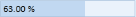

# Range Adorner

The EnableRangeAdorner property is used to show the adorner range based on the minimum and maximum values given to that control.

### Properties

_Property table_

<table>
<tr>
<td>
{{ '**Property**' | markdownify }}</td><td>
{{ '**Description**' | markdownify }}</td><td>
{{ '**Data Type**' | markdownify }}</td></tr>
<tr>
<td>
EnableRangeAdorner </td><td>
The Adorner range will displayed based on the value.</td><td>
bool </td></tr>
</table>

## Adding Range Adorner to an Application 

We have to set the EnableRangeAdorner property, either in XAML or the code file.


 EnableRangeAdorner="True"


  control.EnableRangeAdorner = true;


