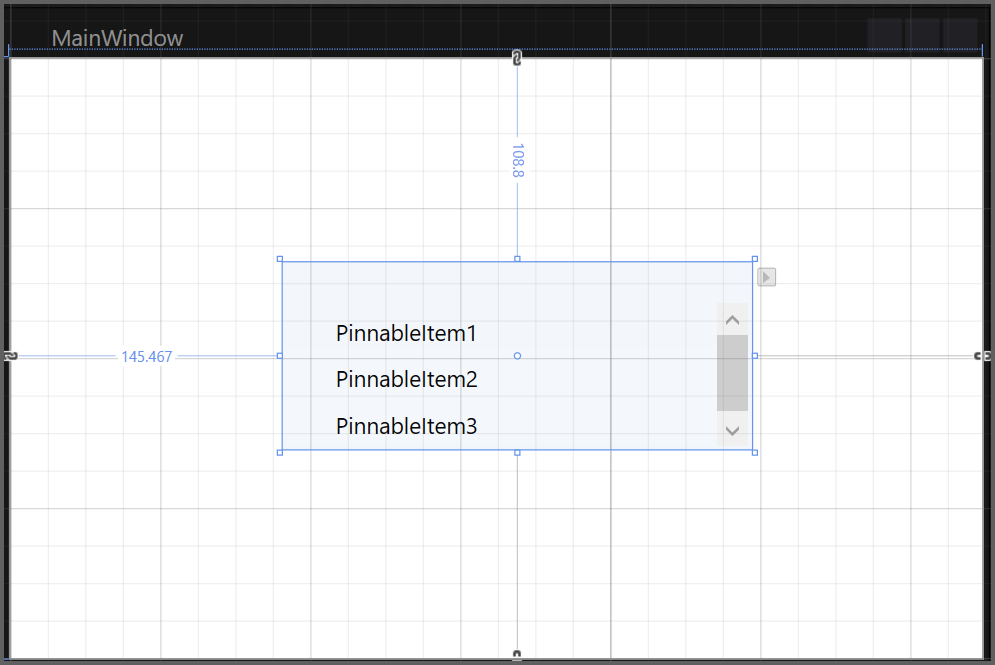
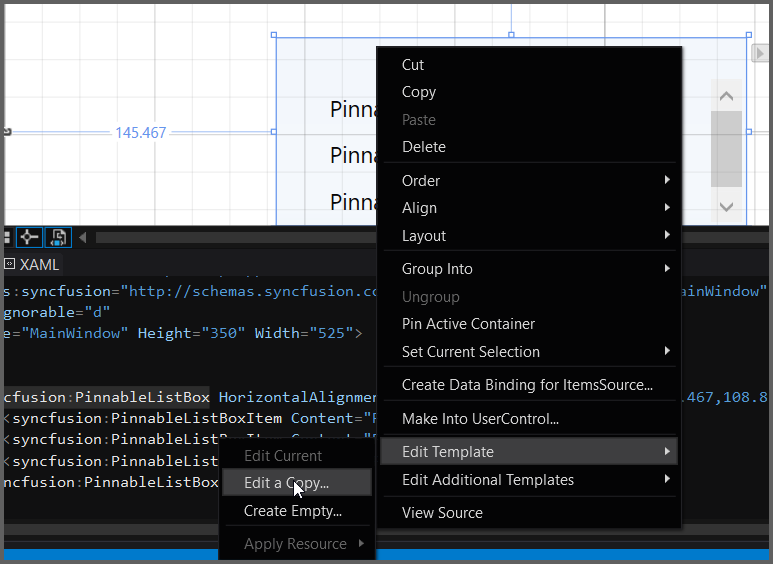
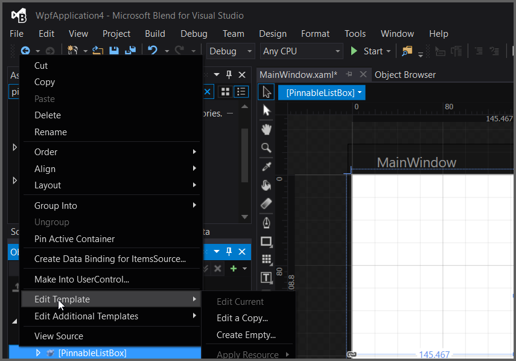
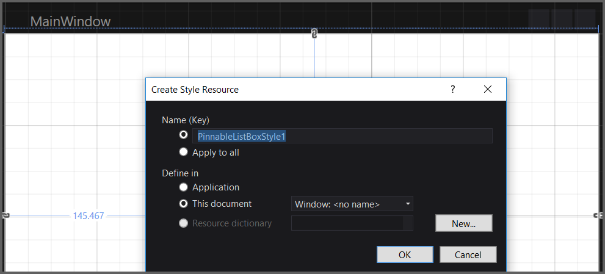
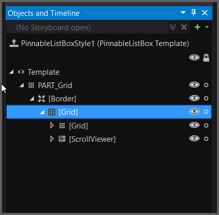

# Appearance      

## Setting VisualStyle for PinnableListBox

The appearance of the PinnableListBox control can be customized by using the SfSkinManager themes. The following are the various SfSkinManager themes supported by PinnableListBox control.

* Metro
* Lime
* Saffron
* Blend
* Office365
* Office2010Black
* Office2010Blue
* Office2010Silver
* Office2013White
* Office2013LightGray
* Office2013DarkGray
* Office2016White
* Office2016Colorful
* Office2016DarkGray
* VisualStudio2013
* VisualStudio2015

 Please refer below link for further details about SfSkinManager themes.

 [Themes](/wpf/themes/getting-started "SfSkinManager Getting Started")

## Blendability

You can edit the PinnableListBox Template to give a nice look and feel by using Expression Blend.

The steps to edit the PinnableListBox Template by using Expression Blend are as follows:

1. Create a simple WPF application in Expression Blend.
2. Drag and drop the PinnableListBox into the application from the Assets tab.

   

3. After creating the PinnableListBox, select the PinnableListBox and navigate to Object > Edit Style > Edit a Copy, to edit the Template of the PinnableListBox.

   

   Another way to edit the Template is as follows:

4. In Object and Timeline, right-click the PinnableListBox control and select the Edit Template option, as displayed below. 

   

   {:.prettyprint}

This will open a dialog (below) where you can give your style a name and define exactly where you’d like to store it.

The result of these steps is an XAML, which is placed within your application. This XAML represents the default style for the PinnableListBox.



<Grid>

<syncfusion:PinnableListBox HorizontalAlignment="Left" Height="100" Margin="145.467,108.8,0,0" 
    VerticalAlignment="Top" Width="250" Style="{DynamicResource PinnableListBoxStyle1}">
            <syncfusion:PinnableListBoxItem Content="AutoComplete"/>
            <syncfusion:PinnableListBoxItem Content="PivotGrid"/>
            <syncfusion:PinnableListBoxItem Content="IntegerTextBox"/>
</syncfusion:PinnableListBox>

</Grid>



All template items can now be found in the Objects and Timeline window.

