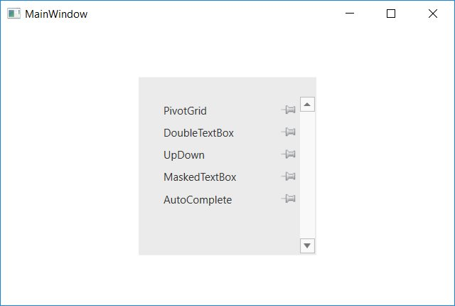

# Getting Started

This section explains how to add the `PinnableListBox` control to an application and its structure.

## Adding DoubleTextBox to a WPF Application

`PinnableListBox` can be added to an application in the following way.

### Create the PinnableListBox Control to an application by using XAML:

The following ways explains how to add PinnableListBox control using XAML code:

* Create a WPF project in Visual Studio and refer `Syncfusion.Shared.Wpf` assembly to the project.    
* Include an XML namespace for the above assemblies to the Main window. 





<Window x:Class="Application_New.MainWindow"

xmlns="http://schemas.microsoft.com/winfx/2006/xaml/presentation"

xmlns:x="http://schemas.microsoft.com/winfx/2006/xaml"

xmlns:syncfusion="http://schemas.syncfusion.com/wpf"

Title="MainWindow" Height="350" Width="525">





* Now add the PinnableListBox control and include PinnableListBoxItem with a required optimal name using the namespace 





 <syncfusion:PinnableListBox x:Name="pinnableListBox" Height="200"  Width="200">
            <syncfusion:PinnableListBoxItem Content="PivotGrid"/>
            <syncfusion:PinnableListBoxItem Content="DoubleTextBox"/>
            <syncfusion:PinnableListBoxItem Content="UpDown"/>
            <syncfusion:PinnableListBoxItem Content="MaskedTextBox"/>
            <syncfusion:PinnableListBoxItem Content="AutoComplete"/>
 </syncfusion:PinnableListBox> 





### Create the PinnableListBox control to an application by C#:

The following code illustrate how to add DoubleTextBox control to an application by C#.





  PinnableListBox pinnableListBox = new PinnableListBox();
  
  pinnableListBox.Items.Add(new PinnableListBoxItem() { Content = "DoubleTextBox" });
  
  pinnableListBox.Items.Add(new PinnableListBoxItem() { Content = "UpDown" });
  
  pinnableListBox.Items.Add(new PinnableListBoxItem() { Content = "AutoComplete" });
  
  Grid1.Children.Add(pinnableListBox);





## PinnableListBox Members

PinnableListBox exposes the following members:

### Properties

<table>
<tr>
<th>
Name</th><th>
Type</th><th>
Value it Accepts</th><th>
Description</th><th>
Default Value</th><th>
Reference Link</th></tr>
<tr>
<td>
Header</td><td>
Dependency Property</td><td>
String</td><td>
It is used to set header to the PinnableListBox control.</td><td>
Empty</td><td>
NA</td></tr>
<tr>
<td>
PinItemsSortDescription</td><td>
Dependency Property</td><td>
String</td><td>
Sort the items while pinning the items based on description.</td><td>
Empty</td><td>
NA</td></tr>
<tr>
<td>
UnPinItemsSortDescription</td><td>
Dependency Property</td><td>
String</td><td>
Sort the items while unpinning the items based on description.</td><td>
Empty</td><td>
NA</td></tr>
<tr>
<td>
PinnedSortDirection</td><td>
Dependency Property</td><td>
ListSortDirection</td><td>
Sort the items while pinning the items either in ascending or descending order.</td><td>
Ascending</td><td>
NA</td></tr>
<tr>
<td>
UnPinnedSortDirection</td><td>
Dependency Property</td><td>
ListSortDirection</td><td>
Sort the items while unpinning the items either in ascending or descending order.</td><td>
Ascending</td><td>
NA</td></tr>

