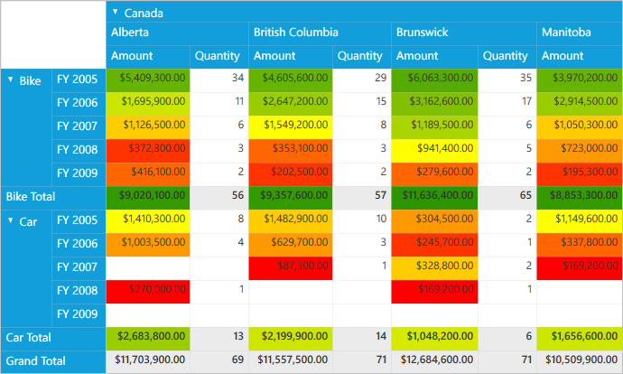

# Formatting using gradient color scales in WPF Pivot Grid

Conditional formatting is a process of applying customized styles to any object based on specified conditions. In this scenario, styles are applied in the form of gradient color scales through-out the control. 

It can be defined by using the `PivotGridControl.ColorScaleConditionalFormats`, which is an observable collection of *PivotGridColorScaleConditionalFormat* type. Meanwhile, it can be done in the following ways.

* Apply format using predefined color scales
* Apply format using custom colors

N> To apply conditional formatting based on gradient color scale values, make sure that `ApplyToAllLevels` property is set to **true**.

## Apply format using predefined color scales

It can be applied by setting the `ColorScaleName` property with pre-defined color scale value selected from *ColorScale* enumerator. These properties can be defined either in XAML or code-behind.

For **XAML**, refer to the following code snippet.



    <Grid>
        <syncfusion:PivotGridControl HorizontalAlignment="Left" Name="pivotGrid" VerticalAlignment="Top" VisualStyle="Metro" ItemSource="{Binding   Source={StaticResource data}}">

            <syncfusion:PivotGridControl.PivotRows>
                <syncfusion:PivotItem FieldHeader="Product" FieldMappingName="Product" TotalHeader="Total" />
                <syncfusion:PivotItem FieldHeader="Date" FieldMappingName="Date" TotalHeader="Total" />
            </syncfusion:PivotGridControl.PivotRows>
            <syncfusion:PivotGridControl.PivotColumns>
                <syncfusion:PivotItem FieldHeader="Country" FieldMappingName="Country" TotalHeader="Total" />
                <syncfusion:PivotItem FieldHeader="State" FieldMappingName="State" TotalHeader="Total" />
            </syncfusion:PivotGridControl.PivotColumns>
            <syncfusion:PivotGridControl.PivotCalculations>
                <syncfusion:PivotComputationInfo CalculationName="Total" FieldName="Amount" Format="C" SummaryType="DoubleTotalSum" />
                <syncfusion:PivotComputationInfo CalculationName="Total" FieldName="Quantity" SummaryType="Count" />
            </syncfusion:PivotGridControl.PivotCalculations>

            <!-- Conditional Formatting Cells -->
            <syncfusion:PivotGridControl.ColorScaleConditionalFormats>
                <syncfusion:PivotGridColorScaleConditionalFormat Name="C1" CalculationName="Amount" ApplyToAllLevels="True" ColorScaleName="BlueWhiteRed" />
            </syncfusion:PivotGridControl.ColorScaleConditionalFormats>

            </syncfusion:PivotGridControl>

        </syncfusion:PivotGridControl>
    </Grid>



For **code-behind**, refer to the following code snippet.



public partial class MainWindow: Window {
    PivotGridControl pivotGrid = new PivotGridControl();
    public MainWindow() {
        InitializeComponent();
        grid1.Children.Add(pivotGrid);
        pivotGrid.ItemSource = ProductSales.GetSalesData();
        PivotItem m_PivotItem = new PivotItem() {
            FieldHeader = "Product", FieldMappingName = "Product", TotalHeader = "Total"
        };
        PivotItem m_PivotItem1 = new PivotItem() {
            FieldHeader = "Date", FieldMappingName = "Date", TotalHeader = "Total"
        };
        PivotItem n_PivotItem = new PivotItem() {
            FieldHeader = "Country", FieldMappingName = "Country", TotalHeader = "Total"
        };
        PivotItem n_PivotItem1 = new PivotItem() {
            FieldHeader = "State", FieldMappingName = "State", TotalHeader = "Total"
        };
        // Adding PivotItem to PivotRows
        pivotGrid.PivotRows.Add(m_PivotItem);
        pivotGrid.PivotRows.Add(m_PivotItem1);
        // Adding PivotItem to PivotColumns
        pivotGrid.PivotColumns.Add(n_PivotItem);
        pivotGrid.PivotColumns.Add(n_PivotItem1);
        PivotComputationInfo m_PivotComputationInfo = new PivotComputationInfo() {
            CalculationName = "Amount", FieldName = "Amount", Format = "C", SummaryType = Syncfusion.PivotAnalysis.Base.SummaryType.DoubleTotalSum
        };
        PivotComputationInfo m_PivotComputationInfo1 = new PivotComputationInfo() {
            CalculationName = "Quantity", FieldName = "Quantity", SummaryType = Syncfusion.PivotAnalysis.Base.SummaryType.Count
        };
        pivotGrid.PivotCalculations.Add(m_PivotComputationInfo);
        pivotGrid.PivotCalculations.Add(m_PivotComputationInfo1);

        // Conditional formatting cells.
        PivotGridColorScaleConditionalFormat m_ColorScaleFormat = new PivotGridColorScaleConditionalFormat()
        {
            Name = "C1",
            CalculationName= "Amount",
            ColorScaleName = ColorScale.BlueWhiteRed,
            ApplyToAllLevels = true
        };
        //Adding Conditional Formats to PivotGrid
        pivotGrid.ColorScaleConditionalFormats.Add(m_ColorScaleFormat);
    }
}



## Apply format using custom colors

It can be applied by providing custom colors to the following properties - `StartColor`, `EndColor`, `MiddleColor` in the  application. Also, we can apply conditional formatting based on two level of gradient color scales by defining `StartColor` and `EndColor` properties alone. These properties can be defined either in XAML or code-behind.

For **XAML**, refer to the following code snippet.



    <Grid>
        <syncfusion:PivotGridControl HorizontalAlignment="Left" Name="pivotGrid" VerticalAlignment="Top" VisualStyle="Metro" ItemSource="{Binding   Source={StaticResource data}}">

            <syncfusion:PivotGridControl.PivotRows>
                <syncfusion:PivotItem FieldHeader="Product" FieldMappingName="Product" TotalHeader="Total" />
                <syncfusion:PivotItem FieldHeader="Date" FieldMappingName="Date" TotalHeader="Total" />
            </syncfusion:PivotGridControl.PivotRows>
            <syncfusion:PivotGridControl.PivotColumns>
                <syncfusion:PivotItem FieldHeader="Country" FieldMappingName="Country" TotalHeader="Total" />
                <syncfusion:PivotItem FieldHeader="State" FieldMappingName="State" TotalHeader="Total" />
            </syncfusion:PivotGridControl.PivotColumns>
            <syncfusion:PivotGridControl.PivotCalculations>
                <syncfusion:PivotComputationInfo CalculationName="Total" FieldName="Amount" Format="C" SummaryType="DoubleTotalSum" />
                <syncfusion:PivotComputationInfo CalculationName="Total" FieldName="Quantity" SummaryType="Count" />
            </syncfusion:PivotGridControl.PivotCalculations>

            <!-- Conditional Formatting Cells -->
            <syncfusion:PivotGridControl.ColorScaleConditionalFormats>
                <syncfusion:PivotGridColorScaleConditionalFormat Name="C1" CalculationName="Amount" ApplyToAllLevels="True" StartColor="Green" MiddleColor="Yellow" EndColor="Red" />
            </syncfusion:PivotGridControl.ColorScaleConditionalFormats>

            </syncfusion:PivotGridControl>

        </syncfusion:PivotGridControl>
    </Grid>



For code-behind, refer to the following code snippet.



public partial class MainWindow: Window {
    PivotGridControl pivotGrid = new PivotGridControl();
    public MainWindow() {
        InitializeComponent();
        grid1.Children.Add(pivotGrid);
        pivotGrid.ItemSource = ProductSales.GetSalesData();
        PivotItem m_PivotItem = new PivotItem() {
            FieldHeader = "Product", FieldMappingName = "Product", TotalHeader = "Total"
        };
        PivotItem m_PivotItem1 = new PivotItem() {
            FieldHeader = "Date", FieldMappingName = "Date", TotalHeader = "Total"
        };
        PivotItem n_PivotItem = new PivotItem() {
            FieldHeader = "Country", FieldMappingName = "Country", TotalHeader = "Total"
        };
        PivotItem n_PivotItem1 = new PivotItem() {
            FieldHeader = "State", FieldMappingName = "State", TotalHeader = "Total"
        };
        // Adding PivotItem to PivotRows
        pivotGrid.PivotRows.Add(m_PivotItem);
        pivotGrid.PivotRows.Add(m_PivotItem1);
        // Adding PivotItem to PivotColumns
        pivotGrid.PivotColumns.Add(n_PivotItem);
        pivotGrid.PivotColumns.Add(n_PivotItem1);
        PivotComputationInfo m_PivotComputationInfo = new PivotComputationInfo() {
            CalculationName = "Amount", FieldName = "Amount", Format = "C", SummaryType = Syncfusion.PivotAnalysis.Base.SummaryType.DoubleTotalSum
        };
        PivotComputationInfo m_PivotComputationInfo1 = new PivotComputationInfo() {
            CalculationName = "Quantity", FieldName = "Quantity", SummaryType = Syncfusion.PivotAnalysis.Base.SummaryType.Count
        };
        pivotGrid.PivotCalculations.Add(m_PivotComputationInfo);
        pivotGrid.PivotCalculations.Add(m_PivotComputationInfo1);

        // Conditional formatting cells.
        PivotGridColorScaleConditionalFormat m_ColorScaleFormat = new PivotGridColorScaleConditionalFormat()
        {
            Name = "C1",
            CalculationName= "Amount",
            ApplyToAllLevels = true,
            StartColor = System.Drawing.Color.Green,
            MiddleColor = System.Drawing.Color.Yellow,
            EndColor = System.Drawing.Color.Red
        };
        //Adding Conditional Formats to PivotGrid
        pivotGrid.ColorScaleConditionalFormats.Add(m_ColorScaleFormat);
    }
}



## Apply formatting to specific level

`ApplyToSpecificLevel` property specifies whether to apply conditional formatting to data cells placed at the intersection of specific row and column fields. It can be achieved by defining `RowName` and `ColumnName` properties with appropriate pivot field name.

N> To apply conditional formatting to specific level, make sure that `ApplyToAllLevels` property is set to **false**.

To achieve this through **XAML**, refer to the following code snippet.



    <Grid>
        <syncfusion:PivotGridControl HorizontalAlignment="Left" Name="pivotGrid" VerticalAlignment="Top" VisualStyle="Metro" ItemSource="{Binding   Source={StaticResource data}}">

            <syncfusion:PivotGridControl.PivotRows>
                <syncfusion:PivotItem FieldHeader="Product" FieldMappingName="Product" TotalHeader="Total" />
                <syncfusion:PivotItem FieldHeader="Date" FieldMappingName="Date" TotalHeader="Total" />
            </syncfusion:PivotGridControl.PivotRows>
            <syncfusion:PivotGridControl.PivotColumns>
                <syncfusion:PivotItem FieldHeader="Country" FieldMappingName="Country" TotalHeader="Total" />
                <syncfusion:PivotItem FieldHeader="State" FieldMappingName="State" TotalHeader="Total" />
            </syncfusion:PivotGridControl.PivotColumns>
            <syncfusion:PivotGridControl.PivotCalculations>
                <syncfusion:PivotComputationInfo CalculationName="Total" FieldName="Amount" Format="C" SummaryType="DoubleTotalSum" />
                <syncfusion:PivotComputationInfo CalculationName="Total" FieldName="Quantity" SummaryType="Count" />
            </syncfusion:PivotGridControl.PivotCalculations>

            <!-- Conditional Formatting Cells -->
            <syncfusion:PivotGridControl.ColorScaleConditionalFormats>
                <syncfusion:PivotGridColorScaleConditionalFormat Name="C1" CalculationName="Quantity" ApplyToSpecificLevel="True" RowName="Date" ColumnName="Country"  ColorScaleName="GreenYellow" />
            </syncfusion:PivotGridControl.ColorScaleConditionalFormats>

            </syncfusion:PivotGridControl>

        </syncfusion:PivotGridControl>
    </Grid>



To achieve this through code-behind, refer to the following code snippet.



public partial class MainWindow: Window {
    PivotGridControl pivotGrid = new PivotGridControl();
    public MainWindow() {
        InitializeComponent();
        grid1.Children.Add(pivotGrid);
        pivotGrid.ItemSource = ProductSales.GetSalesData();
        PivotItem m_PivotItem = new PivotItem() {
            FieldHeader = "Product", FieldMappingName = "Product", TotalHeader = "Total"
        };
        PivotItem m_PivotItem1 = new PivotItem() {
            FieldHeader = "Date", FieldMappingName = "Date", TotalHeader = "Total"
        };
        PivotItem n_PivotItem = new PivotItem() {
            FieldHeader = "Country", FieldMappingName = "Country", TotalHeader = "Total"
        };
        PivotItem n_PivotItem1 = new PivotItem() {
            FieldHeader = "State", FieldMappingName = "State", TotalHeader = "Total"
        };
        // Adding PivotItem to PivotRows
        pivotGrid.PivotRows.Add(m_PivotItem);
        pivotGrid.PivotRows.Add(m_PivotItem1);
        // Adding PivotItem to PivotColumns
        pivotGrid.PivotColumns.Add(n_PivotItem);
        pivotGrid.PivotColumns.Add(n_PivotItem1);
        PivotComputationInfo m_PivotComputationInfo = new PivotComputationInfo() {
            CalculationName = "Amount", FieldName = "Amount", Format = "C", SummaryType = Syncfusion.PivotAnalysis.Base.SummaryType.DoubleTotalSum
        };
        PivotComputationInfo m_PivotComputationInfo1 = new PivotComputationInfo() {
            CalculationName = "Quantity", FieldName = "Quantity", SummaryType = Syncfusion.PivotAnalysis.Base.SummaryType.Count
        };
        pivotGrid.PivotCalculations.Add(m_PivotComputationInfo);
        pivotGrid.PivotCalculations.Add(m_PivotComputationInfo1);

        // Conditional formatting cells.
        PivotGridColorScaleConditionalFormat m_ColorScaleFormat = new PivotGridColorScaleConditionalFormat()
        {
            Name = "C1",
            CalculationName = "Quantity",
            ApplyToSpecificLevel = true,
            RowName = "Date",
            ColumnName = "Country",
            ColorScaleName = ColorScale.GreenYellow
        };
        //Adding Conditional Formats to PivotGrid
        pivotGrid.ColorScaleConditionalFormats.Add(m_ColorScaleFormat);
    }
}



