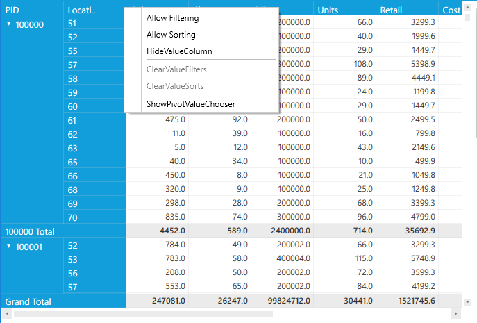

# Context Menu in WPF Pivot Grid

The [WPF Pivot Grid](https://www.syncfusion.com/wpf-controls/pivot-grid) supports the context menu option in RowPivotsOnly mode. The following options are available.

* **Allow Filtering**: Enables or disables filtering in the selected pivot computation column.
* **Allow Sorting**: Enables or disables sorting in the selected pivot computation column.
* **HideValueColumn**: Hides the selected pivot computation column.
* **ClearValueFilters**: Clears the filtered changes in all pivot computation columns.
* **ClearValueSorts**: Clears the sorted values in all pivot computation columns.
* **ShowPivotValueChooser**: Launches the pivot value chooser window to add or remove items in the Pivot Grid.

The `EnableContextMenu` property is used to display the context menu by right-clicking each column.

To do so, after defining the control in RowPivotsOnly mode, raise its loaded event. Inside the `PivotGrid_Loaded()` event, set the `EnableContextMenu` property.



public partial class MainWindow: Window {
    public MainWindow() {
        InitializeComponent();
        pivotGrid.Loaded += pivotGrid_Loaded;
    }

    void pivotGrid_Loaded(object sender, RoutedEventArgs e) {
        pivotGrid.RowHeaderCellStyle.EnableContextMenu = true;
        pivotGrid.ColumnHeaderCellStyle.EnableContextMenu = true;
    }
}



N> You can also explore our [WPF Pivot Grid example](https://github.com/syncfusion/wpf-demos) to know how to organize and summarize business data and display the result in a cross-table format.